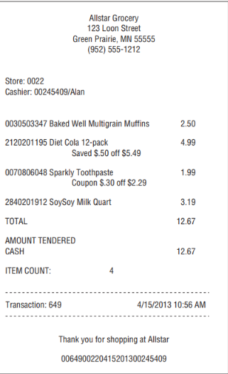
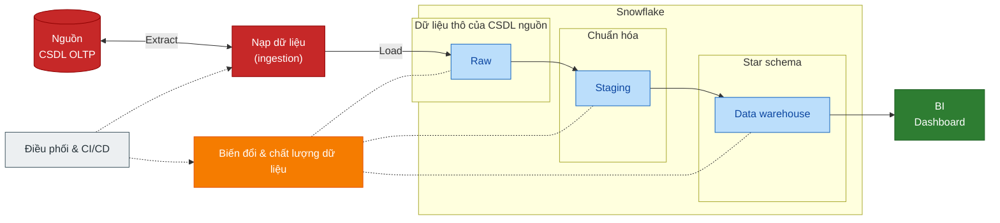
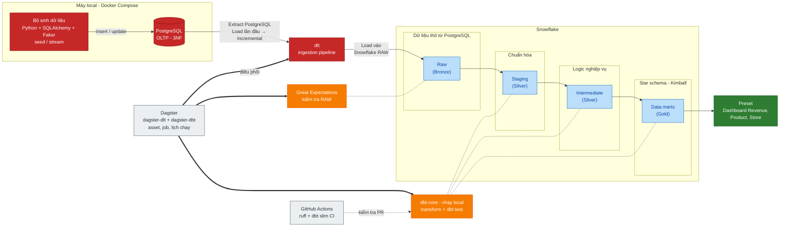
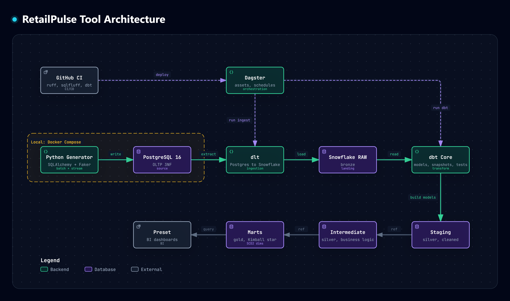

# Retail Pulse

Nền tảng phân tích bán lẻ end-to-end chạy trên máy cá nhân: PostgreSQL (OLTP) → dlt → Snowflake (Medallion, Kimball SCD2) → dbt → Dagster → Preset. Dữ liệu được kiểm tra bằng Great Expectations và dbt test, mọi thay đổi được kiểm tra bằng GitHub Actions.

> **Phạm vi:** nạp dữ liệu theo kiểu incremental dựa trên cột `updated_at` (batch). CDC dựa trên log (Debezium, Redpanda) nằm ngoài phạm vi hiện tại; xem [Project-Spec](./docs/Project-Spec.md).

# Bài toán: phân tích POS bán lẻ để tối ưu lợi nhuận

Mục tiêu là tăng lợi nhuận của chuỗi bán lẻ bằng cách tối ưu giá và khuyến mãi. Quy trình nghiệp vụ lõi là bán hàng tại điểm bán (POS), vì đây là nguồn dữ liệu giao dịch chi tiết, chính xác và liên tục nhất.

Cần có từng dòng hàng đã mua, số lượng, cửa hàng, thời điểm, giá niêm yết, mã khuyến mãi và số tiền cuối cùng, ghép với giá vốn để tính lợi nhuận. Từ đó trả lời các câu hỏi như: cửa hàng và sản phẩm nào lãi nhiều nhất, khuyến mãi nào hiệu quả, đổi giá ảnh hưởng thế nào. Khách hàng, tồn kho, trả hàng và hủy đơn nằm ngoài phạm vi.

> **Tài liệu:** lộ trình theo phase, hướng dẫn chạy và thiết kế từng thành phần nằm ở
> [docs/README.md](./docs/README.md). Đặc tả chuẩn của dự án là [docs/Project-Spec.md](./docs/Project-Spec.md).

# 1. Mô hình dữ liệu vận hành

Nguồn OLTP được mô hình hóa qua ba bước: Conceptual → Logical (3NF, 10 bảng) → Physical (PostgreSQL). Nghiệp vụ POS gồm `sales_transaction` (header) và `sales_transaction_item` (từng dòng hàng). Chi tiết và sơ đồ: [docs/design/operational-data-modeling.md](./docs/design/operational-data-modeling.md). Mô hình phân tích cho warehouse: [docs/design/analytical-data-modeling.md](./docs/design/analytical-data-modeling.md).

# 2. Kiến trúc dữ liệu

## A. Tổng quan

Dữ liệu đi từ CSDL nguồn qua pipeline nạp vào Snowflake, được chuẩn hóa rồi dựng thành star schema cho dashboard. Hai lớp phía dưới (biến đổi và điều phối) không chứa dữ liệu mà điều khiển các lớp còn lại.

## B. Chi tiết

Cùng luồng trên, gắn với công cụ thật. Tầng Bronze/Silver/Gold là cách gọi theo kiến trúc Medallion.

## C. Công cụ

Cùng pipeline nhìn theo công cụ. Dữ liệu đi từ trái sang phải ở hàng giữa (generator → PostgreSQL → dlt → Snowflake RAW → dbt), dbt dựng các tầng Snowflake ở hàng dưới, Dagster và GitHub CI nằm phía trên làm lớp điều khiển.

> Ảnh vẽ từ bản thiết kế ban đầu nên khác thực tế ở ba điểm: CI hiện chỉ có `ruff` và slim CI (chưa có `sqlfluff`, chưa tự deploy); dbt không dùng snapshot (SCD2 tự xây bằng window function); Great Expectations chưa có trong ảnh.

| Công cụ | Vai trò | Trạng thái |
| --- | --- | --- |
| Python generator (SQLAlchemy, Faker) | Seed dữ liệu lịch sử, mô phỏng đổi giá, đổi cửa hàng nhân viên và bán hàng mới | Xong |
| PostgreSQL 16 (Docker Compose) | CSDL nguồn OLTP, 3NF | Xong |
| dlt | Nạp incremental từ PostgreSQL vào Snowflake RAW | Xong |
| Snowflake | Các tầng RAW, staging, intermediate, marts | Xong |
| dbt Core | Staging, intermediate, marts, dimension SCD2, test | Xong |
| Dagster | Điều phối dlt, dbt và kiểm tra chất lượng thành asset, job, lịch chạy hằng ngày | Xong |
| Preset | Dashboard BI trên marts | Xong |
| Great Expectations | Kiểm tra chất lượng dữ liệu RAW | Xong |
| GitHub Actions | Lint `ruff`, slim CI cho dbt, bảo vệ nhánh `main` | Xong (chưa có CD, `sqlfluff`, `pytest`) |

Lộ trình theo phase và cách chạy: [docs/README.md](./docs/README.md).
