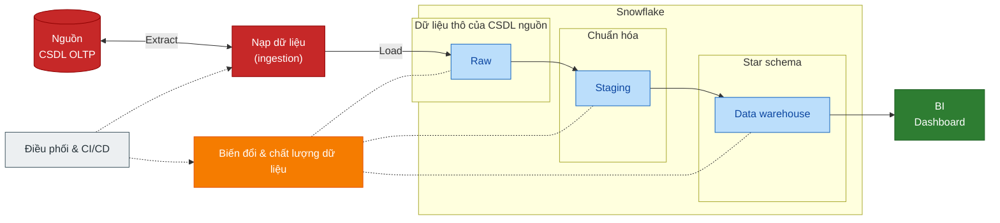
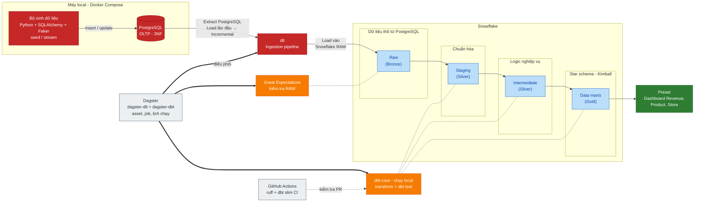

# Retail Pulse

**Từ một tờ hóa đơn đến dashboard lợi nhuận: xây pipeline dữ liệu bán lẻ end-to-end.**

PostgreSQL → dlt → Snowflake → dbt → Dagster → Preset, kiểm tra bằng Great Expectations và GitHub Actions. Chạy được trên một chiếc laptop.

Mỗi lần bạn thanh toán ở siêu thị, một tờ hóa đơn như trên ra đời. Với người mua, nó là mảnh giấy để vứt đi. Với chuỗi bán lẻ, nó là mỏ vàng: mỗi dòng cho biết **bán gì, bao nhiêu, ở đâu, lúc nào, giá nào, có khuyến mãi không**.

Vấn đề là mỏ vàng đó nằm rải rác trong cơ sở dữ liệu của hệ thống bán hàng (POS), thiết kế để ghi nhanh chứ không để phân tích. Dự án này đi hết quãng đường từ đó đến một dashboard trả lời được những câu hỏi như:

- Cửa hàng nào và sản phẩm nào lãi nhiều nhất?
- Khuyến mãi nào thật sự hiệu quả, khuyến mãi nào chỉ cho đi?
- Giá vốn tăng 3% thì lợi nhuận thay đổi ra sao?

Khách hàng, tồn kho, trả hàng và hủy đơn nằm ngoài phạm vi, để tập trung làm đúng một quy trình: **bán hàng**.

> **Phạm vi nạp dữ liệu:** incremental theo cột `updated_at` (batch). CDC dựa trên log (Debezium, Redpanda) chưa làm; xem [Project-Spec](./docs/Project-Spec.md).
> **Tài liệu:** lộ trình theo phase, hướng dẫn chạy và thiết kế nằm ở [docs/README.md](./docs/README.md).

# 1. Bắt đầu từ nguồn: mô hình dữ liệu vận hành

Trước khi nghĩ đến warehouse, phải hiểu dữ liệu nguồn trông thế nào. Hệ thống POS giả lập được mô hình hóa qua ba bước: Conceptual (có những thực thể nào) → Logical (3NF, 10 bảng) → Physical (PostgreSQL).

Trọng tâm là hai bảng: `sales_transaction` là **header** (một lần thanh toán), `sales_transaction_item` là **từng dòng hàng** trên hóa đơn. Mọi phân tích về doanh thu đều xuất phát từ dòng hàng này.

Sơ đồ và lý do thiết kế: [Mô hình dữ liệu vận hành](./docs/design/operational-data-modeling.md). Phía warehouse: [Mô hình phân tích](./docs/design/analytical-data-modeling.md).

# 2. Kiến trúc: nhìn như một nhà hàng

Cách dễ nhất để hình dung pipeline là một nhà hàng. **Nguyên liệu** (dữ liệu thô) về kho, được **sơ chế** (làm sạch, chuẩn hóa), **nấu** (áp dụng logic nghiệp vụ), rồi **bày đĩa** (star schema) cho khách ăn (dashboard). Còn một quản lý đứng ngoài lo lịch, và một người kiểm tra chất lượng ở mọi công đoạn.

## A. Bức tranh lớn

Một đường chính từ trái sang phải. Hai khối phía dưới không chứa dữ liệu mà điều khiển các khối còn lại.

## B. Gắn với công cụ thật

Cùng luồng trên, nhưng mỗi ô là một công cụ cụ thể. Bronze, Silver, Gold là cách gọi của kiến trúc Medallion: càng sang phải dữ liệu càng sạch và càng gần câu hỏi nghiệp vụ.

# 3. Những quyết định đáng kể

Vài lựa chọn quyết định hình dạng của dự án, và lý do:

- **RAW chỉ ghi thêm, không bao giờ ghi đè.** Khi giá một sản phẩm đổi, dlt thêm một dòng mới thay vì sửa dòng cũ. Nhờ vậy lịch sử không mất, và đó là nguyên liệu để dựng SCD2. Cái giá: xóa RAW là mất lịch sử vĩnh viễn, nên mọi lệnh có thể xóa RAW đều được cảnh báo trong tài liệu.
- **SCD2 tự xây bằng window function, không dùng `dbt snapshot`.** Với dữ liệu append-only, so sánh dòng hiện tại với dòng liền trước (`LAG`) cho ra các khoảng thời gian hiệu lực mà vẫn kiểm soát được từng bước. Một giao dịch luôn được gắn với giá vốn **của đúng thời điểm bán**.
- **Chỉ giao dịch `completed` đi vào phân tích.** Bộ lọc nằm ở staging, từ tầng sau không ai phải nhớ đến cột `status`.
- **Dữ liệu đến trễ không viết logic vá riêng.** Dòng fact không khớp được dimension sẽ mang khóa `-2` ("Unknown"), và được sửa bằng cách dựng lại bảng fact (`--full-refresh`) chứ không phức tạp hóa bước incremental.
- **Mọi thay đổi đi qua pull request.** CI chạy dbt trên một database riêng, chỉ build phần bị đổi (slim CI), nên không đụng dữ liệu thật.

# 4. Dự án gồm những gì

Hình dưới là cùng pipeline nhìn theo công cụ: dữ liệu đi từ trái sang phải ở hàng giữa, dbt dựng các tầng Snowflake ở hàng dưới, Dagster và GitHub CI nằm phía trên làm lớp điều khiển.

> Ảnh vẽ từ bản thiết kế ban đầu nên khác thực tế ở ba điểm: CI hiện chỉ có `ruff` và slim CI (chưa có `sqlfluff`, chưa tự deploy); dbt không dùng snapshot (SCD2 tự xây bằng window function); Great Expectations chưa có trong ảnh.

| Công cụ | Vai trò | Trạng thái |
| --- | --- | --- |
| Python generator (SQLAlchemy, Faker) | Seed dữ liệu lịch sử, mô phỏng đổi giá, đổi cửa hàng nhân viên và bán hàng mới | Xong |
| PostgreSQL 16 (Docker Compose) | CSDL nguồn OLTP, 3NF | Xong |
| dlt | Nạp incremental từ PostgreSQL vào Snowflake RAW | Xong |
| Snowflake | Các tầng RAW, staging, intermediate, marts | Xong |
| dbt Core | Staging, intermediate, marts, dimension SCD2, test | Xong |
| Dagster | Điều phối dlt, dbt và kiểm tra chất lượng thành asset, job, lịch chạy hằng ngày | Xong |
| Preset | Dashboard BI trên marts | Xong |
| Great Expectations | Kiểm tra chất lượng dữ liệu RAW | Xong |
| GitHub Actions | Lint `ruff`, slim CI cho dbt, bảo vệ nhánh `main` | Xong (chưa có CD, `sqlfluff`, `pytest`) |

Muốn chạy thử? Bắt đầu từ [docs/README.md](./docs/README.md): có lộ trình theo phase và các lệnh chạy nhanh.
