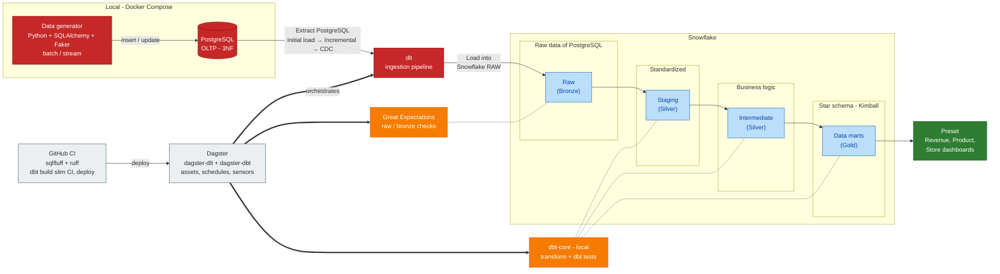

# Retail Pulse

Building an End-to-End Analytics Engineering with Batch & CDC Streaming Data Platform: PostgreSQL, Debezium, Redpanda, dlt, Snowflake (Medallion & Kimball SCD2), dbt, Dagster, and Github CI/CD.

# Problem Definition: A Retail POS & Profit Optimization Analytics Case
In this challenge, our goal is to maximize enterprise profitability by optimizing logistics management alongside pricing and promotion strategies. To achieve this, we focus on Point of Sale (POS) sales operations as our core business process, as it serves as the primary source of detailed, accurate, and continuous transaction data. We require granular POS transaction records, including itemized purchases, sold quantities, store locations, timestamps, base prices, applied promotion codes, and final transaction amounts. Furthermore, integrating POS data with product cost margins and inventory levels is essential to track product movement and supply chain efficiency. By analyzing this dataset, we can uncover actionable insights to streamline inventory allocation, evaluate promotional effectiveness, refine pricing strategies, and drive sustainable profit growth.

> **Documentation:** phase-by-phase roadmap, run guides and component design notes live in
> [docs/README.md](./docs/README.md). The canonical specification is
> [docs/Project-Spec.md](./docs/Project-Spec.md).

# 1. Operational Data Modeling
Nguồn OLTP được mô hình hóa theo ba bước Conceptual → Logical (3NF, 10 bảng) → Physical (PostgreSQL),
gồm sales_transaction (header) và sales_transaction_item (line item) cho nghiệp vụ POS. Nội dung đầy
đủ và các sơ đồ: [docs/design/operational-data-modeling.md](./docs/design/operational-data-modeling.md).
Mô hình phân tích cho warehouse: [docs/design/analytical-data-modeling.md](./docs/design/analytical-data-modeling.md).

# 2 Data Architecture
## A. High-Level

## B. Low-Level Data Architecture

## C. Tool Architecture

The same pipeline seen as the tools that implement it. Data moves left to right through the middle row (generator → PostgreSQL → dlt → Snowflake RAW → dbt), dbt builds the Snowflake layers on the bottom row, and Dagster and GitHub CI sit above as the control plane.

| Tool | Role | Status |
| --- | --- | --- |
| Python generator (SQLAlchemy, Faker) | Seeds historical data and simulates product price/cost changes | Done |
| PostgreSQL 16 (Docker Compose) | Source OLTP database, 3NF | Done |
| dlt | Incremental ingestion from PostgreSQL to Snowflake RAW | Done |
| Snowflake | RAW, staging, intermediate and marts layers | RAW done |
| dbt Core | Staging, intermediate, marts, SCD2 dimensions, tests | Planned |
| Dagster | Orchestrates dlt and dbt as assets | Planned |
| Preset | BI dashboards on the marts | Planned |
| GitHub CI | Lint, test, deploy | Planned |
| Great Expectations | Optional data quality checks on RAW | Done |

See [docs/README.md](./docs/README.md) for the phase-by-phase roadmap.

