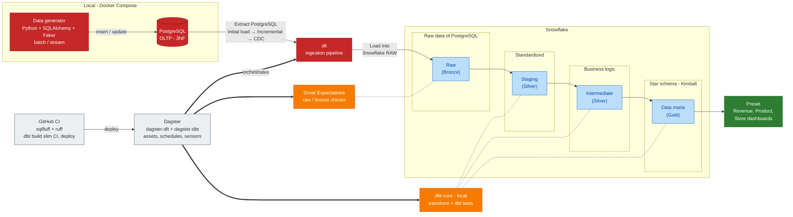

# Retail Pulse

Building an End-to-End Analytics Engineering with Batch & CDC Streaming Data Platform: PostgreSQL, Debezium, Redpanda, dlt, Snowflake (Medallion & Kimball SCD2), dbt, Dagster, and Github CI/CD.

# Problem Definition: A Retail POS & Profit Optimization Analytics Case
In this challenge, our goal is to maximize enterprise profitability by optimizing logistics management alongside pricing and promotion strategies. To achieve this, we focus on Point of Sale (POS) sales operations as our core business process, as it serves as the primary source of detailed, accurate, and continuous transaction data. We require granular POS transaction records, including itemized purchases, sold quantities, store locations, timestamps, base prices, applied promotion codes, and final transaction amounts. Furthermore, integrating POS data with product cost margins and inventory levels is essential to track product movement and supply chain efficiency. By analyzing this dataset, we can uncover actionable insights to streamline inventory allocation, evaluate promotional effectiveness, refine pricing strategies, and drive sustainable profit growth.


> **Documentation:** phase-by-phase roadmap, run guides and component design notes live in
> [docs/README.md](./docs/README.md). The canonical specification is
> [docs/Project-Spec.md](./docs/Project-Spec.md).

# 1. Operational Data Modeling
## a. Conceptual Model
First step, consisting of the conceptual modeling phase, allows us to conceptualize and define the overall structure and relationships within the database. This involves identifying the key entities, their attributes, and their associations. Through careful analysis and collaboration with stakeholders, we will capture the essence of the management system and translate it into a concise and comprehensive conceptual model (Figure 1).   In the conceptual model in Figure 1, we can observe four entities: Store, Employee, Product, and Promotion, connected through two key events: Buy and Stocks. The primary event, Buy, enables us to track sales transactions at retail stores through cashiers while applying active promotions. (Keep in mind, capturing detailed POS transaction attributes such as Date, Payment method, Quantity, Regular price, and Coupon amount is essential for pricing and promotion analytics.) The second event, Stocks, is designed as a periodic snapshot event to track inventory levels (Quantity on hand) across stores over time (Snapshot date). Note that while the Stocks event is included in this conceptual model to accommodate broader supply chain design, it is currently out of scope and not utilized in this specific analytics case. For each entity and event, we have defined specific attributes to build a comprehensive operational database. Look Figure 1 below.


## b. Logical Model
As we previously mentioned, to convert the conceptual ERD into a logical schema, we create a structured representation of entities, attributes, and their relationships. This schema acts as a foundation for implementing the database in a relational database management system. We turn the entities into tables, with their attributes becoming table columns. Relationships are handled based on their cardinality: for 1:N relationships, we use foreign keys to connect tables, and for M:N relationships, we create separate associative tables to represent the connections. Furthermore, by strictly applying normalization principles up to the Third Normal Form (3NF), we eliminate data redundancy, prevent update anomalies, and ensure data integrity.


If we apply these normalization rules to our concept, we obtain the logical schema illustrated in Figure 3.


As you can see, our logical model consists of ten normalized tables:
- Core Entities & Lookups: Primary entities such as Store, employee, product, and promotion store main domain data. To achieve 3NF and remove transitive dependencies, attributes like categories, brands, and payment methods are normalized into standalone lookup tables (category, brand, and payment_method).
- Transaction Processing (Header & Detail Split): The core POS sales event (Buy) is decomposed into two tables—sales_transaction for high-level transaction metadata (store, employee cashier, payment method, and timestamp) and sales_transaction_item for line-item details (SKU, quantity, regular price, line number, and coupon amount)—preventing data duplication across multiple items per bill.
- Association Tables: The promotion_product table resolves the M:N relationship between products and promotions

## c. Physical Model
While the logical model primarily deals with the structural representation of the database, the physical model delves into the practical aspects of data management, assuming we have chosen a specific database engine. In our case, we select PostgreSQL for its robust support for transactional integrity, strict data typing, and financial decimal precision. Thus, we need to translate our 3NF logical model into specific physical storage configurations, PostgreSQL data types, and integrity constraints.
Figure 4 shows our physical ERD diagram, detailing PostgreSQL data types, column nullability (NN for NOT NULL), primary keys, and foreign key relationships.
Now we can translate the previous logical model into a set of DDL scripts, starting by defining custom ENUM types and establishing our database structure (Example 1).


```sql
-- Define enumerated types for restricted categorical attributes
CREATE TYPE promotion_type AS ENUM ('percentage', 'fixed_amount');
CREATE TYPE transaction_status AS ENUM ('completed', 'cancelled', 'returned');

-- Create core lookup entities
CREATE TABLE IF NOT EXISTS store (
    id BIGINT GENERATED ALWAYS AS IDENTITY PRIMARY KEY,
    store_name VARCHAR(100) NOT NULL UNIQUE,
    address VARCHAR(255) NOT NULL,
    phone_number VARCHAR(20),
    created_at TIMESTAMPTZ NOT NULL DEFAULT NOW(),
    updated_at TIMESTAMPTZ NOT NULL DEFAULT NOW()
);

CREATE TABLE IF NOT EXISTS category (
    id BIGINT GENERATED ALWAYS AS IDENTITY PRIMARY KEY,
    category_name VARCHAR(100) NOT NULL UNIQUE,
    created_at TIMESTAMPTZ NOT NULL DEFAULT NOW(),
    updated_at TIMESTAMPTZ NOT NULL DEFAULT NOW()
);

CREATE TABLE IF NOT EXISTS brand (
    id BIGINT GENERATED ALWAYS AS IDENTITY PRIMARY KEY,
    brand_name VARCHAR(100) NOT NULL UNIQUE,
    created_at TIMESTAMPTZ NOT NULL DEFAULT NOW(),
    updated_at TIMESTAMPTZ NOT NULL DEFAULT NOW()
);

CREATE TABLE IF NOT EXISTS payment_method (
    id BIGINT GENERATED ALWAYS AS IDENTITY PRIMARY KEY,
    method VARCHAR(50) NOT NULL UNIQUE,
    created_at TIMESTAMPTZ NOT NULL DEFAULT NOW(),
    updated_at TIMESTAMPTZ NOT NULL DEFAULT NOW()
);
```
The sales_transaction table records high-level POS receipt metadata, while sales_transaction_item records granular line items. The line-item table utilizes a composite primary key consisting of (transaction_id, line_number), ensuring ordinal integrity for every receipt item. Foreign key constraints maintain strict referential integrity. Crucially, the ON DELETE CASCADE clause on fk_item_transaction guarantees that if a transaction record is purged, its corresponding detail lines are automatically cleaned up to prevent orphan rows.

Across all tables, created_at and updated_at columns with timezone-aware timestamps (TIMESTAMPTZ) serve as audit columns. Including audit timestamps is an operational best practice: it enables downstream data pipelines to perform incremental extraction and Change Data Capture (CDC) via log-based or query-based replication tools (such as Debezium or Airflow incremental DAGs) without requiring full database dumps.

Understanding physical database design, data type selection, and constraint enforcement equips data engineers and analytics professionals with the necessary context to optimize downstream ELT/ETL jobs, diagnose query performance bottlenecks, and design robust data lakehouse ingestion layers.

# 2 Data Architecture
## A. High-Level

## B. Low-Level Data Architecture


## C. Tool Architecture

The same pipeline seen as the tools that implement it. Data moves left to right through the middle row (generator → PostgreSQL → dlt → Snowflake RAW → dbt), dbt builds the Snowflake layers on the bottom row, and Dagster and GitHub CI sit above as the control plane.


| Tool | Role | Status |
| --- | --- | --- |
| Python generator (SQLAlchemy, Faker) | Seeds historical data and simulates product price/cost changes | Done |
| PostgreSQL 16 (Docker Compose) | Source OLTP database, 3NF | Done |
| dlt | Incremental ingestion from PostgreSQL to Snowflake RAW | Done |
| Snowflake | RAW, staging, intermediate and marts layers | RAW done |
| dbt Core | Staging, intermediate, marts, SCD2 snapshots, tests | Planned |
| Dagster | Orchestrates dlt and dbt as assets | Planned |
| Preset | BI dashboards on the marts | Planned |
| GitHub CI | Lint, test, deploy | Planned |
| Great Expectations | Optional data quality checks on RAW | Deferred |

See [docs/README.md](./docs/README.md) for the phase-by-phase roadmap.

