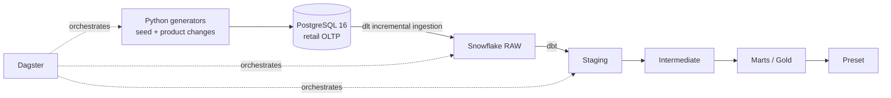

# RetailPulse Project Specification

| Field | Value |
| --- | --- |
| Status | Active |
| Version | 1.0 |
| Last updated | 2026-10-06 |
| Current implementation priority | dbt project (phase 5) |

## 1. Document Purpose

This document is the canonical product and technical specification for RetailPulse. It records
the agreed project scope, architecture, data contracts, implementation status, and acceptance
criteria. Implementation work should follow this specification unless a later decision explicitly
supersedes it.

RetailPulse is an existing project. Changes must build on the current repository and preserve the
decisions marked as finalized in this document.

## 2. Product Vision

RetailPulse is an end-to-end retail analytics portfolio project that demonstrates practical data
engineering and analytics engineering skills:

- normalized OLTP schema design;
- realistic synthetic data generation;
- incremental ingestion from PostgreSQL into Snowflake;
- dbt transformations and dimensional modeling;
- slowly changing dimension (SCD) handling;
- pipeline orchestration; and
- consumption through business intelligence dashboards.

The project is optimized for portfolio and interview use. It should be realistic enough to
demonstrate sound engineering decisions while remaining small, understandable, reproducible, and
easy to explain.

## 3. Goals and Success Criteria

The completed project must demonstrate this flow:

1. Seed a realistic historical retail dataset into PostgreSQL.
2. Simulate meaningful business changes in the source system.
3. Incrementally ingest PostgreSQL data into Snowflake with dlt.
4. Transform raw data through dbt staging, intermediate, and mart layers.
5. Preserve product and employee history through warehouse-managed SCD Type 2 models.
6. Expose analytics-ready facts and dimensions to Preset.
7. Orchestrate ingestion and transformation with Dagster.

The project is successful when the flow can be run and explained end to end, product cost history
is visible in the warehouse, historical sales and margin analysis use the correct dimensional
version, and the main pipeline behaviors are covered by focused tests and documentation.

## 4. Finalized Technology Stack

| Capability | Technology | Constraint |
| --- | --- | --- |
| Source OLTP database | PostgreSQL 16 | Runs locally through Docker Compose |
| Runtime infrastructure | Docker Compose | Kubernetes is out of scope |
| Language | Python 3.12 or 3.13 | Managed as defined in `pyproject.toml` |
| Python dependency management | uv | `uv.lock` is the reproducible lock file |
| ORM and database access | SQLAlchemy | Reuse the existing models and session factory |
| Synthetic data | Faker | Used for initial historical data generation |
| Ingestion | dlt | PostgreSQL to Snowflake |
| Cloud warehouse | Snowflake | Database `RETAIL_PULSE`, warehouse `RETAIL_WH` |
| Transformation | dbt Core with dbt-snowflake | Owns warehouse transformation and SCD logic |
| Orchestration | Dagster | Integrates dlt and dbt assets |
| BI | Preset | Reads analytics-ready mart models |
| Optional data quality | Great Expectations | Deferred until a later phase |

Replacing a finalized technology is out of scope unless the project owner explicitly requests it.

## 5. System Architecture

The warehouse follows a light medallion structure and uses Kimball-style dimensional marts:

- **RAW:** source-aligned tables landed by dlt;
- **staging:** cleaned, typed, renamed, and conformed source data;
- **intermediate:** reusable business transformations where they reduce duplication; and
- **marts/gold:** analytics-ready facts and dimensions.

## 6. Business Scope

### 6.1 In Scope

RetailPulse models point-of-sale retail activity involving:

- stores;
- employees;
- products, categories, and brands;
- promotions and product-promotion eligibility;
- payment methods;
- sales transaction headers; and
- sales transaction line items.

Primary analytics use cases include sales performance, product performance, promotion analysis,
store performance, and historical gross margin analysis.

### 6.2 Explicitly Out of Scope

The following are intentionally excluded:

- customer modeling;
- inventory modeling;
- `fact_inventory_snapshot`;
- Kubernetes;
- enterprise-scale operational complexity; and
- SCD history implemented in Python source generators.

These exclusions keep the portfolio focused. They must not be reintroduced without an explicit
scope change.

## 7. PostgreSQL Source Specification

### 7.1 Database Contract

- PostgreSQL version: 16.
- Application schema: `retail`.
- Source runtime: Docker Compose only.
- Logical replication support: enabled with `wal_level=logical`.
- Audit fields: every source table has `created_at` and `updated_at`.
- Update behavior: PostgreSQL triggers maintain `updated_at` on every row update.
- Monetary fields: `NUMERIC(12, 2)`; floating-point values must not be written to these fields.
- Time zone behavior: timestamps use `TIMESTAMPTZ`.

### 7.2 Source Entities

| Table | Business key / primary key | Purpose |
| --- | --- | --- |
| `store` | `id`; unique `store_name` | Retail locations |
| `employee` | `id` | Employees assigned to stores |
| `category` | `id`; unique `category_name` | Product classification |
| `brand` | `id`; unique `brand_name` | Product brand reference |
| `product` | `id`; unique `product_sku` | Sellable products and current price/cost |
| `promotion` | `id` | Percentage or fixed-amount promotions |
| `promotion_product` | (`product_id`, `promotion_id`) | Eligible product-promotion pairs |
| `payment_method` | `id`; unique `method` | Transaction payment reference |
| `sales_transaction` | `transaction_id` | Point-of-sale transaction header |
| `sales_transaction_item` | (`transaction_id`, `line_number`) | Point-of-sale transaction-item detail |

The source schema is normalized for OLTP usage. DDL and ORM definitions must remain aligned.

### 7.3 Source Integrity Rules Relevant to Analytics

- Product `unit_price` and `unit_cost` must be non-negative.
- Transaction item `regular_price` captures the price at the time of sale.
- Transaction item `quantity` and `line_number` must be positive.
- A promotion attached to a transaction item must be eligible for that product.
- Transaction status is one of `completed`, `cancelled`, or `returned`.
- Percentage promotions cannot exceed 100 percent.
- Employee end dates cannot precede start dates.

## 8. Data Generation

### 8.1 Initial Historical Seed

The existing `seed.py` command creates a reproducible historical baseline. It is a batch operation,
not a recurring stream.

Current default baseline:

- approximately 100,000 transactions (the observed seeded result is 100,339);
- 10 stores;
- 8 employees per store;
- 500 products;
- 40 promotions; and
- approximately 365 days of history.

The seed process must refuse to overwrite an existing database unless reset behavior is explicitly
requested.

### 8.2 Product Change Simulator (`stream.py`)

#### Purpose

`stream.py` simulates low-frequency, realistic source-side changes to existing products. Its output
provides incremental source changes for dlt and, later, successive records for the dbt product
snapshot.

It is a lightweight change simulator, not a reseed tool and not a high-volume event generator.

#### Functional Requirements

The simulator must:

1. operate only on existing rows in `retail.product`;
2. update `unit_cost` as the normal change type;
3. update `unit_price` less frequently than `unit_cost`;
4. select a small subset of products per cycle;
5. use bounded, business-plausible percentage changes;
6. round monetary values consistently and write `Decimal` values;
7. preserve non-negative price and cost values;
8. avoid changing primary keys, SKU, name, brand, or category;
9. allow the database trigger to set `updated_at`;
10. commit each successful cycle atomically;
11. provide a one-cycle mode suitable for tests, demos, and orchestration;
12. optionally repeat cycles with a configurable interval;
13. support deterministic selection and change values when a random seed is supplied;
14. report enough information to identify the cycle and changed products; and
15. exit with a clear message when no products exist.

#### Default Behavior

Defaults must favor safe local demonstration:

- one cycle unless continuous behavior is explicitly requested;
- a small number of products per cycle;
- cost-only changes in most cases;
- price changes controlled by a low probability; and
- no inserts, deletes, or changes to other tables.

Exact CLI flag names, numeric bounds, default batch size, price-change probability, and interval
remain implementation details until `stream.py` is implemented. They must be documented in
`--help` and covered by tests once chosen.

#### Failure and Transaction Behavior

- Invalid arguments must fail before any database mutation.
- A failed cycle must roll back all changes from that cycle.
- Database connection and constraint errors must produce a non-zero exit status.
- Interrupting a repeating run must stop cleanly without corrupting a committed cycle.

#### Acceptance Criteria

Given a seeded database, one simulator cycle is accepted when:

- the configured number of distinct existing products is updated, capped by the available count;
- most changed rows have a different `unit_cost`;
- `unit_price` changes only according to the configured low-probability rule;
- no table other than `retail.product` is changed;
- product identity and classification fields remain unchanged;
- every changed row receives a newer `updated_at` from PostgreSQL;
- all monetary constraints remain valid;
- the command terminates after one cycle by default; and
- the same initial data and random seed produce the same selected products and values.

Unit tests should cover calculation, rounding, bounds, deterministic random behavior, and argument
validation. A PostgreSQL integration test should cover persistence, trigger-driven `updated_at`,
transaction rollback, and the product-only scope.

## 9. Ingestion Specification

### 9.1 dlt Pipeline Contract

- Pipeline name: `retail_oltp_to_snowflake`.
- Destination: Snowflake.
- Database: `RETAIL_PULSE`.
- Dataset/schema: `RAW` (configured as `raw` in dlt).
- Warehouse: `RETAIL_WH`.
- Loader role: `LOADER`.
- Loader service user: `DLT_LOADER`.
- Authentication: key pair.

### 9.2 Load Strategies

| Source table | Strategy | Merge key / cursor |
| --- | --- | --- |
| `sales_transaction` | Incremental merge | `transaction_id` / `updated_at` |
| `sales_transaction_item` | Incremental merge | (`transaction_id`, `line_number`) / `updated_at` |
| `product` | Incremental merge | `id` / `updated_at` |
| `employee` | Incremental merge | `id` / `updated_at` |
| `store` | Replace | Full table |
| `category` | Replace | Full table |
| `brand` | Replace | Full table |
| `payment_method` | Replace | Full table |
| `promotion` | Replace | Full table |
| `promotion_product` | Replace | Full table |

Incremental ingestion is phase 1. CDC is a later extension and must not block the initial end-to-end
demo. Cleaning or full-refresh operations must preserve the `RAW` schema so existing Snowflake
grants remain valid; temporary `RAW_STAGING` artifacts may be cleaned separately.

## 10. Warehouse and dbt Specification

### 10.1 Model Layers

Staging models must provide source-aligned cleanup and type normalization without embedding mart
business logic. Intermediate models are optional and should exist only for reusable transformations.
Mart models must expose stable analytics contracts to Preset.

### 10.2 Planned Gold Models

| Model | Grain | History strategy |
| --- | --- | --- |
| `fact_sales` | One transaction item | No SCD |
| `dim_product` | One product version | SCD Type 2 |
| `dim_employee` | One employee version | SCD Type 2 |
| `dim_store` | One store | Static or Type 1 |
| `dim_date` | One calendar date | Static |
| `dim_promotion` | One promotion | Static or Type 1 |
| `dim_payment_method` | One payment method | Static or Type 1 |

### 10.3 Fact Sales Contract

`fact_sales` must use transaction-item grain. It should retain identifiers needed to trace a fact
back to the source transaction and line number and provide dimension keys for date, product,
employee, store, promotion, and payment method where applicable.

Measures should support at least quantity, regular sales value, discount value, net sales value,
cost, and gross margin. The precise treatment of cancelled and returned transactions, promotion
calculation, and unknown dimension members must be finalized before the mart is implemented.

### 10.4 SCD Type 2 Ownership

SCD history belongs exclusively to dbt snapshots and downstream dbt models:

- `product`: Type 2 history is required, with `unit_cost` as the primary demonstrated change and
  `unit_price` also tracked when it changes;
- `employee`: Type 2 history is required for historically relevant changes such as store assignment
  and employment attributes;
- source-side Python code performs ordinary business updates only; and
- source generators must never create SCD validity columns or historical duplicate rows.

Snapshots should use source `updated_at` timestamps where appropriate. Snapshot configuration,
surrogate key strategy, validity boundary conventions, and point-in-time fact joins must be stated
in the dbt model documentation when implemented.

## 11. Orchestration Specification

Dagster is introduced after ingestion and dbt models work independently. It must represent dlt and
dbt work as observable assets and preserve their native responsibilities.

The initial orchestration scope is:

1. run the PostgreSQL-to-Snowflake dlt ingestion;
2. run dbt snapshots after successful ingestion;
3. run dbt models and tests after successful snapshots; and
4. expose run status and materialization metadata through Dagster.

Scheduling frequency, retry policy, sensors, alerting, and deployment topology are TBD. The product
simulator must be runnable independently and may later be scheduled as a separate upstream step.

## 12. BI Specification

Preset must query dbt mart models, not PostgreSQL or raw dlt tables. Initial dashboard subjects are:

- revenue and sales trends;
- product and category performance;
- store performance;
- promotion effectiveness; and
- gross margin over time using historical product cost.

Dashboard layout, exact metrics, filters, and refresh expectations are TBD until mart contracts are
finalized.

## 13. Quality Attributes

### 13.1 Maintainability

- Prefer straightforward code and explicit data contracts.
- Reuse existing project patterns and configuration.
- Keep source generation, ingestion, transformation, orchestration, and BI concerns separate.
- Avoid abstractions that do not improve the portfolio narrative or remove meaningful duplication.

### 13.2 Reproducibility

- Dependencies are installed through uv.
- PostgreSQL runs through the checked-in Docker Compose configuration.
- Initial seed generation supports deterministic random seeding.
- Product simulation supports deterministic runs for testing.
- Environment-specific credentials remain outside version control.

### 13.3 Data Quality

At minimum, tests should cover:

- primary key uniqueness and non-nullness;
- accepted categorical values;
- source relationship integrity;
- non-negative monetary measures;
- transaction-item grain in `fact_sales`;
- valid and non-overlapping SCD2 intervals per business key; and
- fact-to-dimension referential integrity.

dbt tests are required for transformed models. Great Expectations is optional and deferred.

### 13.4 Security and Cost Control

- Secrets and private keys must not be committed.
- dlt uses the least-privilege `LOADER` role.
- dbt uses a separate transformation role.
- Snowflake development resources should remain small and auto-suspend when idle.

## 14. Delivery Phases and Current Status

| Phase | Deliverable | Status |
| --- | --- | --- |
| 1 | PostgreSQL schema, ORM, and Docker Compose | Complete |
| 2 | Historical seed generator | Complete |
| 3 | dlt full and incremental ingestion to Snowflake RAW | Complete and working |
| 4 | Product-only source change simulator | Complete |
| 5 | dbt project, sources, staging, snapshots, and marts | Pending |
| 6 | Dagster asset orchestration | Pending |
| 7 | Preset dashboards | Pending |
| 8 | Great Expectations extension | Optional / deferred |

## 15. Repository Contracts

Existing implementation locations:

- `infras/docker-compose.yml`: local PostgreSQL runtime;
- `infras/postgres/init/01_schema.sql`: source DDL, constraints, indexes, and triggers;
- `src/retail_pulse/oltp/db.py`: SQLAlchemy engine, settings, and session factory;
- `src/retail_pulse/oltp/models.py`: ORM schema;
- `src/retail_pulse/generator/common.py`: shared random source and money rounding;
- `src/retail_pulse/generator/seed.py`: historical seed generation;
- `src/retail_pulse/generator/stream.py`: product change simulator;
- `src/retail_pulse/ingestion/pipelines.py`: dlt source and pipeline;
- `src/retail_pulse/ingestion/clean.py`: dlt/Snowflake cleanup operations;
- `tests/`: pytest suites; `conftest.py` provisions a disposable PostgreSQL test database;
- `docs/README.md`: documentation index and phase roadmap;
- `docs/phases/`: per-phase run and verification guides;
- `docs/design/`: component design and implementation notes;
- `Makefile`: local developer commands; and
- `pyproject.toml`: package metadata, commands, dependencies, and tool configuration.

New work should extend these locations and naming conventions rather than duplicate them.

## 16. Definition of Done

A feature is done when:

- behavior matches this specification and the established architecture;
- focused automated tests cover normal behavior and important failure paths;
- linting and relevant test suites pass;
- operational commands and configuration are documented;
- no secrets or local runtime artifacts are introduced into version control; and
- the feature can be demonstrated and explained as part of the end-to-end portfolio narrative.

The complete project is done when a user can seed PostgreSQL, create product changes, incrementally
load Snowflake, build dbt snapshots and marts, inspect the pipeline in Dagster, and explore the
resulting analytics in Preset.

## 17. Decision Log

| Decision | Status | Rationale |
| --- | --- | --- |
| Docker Compose only; no Kubernetes | Final | Appropriate operational scope for a portfolio project |
| dlt for PostgreSQL-to-Snowflake ingestion | Final | Existing implementation is working |
| Transaction-item grain for `fact_sales` | Final | Supports granular POS analysis |
| Product and employee as SCD Type 2 | Final | Their changes affect historical interpretation |
| Other dimensions static or Type 1 | Final | Additional history is not justified by current scope |
| dbt snapshots own SCD history | Final | Separates source behavior from warehouse history management |
| `stream.py` changes products only | Final for current phase | Focuses the demo on meaningful cost history |
| Inventory and customer domains excluded | Final | Prevents unnecessary project expansion |
| Incremental ingestion before CDC | Final | Delivers a coherent end-to-end path before advanced expansion |

Any change to a final decision must be explicit and should update this log, the affected acceptance
criteria, and the implementation documentation in the same change.
