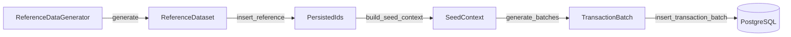
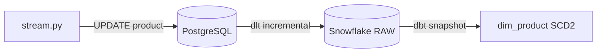
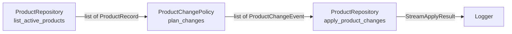

# Data flow của seed.py và stream.py

*Một bài walkthrough kỹ thuật: mỗi class giữ gì, làm gì, và trả ra object nào cho bước kế tiếp.*

---

Khi tách một script sinh dữ liệu thành nhiều class, câu hỏi khó nhất không phải là "đặt tên class là gì", mà là:

> **Ở mỗi bước, dữ liệu đang ở dạng nào, nằm ở đâu, và bước sau cần nhận gì?**

Project có hai job sinh dữ liệu với hai mục đích khác nhau, nên thiết kế cũng khác nhau:

| | `seed.py` | `stream.py` |
|---|---|---|
| Mục đích | Dựng dữ liệu nền ban đầu | Mô phỏng thay đổi nhỏ trên dữ liệu có sẵn |
| Khối lượng | Lớn (~100k transaction) | Nhỏ (vài product mỗi lần chạy) |
| Bảng bị ảnh hưởng | Tất cả | Chỉ `product` |
| Thao tác | `INSERT` | `UPDATE` |
| Độ phức tạp thiết kế | Nhiều bước, nhiều class | Mỏng, ít abstraction |

Phần 1 đi qua `seed.py`, phần 2 đi qua `stream.py`. Cả hai đều theo cùng cách nhìn: mỗi thành phần có **state** (giữ gì), **behavior** (làm gì) và **output** (trả ra gì).

---

# Phần 1: `seed.py`

## TL;DR



| Bước | Thành phần | Input | Output |
|---|---|---|---|
| 1 | `ReferenceDataGenerator.generate()` | config, random source | `ReferenceDataset` |
| 2 | `SeedRepository.insert_reference()` | `ReferenceDataset` | `PersistedIds` |
| 3 | `build_seed_context()` | dataset, ids, config | `SeedContext` |
| 4 | `TransactionGenerator.generate_batches()` | `SeedContext` | iterator của `TransactionBatch` |
| 5 | `SeedRepository.insert_transaction_batch()` | `TransactionBatch` | thống kê insert (hoặc `None`) |

Pseudo-flow của cả job:

```python
dataset = reference_generator.generate()
ids = repository.insert_reference(dataset)
ctx = build_seed_context(dataset=dataset, ids=ids, config=config)

for batch in transaction_generator.generate_batches(ctx):
    repository.insert_transaction_batch(batch)
```

Đọc đoạn này mà thấy rõ 5 bước ở trên thì thiết kế đang ổn.

---

## 1. `ReferenceDataGenerator`: sinh dữ liệu nền trong bộ nhớ

Class này chỉ làm một việc: tạo dữ liệu tham chiếu (store, employee, product, promotion, payment method). **Không đụng đến database.**

**State**

| Thuộc tính | Vai trò |
|---|---|
| `config` | Số store, số employee mỗi store, random seed... |
| `random_source` | Bọc `random.Random(seed)` và `Faker` để kết quả tái lập được |
| Các hằng số sinh dữ liệu | Khoảng giá product, tỉ lệ cost/price, danh sách category... |

**Behavior**

```python
class ReferenceDataGenerator:
    def __init__(self, config: SeedConfig, rnd: RandomSource) -> None: ...

    def generate(self) -> ReferenceDataset: ...
```

**Output:** một `ReferenceDataset`. Điểm cần nhớ: dữ liệu ở đây **chỉ có business key** (`store_code`, `sku`...), chưa có ID do database sinh.

---

## 2. `ReferenceDataset`: data container thuần

Đây chỉ là nơi gom các nhóm dữ liệu chưa persist. Dùng `dataclass` là đủ:

```python
@dataclass(frozen=True)
class ReferenceDataset:
    stores: list[StoreDraft]
    employees: list[EmployeeDraft]
    products: list[ProductDraft]
    promotions: list[PromotionDraft]
    payment_methods: list[PaymentMethodDraft]
```

Ví dụ nội dung (rút gọn):

```python
ReferenceDataset(
    stores=[StoreDraft(store_code="S001", store_name="RetailPulse Q1")],
    employees=[EmployeeDraft(employee_code="E001", store_code="S001", full_name="Nguyen Van A")],
    products=[ProductDraft(sku="P001", product_name="Sua tuoi 1L", unit_cost=18000, unit_price=25000)],
    promotions=[PromotionDraft(promotion_code="PROMO10", discount_pct=10)],
    payment_methods=[PaymentMethodDraft(code="CASH", name="Tien mat")],
)
```

Vài lưu ý thiết kế:

- Nên để `frozen=True`. Dataset là dữ liệu đầu vào cho repository, không có lý do để bị sửa giữa chừng.
- Quan hệ giữa các draft đi qua **business key** (`employee.store_code`), không qua ID. Vì ID chưa tồn tại.
- Class này gần như không có method. Nếu cần, chỉ nên có `summary()` hoặc `validate()`.

---

## 3. `SeedRepository.insert_reference()`: persist và lấy ID thật

Đây là chỗ duy nhất (cùng với `insert_transaction_batch`) được phép nói chuyện với database.

**State**

| Thuộc tính | Vai trò |
|---|---|
| `session` / `engine` | Kết nối tới PostgreSQL qua SQLAlchemy |
| `logger` | Ghi lại số dòng đã insert |

**Behavior**

```python
class SeedRepository:
    def insert_reference(self, dataset: ReferenceDataset) -> PersistedIds: ...
    def insert_transaction_batch(self, batch: TransactionBatch) -> InsertStats: ...
```

Thứ tự insert phải tôn trọng foreign key: `store` → `employee`, `category` → `product`, còn `promotion` và `payment_method` độc lập. Sau mỗi nhóm cần `flush()` để ORM điền primary key vào object, rồi mới đọc ID ra.

**Output:** `PersistedIds`.

---

## 4. `PersistedIds`: cầu nối từ business key sang ID thật

Lúc generator tạo store, nó chỉ biết `store_code="S001"`. Sau khi insert, database mới cấp `store_id=101`. Từ đây về sau, mọi bảng con (transaction, transaction_item) phải tham chiếu bằng `101`.

```python
@dataclass(frozen=True)
class PersistedIds:
    store_ids: dict[str, int]            # store_code -> store_id
    employee_ids: dict[str, int]         # employee_code -> employee_id
    product_ids: dict[str, int]          # sku -> product_id
    promotion_ids: dict[str, int]        # promotion_code -> promotion_id
    payment_method_ids: dict[str, int]   # code -> payment_method_id
```

```python
PersistedIds(
    store_ids={"S001": 101, "S002": 102},
    employee_ids={"E001": 1001, "E002": 1002},
    product_ids={"P001": 5001, "P002": 5002},
    promotion_ids={"PROMO10": 301},
    payment_method_ids={"CASH": 1, "CARD": 2},
)
```

Đây là các dict thuần. Nếu muốn, thêm helper kiểu `get_store_id(code)` để lỗi `KeyError` có message rõ ràng hơn.

---

## 5. `SeedContext`: lookup sẵn sàng cho transaction generator

`PersistedIds` là mapping **một chiều theo code**. Nhưng transaction generator cần những câu hỏi khác, ví dụ "store 101 có những employee nào?" hay "product 5001 giá bao nhiêu?". `SeedContext` chính là kết quả của việc **biến đổi** dataset + ids thành các cấu trúc tra cứu nhanh.

```python
@dataclass(frozen=True)
class SeedContext:
    store_ids: list[int]
    employee_ids_by_store: dict[int, list[int]]
    product_ids_by_category: dict[int, list[int]]
    product_price_lookup: dict[int, tuple[Decimal, Decimal]]  # product_id -> (unit_price, unit_cost)
    payment_method_ids: list[int]
    active_promotion_ids: list[int]
    dates: list[date]
```

Hàm dựng context:

```python
def build_seed_context(
    dataset: ReferenceDataset,
    ids: PersistedIds,
    config: SeedConfig,
) -> SeedContext:
    employee_ids_by_store: dict[int, list[int]] = defaultdict(list)
    for emp in dataset.employees:
        store_id = ids.store_ids[emp.store_code]
        employee_ids_by_store[store_id].append(ids.employee_ids[emp.employee_code])

    price_lookup = {
        ids.product_ids[p.sku]: (p.unit_price, p.unit_cost)
        for p in dataset.products
    }
    ...
```

Điểm đáng để ý:

- `SeedContext` **không** chứa lại list object ban đầu. Nó chỉ chứa ID và index, đúng thứ generator cần.
- Join giữa `employee.store_code` và `store_ids` xảy ra **một lần ở đây**, nên vòng lặp sinh hàng trăm nghìn transaction không phải tra cứu lại.
- `build_seed_context` là hàm thuần (không I/O), nên rất dễ unit test với dataset và ids giả.

---

## 6. `TransactionGenerator`: nơi chứa logic bán hàng

Đây là class có nhiều business logic nhất. Nó chỉ đọc `SeedContext`, không chạm database.

**State**

| Thuộc tính | Vai trò |
|---|---|
| `config` | Số giao dịch mục tiêu, `batch_size`, số item tối đa mỗi đơn |
| `random_source` | Cùng nguồn random với toàn job |
| Các rule nội bộ | Giờ cao điểm, phân bố quantity, xác suất áp promotion |

**Behavior**

```python
class TransactionGenerator:
    def __init__(self, config: SeedConfig, rnd: RandomSource) -> None: ...

    def generate_batches(self, ctx: SeedContext) -> Iterator[TransactionBatch]: ...
```

Nên trả về **iterator** thay vì một list lớn. Với khoảng 100k transaction, sinh tới đâu ghi tới đó giúp giữ memory ổn định và batch size điều khiển được qua config.

**Output:** từng `TransactionBatch`. Mỗi batch gồm header và các line item:

```python
TransactionDraft(
    store_id=101,
    employee_id=1001,
    payment_method_id=1,
    promotion_id=None,
    sold_at=datetime(2024, 1, 1, 9, 15),
    items=[
        ItemDraft(product_id=5001, quantity=2, unit_price=25000, unit_cost=18000),
        ItemDraft(product_id=5002, quantity=1, unit_price=18000, unit_cost=12000),
    ],
)
```

Lưu ý: `unit_price` và `unit_cost` lấy từ `product_price_lookup` tại thời điểm sinh. Đây là **snapshot giá lúc bán**, nên về sau dù `stream.py` có đổi giá product thì transaction cũ vẫn đúng.

---

## 7. `SeedRepository.insert_transaction_batch()`: ghi từng lô

Nhận một batch và ghi vào `transaction` cùng `transaction_item`.

Output tùy thiết kế, nhưng nên trả về một object thống kê nhỏ để coordinator log được tiến độ:

```python
@dataclass(frozen=True)
class InsertStats:
    inserted_transactions: int
    inserted_line_items: int
```

Về mặt kỹ thuật, một vài điểm thực tế:

- **Một batch = một transaction DB.** Commit sau mỗi batch, rollback nguyên batch nếu lỗi.
- Với khối lượng lớn, cân nhắc `session.execute(insert(...), list_of_dicts)` (bulk insert) thay vì add từng ORM object.
- Cần `flush()` sau khi insert header nếu line item phải tham chiếu `transaction_id` do DB sinh.

---

## 8. Ghép lại: `SeedCoordinator`

Coordinator không chứa logic sinh dữ liệu. Nó chỉ nối các bước theo đúng thứ tự:

```python
class SeedCoordinator:
    def run(self) -> None:
        dataset = self.reference_generator.generate()
        ids = self.repository.insert_reference(dataset)
        ctx = build_seed_context(dataset, ids, self.config)

        total = 0
        for batch in self.transaction_generator.generate_batches(ctx):
            stats = self.repository.insert_transaction_batch(batch)
            total += stats.inserted_transactions
            self.logger.info("Inserted %d transactions so far", total)
```

Và `seed.py` trở thành entrypoint mỏng:

```python
def main() -> None:
    config = SeedConfig.from_env()
    SeedCoordinator.from_config(config).run()
```

---

## Những lỗi thường gặp

| Lỗi | Hậu quả | Cách tránh |
|---|---|---|
| Build `SeedContext` ngay từ generator | Context chứa dữ liệu chưa có ID thật | Luôn đi qua `PersistedIds` |
| Generator tự commit DB | Khó test, khó rollback | Mọi thao tác DB đi qua `SeedRepository` |
| Dùng `Faker()` / `random` rải rác | Không tái lập được dữ liệu | Mọi random đi qua `RandomSource` |
| Trả cả list transaction một lần | Tốn memory | Trả `Iterator[TransactionBatch]` |
| Thêm cả `end_date` lẫn `num_days` vào config | Hai giá trị dễ lệch nhau | Giữ `start_date` + `num_days`, suy ra phần còn lại |

---

## Tóm tắt Phần 1

Toàn bộ thiết kế của `seed.py` quy về một quy tắc: **mỗi object chỉ giữ dữ liệu ở đúng một trạng thái**.

```text
ReferenceDataset  →  dữ liệu chưa persist, định danh bằng business key
PersistedIds      →  mapping business key → ID thật trong DB
SeedContext       →  lookup đã index sẵn cho việc sinh transaction
TransactionBatch  →  dữ liệu giao dịch chờ ghi
```

Khi ranh giới này rõ, mỗi bước đều test được độc lập.

---

# Phần 2: `stream.py`

## Vai trò: tạo ra thay đổi, không ghi nhận lịch sử

`stream.py` **không làm SCD2**. Nó chỉ `UPDATE` bảng `product` ở PostgreSQL nguồn: đổi `unit_cost` là chính, thỉnh thoảng mới đổi `unit_price`. Việc lưu lịch sử thuộc về hai thành phần khác:

- `dlt` mang dữ liệu đã đổi sang Snowflake (incremental theo `updated_at`)
- `dbt snapshot` ghi nhận các phiên bản cũ và mới (SCD2)



Vì `updated_at` đã được database tự cập nhật, code Python **không cần tự set** cột này. Một `UPDATE` thuần SQL cũng đủ để dlt nhìn thấy dòng thay đổi.

## Flow



```python
products = repository.list_active_products()
events = policy.plan_changes(products, config)
result = repository.apply_product_changes(events)
logger.info(result)
```

| Bước | Thành phần | Input | Output |
|---|---|---|---|
| 1 | `ProductRepository.list_active_products()` | không | `list[ProductRecord]` |
| 2 | `ProductChangePolicy.plan_changes()` | products, config | `list[ProductChangeEvent]` |
| 3 | `ProductRepository.apply_product_changes()` | events | `StreamApplyResult` |

Mỗi bước có input và output kiểu rõ ràng, nên có thể test từng bước độc lập. Đặc biệt `plan_changes` là hàm thuần (không I/O), test bằng danh sách product giả là đủ.

## 1. `StreamConfig`

Các tham số điều khiển mức độ và tần suất thay đổi.

```python
@dataclass(frozen=True)
class StreamConfig:
    max_products_per_tick: int = 5
    cost_change_pct_min: float = 0.01
    cost_change_pct_max: float = 0.05
    price_change_probability: float = 0.10   # xác suất đổi thêm unit_price khi một product được chọn
    price_change_pct_min: float = 0.01
    price_change_pct_max: float = 0.08
    min_hours_between_changes: int = 24      # cooldown cho mỗi product
    interval_seconds: int = 30               # chỉ dùng khi chạy loop
    random_seed: int | None = None
```

Hai tham số đáng chú ý:

- `price_change_probability` thể hiện đúng yêu cầu "ưu tiên đổi cost, hiếm khi đổi price". Mọi product được chọn đều đổi `unit_cost`, nhưng chỉ khoảng 10% trong số đó đổi thêm `unit_price`.
- `min_hours_between_changes` là cooldown. Lý do kỹ thuật nằm ở phần "Lưu ý về SCD2" bên dưới.

## 2. `ProductRecord`

Ảnh chụp trạng thái hiện tại của một product, đọc từ database.

```python
@dataclass(frozen=True)
class ProductRecord:
    product_id: int
    sku: str
    product_name: str
    unit_cost: Decimal
    unit_price: Decimal
    updated_at: datetime
```

## 3. `ProductChangeEvent`

Object trung tâm của `stream.py`: mô tả **một thay đổi cụ thể**, gồm cả giá trị cũ và mới.

```python
@dataclass(frozen=True)
class ProductChangeEvent:
    product_id: int
    old_unit_cost: Decimal
    new_unit_cost: Decimal
    old_unit_price: Decimal
    new_unit_price: Decimal
    reason: str  # ví dụ: "supplier_cost_adjustment", "price_revision"
```

Tách event ra khỏi bước `UPDATE` mang lại ba lợi ích:

- Policy chỉ **quyết định**, không biết gì về database.
- Repository chỉ **thực thi** event, không chứa luật nghiệp vụ.
- Log in thẳng event, nên thấy ngay "đổi từ giá trị nào sang giá trị nào".

Nếu một thay đổi không đụng đến `unit_price` thì `new_unit_price == old_unit_price`.

## 4. `ProductChangePolicy`

Chứa toàn bộ luật nghiệp vụ. Không có kết nối DB, không có I/O.

```python
class ProductChangePolicy:
    def __init__(self, rnd: RandomSource) -> None: ...

    def plan_changes(
        self,
        products: list[ProductRecord],
        config: StreamConfig,
    ) -> list[ProductChangeEvent]: ...
```

Các luật nên có:

| Luật | Mục đích |
|---|---|
| Chọn tối đa `max_products_per_tick` product mỗi lần | Giữ khối lượng thay đổi nhỏ |
| Loại product vừa đổi trong `min_hours_between_changes` giờ | Tránh đổi dồn dập trên cùng một product |
| `unit_cost` đổi trong khoảng `cost_change_pct_min..max` (tăng hoặc giảm) | Biến động thực tế, không đột ngột |
| `unit_price` chỉ đổi với xác suất `price_change_probability` | Giá bán ít đổi hơn giá vốn |
| Ràng buộc `new_unit_price >= new_unit_cost` | Không tạo ra margin âm vô lý |
| Làm tròn giá theo đơn vị hợp lý (ví dụ bội số của 100 VND) | Giá trông thật hơn |

Phác thảo một event cho một product:

```python
def _build_event(self, p: ProductRecord, cfg: StreamConfig) -> ProductChangeEvent:
    cost_factor = 1 + self.rnd.signed_pct(cfg.cost_change_pct_min, cfg.cost_change_pct_max)
    new_cost = round_to_step(p.unit_cost * Decimal(cost_factor), step=100)

    new_price = p.unit_price
    reason = "supplier_cost_adjustment"
    if self.rnd.chance(cfg.price_change_probability):
        price_factor = 1 + self.rnd.signed_pct(cfg.price_change_pct_min, cfg.price_change_pct_max)
        new_price = round_to_step(p.unit_price * Decimal(price_factor), step=100)
        reason = "price_revision"

    new_price = max(new_price, new_cost)   # không để price thấp hơn cost
    return ProductChangeEvent(p.product_id, p.unit_cost, new_cost, p.unit_price, new_price, reason)
```

(`signed_pct` và `chance` là hai helper giả định trên `RandomSource`, trả về phần trăm có dấu ngẫu nhiên và kết quả đúng/sai theo xác suất.)

## 5. `ProductRepository`

Lớp duy nhất nói chuyện với PostgreSQL trong `stream.py`.

```python
class ProductRepository:
    def __init__(self, session_factory: sessionmaker) -> None: ...

    def list_active_products(self) -> list[ProductRecord]: ...

    def apply_product_changes(
        self, events: list[ProductChangeEvent]
    ) -> StreamApplyResult: ...
```

```python
@dataclass(frozen=True)
class StreamApplyResult:
    updated_products: int
```

Điểm kỹ thuật khi viết `apply_product_changes`:

- Toàn bộ events của một tick nằm trong **một transaction DB**. Hoặc thành công hết, hoặc rollback hết.
- Chỉ `UPDATE` hai cột `unit_cost` và `unit_price`. **Không set `updated_at`** vì database đã lo.
- Nếu muốn an toàn khi có nhiều tiến trình cùng chạy, thêm điều kiện `WHERE product_id = :id AND unit_cost = :old_unit_cost` (optimistic check). Với scope hiện tại một tiến trình thì chưa cần.
- Nếu `events` rỗng thì trả về `StreamApplyResult(0)` mà không mở transaction.

## 6. `StreamRunner`

Điều phối, không chứa luật.

```python
@dataclass(frozen=True)
class StreamTickResult:
    scanned_products: int
    planned_events: int
    applied_events: int


class StreamRunner:
    def __init__(self, repo: ProductRepository, policy: ProductChangePolicy,
                 config: StreamConfig, logger: logging.Logger) -> None: ...

    def run_once(self) -> StreamTickResult:
        products = self.repo.list_active_products()
        events = self.policy.plan_changes(products, self.config)
        result = self.repo.apply_product_changes(events)
        for e in events:
            self.logger.info(
                "product %s cost %s -> %s, price %s -> %s (%s)",
                e.product_id, e.old_unit_cost, e.new_unit_cost,
                e.old_unit_price, e.new_unit_price, e.reason,
            )
        return StreamTickResult(len(products), len(events), result.updated_products)

    def run_forever(self) -> None:
        while True:
            self.run_once()
            time.sleep(self.config.interval_seconds)
```

`run_once()` dùng để test local và để Dagster gọi sau này. `run_forever()` dùng khi muốn mô phỏng micro-batch liên tục. Nên bắt `KeyboardInterrupt` và lỗi DB trong vòng lặp để process thoát gọn.

## Bố cục file

Giai đoạn đầu có thể để tất cả trong một file `stream.py`:

```text
src/retail_pulse/generator/
└── stream.py
    ├── StreamConfig            (dataclass)
    ├── ProductRecord           (dataclass)
    ├── ProductChangeEvent      (dataclass)
    ├── StreamApplyResult       (dataclass)
    ├── StreamTickResult        (dataclass)
    ├── ProductRepository
    ├── ProductChangePolicy
    └── StreamRunner
```

Khi file lớn lên, tách dataclass sang `stream_models.py` trước, rồi mới tính đến việc tách repository.

Chưa cần các lớp như `PriceCalculator`, `RandomSelector`, `EventPublisher`, `ChangeValidator`, `StreamStateManager`. Với scope "chỉ đổi giá product", thêm chúng chỉ làm code nặng hơn nhu cầu thật.

## Lưu ý về SCD2 khi thiết kế tần suất thay đổi

`dbt snapshot` chỉ nhìn thấy dữ liệu **tại thời điểm snapshot chạy**. Nếu một product bị `stream.py` đổi giá 3 lần giữa hai lần ingest, snapshot chỉ ghi nhận trạng thái cuối, hai trạng thái trung gian bị mất.

Với mục tiêu demo SCD2 cho `dim_product`, hệ quả thiết kế là:

- Dùng `min_hours_between_changes` để mỗi product đổi **tối đa một lần giữa hai chu kỳ ingest + snapshot**.
- Chọn `interval_seconds` và lịch chạy ingest sao cho mỗi product có thời gian "đứng yên" đủ lâu.
- Đây cũng là điểm khác biệt đáng nhắc khi so sánh snapshot theo batch với CDC thật (CDC bắt được mọi thay đổi trung gian), và là chủ đề hay cho phase 2.

---

# Phần 3: Hiện thực và kiểm thử

Phần 1 và 2 là thiết kế. Phần này ghi lại code thực tế khớp với thiết kế đến đâu và khác ở chỗ nào.

## Bố cục code

```text
src/retail_pulse/generator/
├── common.py   RandomSource (random.Random + Faker có seed, chance, signed_pct), round_to_step, TZ
├── seed.py     SeedConfig, *Draft, ReferenceDataset, ReferenceDataGenerator, PersistedIds,
│               SeedContext, build_seed_context, TransactionBatch, TransactionGenerator,
│               InsertStats, SeedRepository, SeedCoordinator, main
└── stream.py   StreamConfig, ProductRecord, ProductChangeEvent, StreamApplyResult,
                StreamTickResult, ProductChangePolicy, ProductRepository, StreamRunner, main
```

Cả hai job nhận `session_factory` từ ngoài (`SeedCoordinator.from_config(config, session_factory)`,
`StreamRunner.from_config(config, session_factory)`). Chạy thật thì dùng `SessionLocal`, test thì
truyền session factory trỏ vào database test.

## Khác biệt so với thiết kế

| Thiết kế | Hiện thực | Lý do |
|---|---|---|
| Business key `store_code`, `employee_code`, `promotion_code` | `store_name`, `product_sku`, `category_name`, `brand_name`; employee và promotion map ID **theo thứ tự** (`list[int]`) | Schema thật không có các cột code; employee/promotion không có business key |
| `SeedContext` có `product_ids_by_category`, `dates`... | Có `employees_by_store` kèm ngày vào/nghỉ, `promotions_by_product` kèm hiệu lực, `product_prices` | Đúng những gì TransactionGenerator cần tra cứu |
| `TransactionDraft` / `ItemDraft` dạng dataclass | `TransactionBatch` chứa dict sẵn để bulk insert | Tránh chi phí chuyển đổi cho ~100k đơn / ~280k dòng |
| `insert_reference(dataset)` | `insert_reference(dataset, reset=...)` | Reset (TRUNCATE) và insert danh mục nằm chung một transaction |
| `ProductChangeEvent` không có SKU | Có `sku` | Log đủ thông tin nhận diện product (spec 8.2, yêu cầu 14) |
| Optimistic check "chưa cần" | Đã có: `WHERE unit_cost = old AND unit_price = old`, sai thì rollback cả tick | Rẻ, an toàn khi lỡ chạy hai tiến trình |
| Giá làm tròn 100đ | Giá vốn 100đ, giá bán 1.000đ | Khớp với cách seed sinh giá ban đầu |

Các luật bảo vệ trong `ProductChangePolicy`: biến động quá nhỏ so với bước làm tròn thì vẫn dịch
ít nhất 1 bước (để `unit_cost` luôn đổi); giá bán giảm không thấp hơn giá vốn hiện tại; giá vốn mới
bị chặn bởi giá bán mới; không giá trị nào âm. Chọn product sau khi sắp theo `id` nên cùng dữ liệu
và cùng `--seed` cho cùng kết quả.

## Testing

```bash
make test                 # = make up + uv run pytest
uv run pytest -k seed     # chỉ test seed
```

**Database test.** `tests/conftest.py` tạo database riêng `<PG_DB>_test` (đổi bằng `PG_TEST_DB`)
trên Postgres đang chạy, nạp `infras/postgres/init/01_schema.sql`, TRUNCATE mọi bảng sau mỗi test
và xóa database khi kết thúc. Không dùng SQLite vì schema dựa vào tính năng riêng của PostgreSQL
(schema `retail`, IDENTITY, trigger `updated_at`, `INSERT ... RETURNING` giữ thứ tự). Không dùng
"rollback sau mỗi test" vì generator tự commit theo từng transaction, và đó chính là hành vi cần test.
Postgres chưa bật thì các test cần DB bị skip, unit test vẫn chạy.

| File | Không cần DB | Cần DB |
|---|---|---|
| `tests/test_seed.py` | dataset tái lập được; hình dạng dataset; `build_seed_context` map key → ID; chia batch và tái lập; validate tham số | số dòng danh mục; số giao dịch gần mục tiêu; `product_name` khớp brand; nhân viên đúng cửa hàng và đang làm việc; line_number liên tục; `regular_price` = giá lúc bán; promotion còn hiệu lực; không có FK mồ côi; ngày bán nằm trong `start..end`, giờ 7h–21h; từ chối DB có dữ liệu, `--reset` cho lại đúng dữ liệu cũ |
| `tests/test_stream.py` | tái lập theo seed; số product chọn bị chặn bởi số có sẵn; cooldown; biên độ và làm tròn; xác suất đổi giá bán; không margin âm; validate tham số | một cycle chỉ đổi đúng N product, giữ nguyên SKU/tên/brand/category, trigger cập nhật `updated_at`, không bảng nào khác đổi; rollback cả tick khi lỗi; chạy N cycle với `time.sleep` bị mock; DB trống báo lỗi rõ |

Không có test cho khách hàng, đơn hàng mới hay trạng thái `pending` trong stream: theo spec, domain
customer bị loại khỏi scope, `stream.py` chỉ đổi product, và trạng thái hợp lệ chỉ là
`completed` / `cancelled` / `returned` (spec mục 7 và decision log).

---

# Kết

Cả hai job đều theo cùng một nguyên tắc: **mỗi object chỉ giữ dữ liệu ở đúng một trạng thái, và mỗi class có đúng một trách nhiệm**.

```text
seed.py    →  INSERT khối lượng lớn, đi qua ReferenceDataset → PersistedIds → SeedContext → TransactionBatch
stream.py  →  UPDATE khối lượng nhỏ, đi qua ProductRecord → ProductChangeEvent → StreamApplyResult
```

Điểm chung: phần **quyết định** (generator, policy) tách khỏi phần **ghi database** (repository), và một lớp điều phối mỏng (`SeedCoordinator`, `StreamRunner`) nối các bước lại. Nhờ vậy mỗi phần test được riêng, và hai job có thể dùng chung `RandomSource` cùng cách kết nối database.
