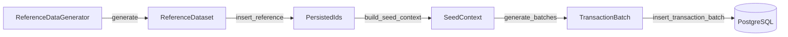
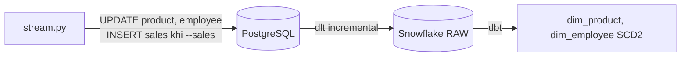
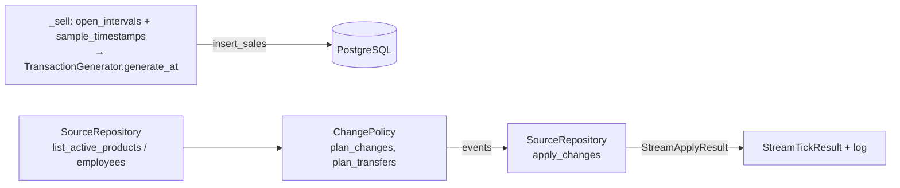

# Bộ sinh dữ liệu: `seed.py` và `stream.py`

Khi tách một script sinh dữ liệu thành nhiều class, câu hỏi khó nhất không phải "đặt tên class là gì" mà là:

> **Ở mỗi bước, dữ liệu đang ở dạng nào, nằm ở đâu, và bước sau cần nhận gì?**

Dự án có hai job sinh dữ liệu với hai mục đích khác nhau, nên thiết kế cũng khác:

| | `seed.py` | `stream.py` |
|---|---|---|
| Mục đích | Dựng dữ liệu nền ban đầu | Mô phỏng thay đổi trên dữ liệu có sẵn, và (tùy chọn) bán hàng mới |
| Khối lượng | Lớn (~100k giao dịch) | Nhỏ (vài product mỗi lần, vài trăm giao dịch nếu bật `--sales`) |
| Bảng bị ảnh hưởng | Tất cả | `product`, `employee`, và `sales_transaction*` khi bật `--sales` |
| Thao tác | `INSERT` | chủ yếu `UPDATE`; `INSERT` giao dịch khi bật `--sales` |

Cách vận hành từng job nằm ở [phase 2](../phases/02-historical-seed.md) và [phase 4](../phases/04-product-change-simulator.md).
Bài này giải thích **vì sao code được chia như vậy**. Cả hai job theo chung một cách nhìn: mỗi thành phần có **state** (giữ gì),
**behavior** (làm gì) và **output** (trả ra gì).

# Phần 1: `seed.py`

## Bức tranh tổng



| Bước | Thành phần | Input | Output |
|---|---|---|---|
| 1 | `ReferenceDataGenerator.generate()` | `SeedConfig`, `RandomSource` | `ReferenceDataset` |
| 2 | `SeedRepository.insert_reference()` | `ReferenceDataset` | `PersistedIds` |
| 3 | `build_seed_context()` | dataset, ids, config | `SeedContext` |
| 4 | `TransactionGenerator.generate_batches()` | `SeedContext` | iterator của `TransactionBatch` |
| 5 | `SeedRepository.insert_transaction_batch()` | `TransactionBatch` | `InsertStats` |

`SeedCoordinator.run()` chỉ nối năm bước này theo đúng thứ tự, không chứa logic sinh dữ liệu.

Toàn bộ thiết kế quy về một quy tắc: **mỗi object chỉ giữ dữ liệu ở đúng một trạng thái.**

```text
ReferenceDataset  →  dữ liệu chưa ghi vào DB, định danh bằng business key
PersistedIds      →  mapping business key → ID thật do database cấp
SeedContext       →  lookup đã index sẵn theo ID cho việc sinh giao dịch
TransactionBatch  →  một lô giao dịch chờ ghi
```

Khi ranh giới này rõ, mỗi bước test được độc lập.

## Từng thành phần

| Thành phần | Làm gì | Điểm thiết kế đáng nhớ |
|---|---|---|
| `ReferenceDataGenerator` | Tạo dữ liệu danh mục (store, employee, product, promotion, payment method) **trong bộ nhớ** | Không đụng database. Dữ liệu chỉ có business key (`store_name`, `product_sku`...), chưa có ID |
| `ReferenceDataset` | Gom các nhóm `*Draft` chưa ghi | `dataclass(frozen=True)`: là đầu vào của repository nên không có lý do bị sửa giữa chừng. Quan hệ giữa các draft đi qua business key vì ID chưa tồn tại |
| `SeedRepository.insert_reference` | Ghi danh mục vào DB, trả `PersistedIds` | Chỗ duy nhất (cùng `insert_transaction_batch`) nói chuyện với DB. Thứ tự ghi theo khóa ngoại (`store` → `employee`, `category` và `brand` → `product`); `flush()` để lấy ID. Reset (TRUNCATE) và ghi danh mục nằm chung **một transaction** |
| `PersistedIds` | Cầu nối business key → ID thật | Generator tạo store chỉ biết `store_name`; sau khi ghi DB mới cấp `store_id`, và mọi bảng con phải tham chiếu bằng ID đó. `employee` và `promotion` không có business key trong schema nên map theo **thứ tự** (`list[int]`) |
| `build_seed_context` | Biến dataset và ids thành cấu trúc tra cứu nhanh | **Hàm thuần**, không I/O, dễ test với dữ liệu giả. Join giữa employee và store xảy ra **một lần ở đây**, nên vòng lặp sinh hàng trăm nghìn giao dịch không phải tra lại |
| `SeedContext` | `employees_by_store` (kèm ngày vào, ngày nghỉ), `promotions_by_product` (kèm hiệu lực), `product_prices`, trọng số thanh toán | Chỉ chứa ID và index, đúng thứ generator cần; không chứa lại list object ban đầu |
| `TransactionGenerator` | Logic bán hàng | Chỉ đọc `SeedContext`, không chạm DB. `generate_batches` trả **iterator**: sinh tới đâu ghi tới đó nên bộ nhớ ổn định với ~100k giao dịch. `generate_at` cho `stream.py` dùng lại đúng luật bán hàng |
| `SeedRepository.insert_transaction_batch` | Ghi một lô | **Một lô là một transaction DB**: commit sau mỗi lô, rollback cả lô nếu lỗi. `TransactionBatch` chứa dict sẵn để bulk insert (~100k đơn, ~280k dòng) |
| `SeedCoordinator` | Nối các bước, log tiến độ | Mỏng; `main()` chỉ đọc cấu hình rồi gọi `run()` |

**Giá tại thời điểm bán:** `regular_price` của dòng hàng là snapshot lúc sinh. Về sau `stream.py` đổi giá sản phẩm thì giao dịch cũ
vẫn giữ giá cũ, đúng như hệ thống POS thật.

**Trạng thái giao dịch:** 95% `completed`, 2% `cancelled`, 3% `returned`. `updated_at` của giao dịch hủy cách lúc bán vài chục phút,
của giao dịch trả hàng cách vài ngày, để dữ liệu có cả những dòng `updated_at` sớm hơn hoặc muộn hơn hóa đơn như hệ thống thật.

## Những lỗi thiết kế hay gặp

| Lỗi | Hậu quả | Cách tránh |
|---|---|---|
| Dựng `SeedContext` ngay từ generator | Context chứa dữ liệu chưa có ID thật | Luôn đi qua `PersistedIds` |
| Generator tự commit DB | Khó test, khó rollback | Mọi thao tác DB đi qua `SeedRepository` |
| Dùng `Faker()` hay `random` rải rác | Không tái lập được dữ liệu | Mọi random đi qua `RandomSource` (bọc `random.Random` và `Faker` có seed) |
| Trả cả list giao dịch một lần | Tốn bộ nhớ | Trả `Iterator[TransactionBatch]` |
| Cấu hình có cả `end_date` lẫn `days` | Hai giá trị dễ lệch nhau | Giữ `start` và `days`, suy ra `end_date` |

# Phần 2: `stream.py`

## Vai trò: tạo ra thay đổi, không ghi nhận lịch sử

`stream.py` **không làm SCD2**. Nó chỉ `UPDATE` ở PostgreSQL nguồn: đổi `unit_cost` là chính, thỉnh thoảng đổi `unit_price`, và chuyển
vài nhân viên sang cửa hàng khác. Việc lưu lịch sử thuộc về hai thành phần khác:
- `dlt` mang dữ liệu đã đổi sang Snowflake (incremental theo `updated_at`);
- dbt dựng các phiên bản cũ và mới (SCD2) từ các dòng append trong RAW.



Vì `updated_at` do trigger của database tự cập nhật, code Python **không cần tự set** cột này; một `UPDATE` thuần là đủ để dlt thấy
dòng thay đổi.

## Một cycle chạy như thế nào



`StreamRunner.run_once()` làm đúng thứ tự: đọc trạng thái hiện tại, **bán hàng trước** (nếu bật `--sales`), rồi lập kế hoạch đổi giá và
chuyển nhân viên, rồi ghi. Bán trước đổi giá để giao dịch mới dùng giá hiện tại, giá mới chỉ có hiệu lực từ lúc này.

| Thành phần | Làm gì | Điểm thiết kế đáng nhớ |
|---|---|---|
| `StreamConfig` | Tham số: số product mỗi cycle, biên độ đổi giá, xác suất đổi giá bán, số nhân viên chuyển, số giao dịch bán | `price_change_probability` thể hiện "ưu tiên đổi giá vốn, hiếm khi đổi giá bán": mọi product được chọn đều đổi `unit_cost`, chỉ ~10% đổi thêm `unit_price` |
| `ProductRecord`, `EmployeeRecord` | Ảnh chụp trạng thái hiện tại đọc từ DB | Chỉ là dữ liệu |
| `ProductChangeEvent`, `EmployeeTransferEvent` | Mô tả **một thay đổi cụ thể**, gồm giá trị cũ và mới | Tách event khỏi bước `UPDATE`: policy chỉ **quyết định**, repository chỉ **thực thi**, và log in thẳng event nên thấy "đổi từ gì sang gì" |
| `ChangePolicy` | Toàn bộ luật nghiệp vụ, không DB, không I/O | `plan_changes` là hàm thuần, test bằng danh sách product giả là đủ |
| `SourceRepository` | Lớp duy nhất nói chuyện với PostgreSQL trong `stream.py` | `apply_changes` nằm trong **một transaction**: thành công hết hoặc rollback hết. Không set `updated_at` |
| `StreamRunner` | Điều phối, không chứa luật | Nhận `clock` từ ngoài (mặc định giờ hiện tại) để test bán hàng với đồng hồ giả |

**Luật của `ChangePolicy`:**

| Luật | Mục đích |
|---|---|
| Chọn tối đa `max_products_per_tick` product, **sắp theo `id` trước khi chọn** | Khối lượng thay đổi nhỏ; cùng dữ liệu và cùng `--seed` cho cùng kết quả |
| `unit_cost` đổi trong khoảng `cost_change_pct_min..max` (tăng hoặc giảm), làm tròn 100đ | Biến động thực tế, không đột ngột |
| Biến động quá nhỏ so với bước làm tròn thì vẫn dịch **ít nhất một bước** | `unit_cost` luôn đổi, nếu không cycle không tạo phiên bản mới |
| `unit_price` chỉ đổi với xác suất `price_change_probability`, làm tròn 1.000đ | Giá bán ít đổi hơn giá vốn |
| Giá bán giảm không thấp hơn giá vốn hiện tại; giá vốn mới bị chặn bởi giá bán mới; không giá trị nào âm | Không tạo margin âm vô lý |
| `employees_per_tick` nhân viên đang làm việc chuyển sang cửa hàng **khác** cửa hàng hiện tại | Có thay đổi `store_id` để dựng lịch sử cho `dim_employee` |

**Optimistic check trong `apply_changes`:** câu `UPDATE` có điều kiện trên giá trị cũ (`WHERE unit_cost = :old AND unit_price = :old`). Nếu một
tiến trình khác vừa sửa dòng đó, cả cycle bị rollback. Rẻ và an toàn khi lỡ chạy hai tiến trình cùng lúc.

**Bán hàng:** `open_intervals(start, end)` và `sample_timestamps(rng, intervals, n)` là **hai hàm thuần** (không DB, không đồng hồ), nên
test được bằng thời gian giả. Chi tiết cách chọn khoảng giờ mở cửa ở [phase 4](../phases/04-product-change-simulator.md#bán-thêm---sales-n).

## Lưu ý về SCD2 khi thiết kế tần suất thay đổi

Ingest incremental theo `updated_at` chỉ thấy **trạng thái của dòng tại lúc ingest chạy**. Nếu một product bị đổi giá 3 lần giữa hai lần
ingest, hai trạng thái trung gian mất. Hệ quả: **mỗi cycle `stream.py` phải được ingest trước khi chạy cycle kế tiếp**. Code không có cooldown;
kỷ luật này nằm ở cách chạy. Đây cũng là điểm khác với CDC thật, vốn bắt được mọi thay đổi trung gian.

Chưa cần các lớp như `PriceCalculator`, `EventPublisher`, `ChangeValidator`. Với phạm vi "đổi giá, chuyển nhân viên, bán thêm", thêm chúng
chỉ làm code nặng hơn nhu cầu thật.

# Phần 3: Bố cục code và kiểm thử

```text
src/retail_pulse/generator/
├── common.py   RandomSource (random.Random + Faker có seed, chance, signed_pct), round_to_step, TZ
├── seed.py     SeedConfig, *Draft, ReferenceDataset, ReferenceDataGenerator, PersistedIds, SeedContext,
│               build_seed_context, TransactionBatch, TransactionGenerator, InsertStats, SeedRepository,
│               SeedCoordinator, main
└── stream.py   StreamConfig, ProductRecord, EmployeeRecord, ProductChangeEvent, EmployeeTransferEvent,
                StreamApplyResult, StreamTickResult, ChangePolicy, open_intervals, sample_timestamps,
                SourceRepository, StreamRunner, main
```

Cả hai job nhận `session_factory` từ ngoài (`SeedCoordinator.from_config`, `StreamRunner.from_config`). Chạy thật dùng `SessionLocal`; test
truyền session factory trỏ vào database test.

## Testing

```bash
make test                 # = make up + uv run pytest
uv run pytest -k seed     # chỉ test seed
```

**Database test.** `tests/conftest.py` tạo database riêng `<PG_DB>_test` (đổi bằng `PG_TEST_DB`) trên Postgres đang chạy, nạp
`infras/postgres/init/01_schema.sql`, TRUNCATE mọi bảng sau mỗi test và xóa database khi kết thúc.
- *Vì sao không dùng SQLite:* schema dựa vào tính năng riêng của PostgreSQL (schema `retail`, IDENTITY, trigger `updated_at`,
  `INSERT ... RETURNING` giữ thứ tự).
- *Vì sao không "rollback sau mỗi test":* generator tự commit theo từng transaction, và đó chính là hành vi cần test.
- Postgres chưa bật thì các test cần DB bị skip, unit test vẫn chạy.

| File | Không cần DB | Cần DB |
|---|---|---|
| `tests/test_seed.py` | dataset tái lập được; hình dạng dataset; `build_seed_context` map key sang ID; chia batch và tái lập; hỗ trợ ít hơn 8 sản phẩm; validate tham số | số dòng danh mục; số giao dịch gần mục tiêu; `product_name` khớp brand; dữ liệu giao dịch nhất quán (nhân viên đúng cửa hàng và đang làm việc, promotion còn hiệu lực, không FK mồ côi); ngày bán nằm trong cửa sổ cấu hình; từ chối DB có dữ liệu, `--reset` cho lại dữ liệu cũ |
| `tests/test_stream.py` | tái lập theo seed; số product chọn bị chặn bởi số có sẵn; chuyển nhân viên sang cửa hàng khác và bị bỏ qua khi chỉ có một cửa hàng; biên độ và làm tròn; xác suất đổi giá bán; không margin âm; luôn dịch ít nhất một bước; `open_intervals` chỉ giữ giờ mở cửa; `sample_timestamps` nằm trong khoảng, đã sắp xếp, tái lập; validate tham số | một cycle chỉ đổi đúng các product được chọn; rollback cả cycle khi lỗi; chạy N cycle với `time.sleep` bị mock; DB trống báo lỗi rõ; nhân viên chuyển sang cửa hàng khác; không bật `--sales` thì không INSERT; bật thì giao dịch mới nằm trong giờ mở cửa; bỏ qua bán hàng khi chưa có giờ mở cửa nào trôi qua |

Không có test cho khách hàng hay trạng thái `pending`: domain khách hàng bị loại khỏi phạm vi, và trạng thái hợp lệ chỉ là `completed`,
`cancelled`, `returned`.

# Kết

Cả hai job theo cùng một nguyên tắc: **mỗi object chỉ giữ dữ liệu ở đúng một trạng thái, mỗi class có đúng một trách nhiệm.**

```text
seed.py    →  INSERT khối lượng lớn:  ReferenceDataset → PersistedIds → SeedContext → TransactionBatch
stream.py  →  UPDATE khối lượng nhỏ:  ProductRecord → ProductChangeEvent → StreamApplyResult (cộng INSERT giao dịch khi --sales)
```

Phần **quyết định** (generator, policy) tách khỏi phần **ghi database** (repository), và một lớp điều phối mỏng (`SeedCoordinator`,
`StreamRunner`) nối các bước lại. Nhờ vậy mỗi phần test được riêng, và hai job dùng chung `RandomSource` cùng cách kết nối database.
