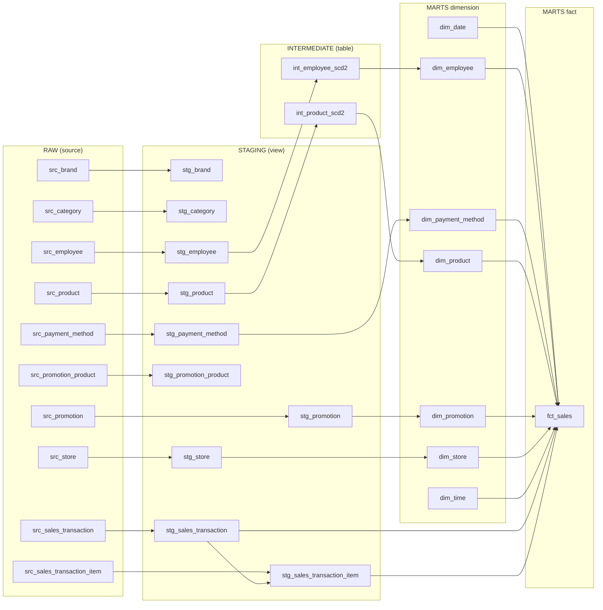
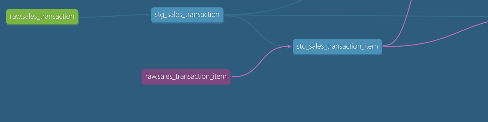

# Phase 5 — dbt (Snowflake RAW → staging → intermediate → marts)

Mục tiêu: biến dữ liệu RAW do dlt nạp thành star schema phân tích doanh số. File này ghi lại từng bước.

## Bước 1 — Kết nối và `dbt debug`

### Hiện trạng
- Project dbt nằm ở `dbt/` (tạo bằng `dbt init`), dùng dbt-core 1.12 và adapter Snowflake trong `.venv` (cài bằng `uv`). Máy còn một bản dbt 2.0.6 ở
  `~/.local/bin`; chọn một bản và dùng nhất quán, tài liệu này chạy bằng bản trong `.venv`.
- dlt đăng nhập bằng key pair (user `DLT_LOADER`, role `LOADER`, cấu hình trong `.dlt/secrets.toml`).
  dbt dùng cùng cách, nhưng với user và role riêng: `DBT_TRANSFORMER` / `TRANSFORMER`
  (tạo bởi `infras/snowflake/init.sql`), private key ở `.snowflake/dbt_transformer.p8`.

### Các file liên quan
| File | Vai trò | Commit? |
|---|---|---|
| `~/.dbt/profiles.yml` | **Cách kết nối**: account, user, key, role, warehouse, schema mặc định. Nằm ngoài repo, mỗi người một file | Không |
| `dbt/dbt_project.yml` | **Nội dung project**: tên, đường dẫn thư mục, `vars`, materialization và schema theo tầng | Có |
| `dbt/macros/generate_schema_name.sql` | Ghi đè cách đặt tên schema (xem bên dưới) | Có |
| `dbt/macros/surrogate_key.sql` | Macro sinh khóa thay thế (dùng ở bước marts) | Có |
| `.env` | Giá trị cho `env_var()` | Không |
| `.snowflake/*.p8` | Private key | Không |

`profiles.yml` không chứa bí mật dạng chuỗi. Hai giá trị thay đổi theo máy được lấy qua `env_var()`:

```yaml
retail_pulse:
  target: dev
  outputs:
    dev:
      type: snowflake
      account: "{{ env_var('SNOWFLAKE_ACCOUNT') }}"
      user: DBT_TRANSFORMER
      private_key_path: "{{ env_var('DBT_PRIVATE_KEY_PATH') }}"
      role: TRANSFORMER
      database: RETAIL_PULSE
      warehouse: RETAIL_WH
      schema: DBT_DEV
      threads: 4
```

Thêm vào `.env` (đã nằm trong `.gitignore`):

```
SNOWFLAKE_ACCOUNT=<org-account>
DBT_PRIVATE_KEY_PATH=/đường/dẫn/tuyệt/đối/.snowflake/dbt_transformer.p8
```

Key không có passphrase, nên không cần biến cho passphrase. Nếu sau này đặt passphrase, thêm
`private_key_passphrase: "{{ env_var('...') }}"`.

### Chạy `dbt debug`
dbt không tự đọc `.env`, nên nạp biến trước:

```bash
source .venv/bin/activate
cd dbt && set -a && . ../.env && set +a && dbt debug
```

Cách đọc kết quả:

| Phần trong output | Ý nghĩa |
|---|---|
| `Loading ~/.dbt/profiles.yml` / `Debugging profile` | Tìm thấy profile `retail_pulse`. Thiếu biến env thì lỗi hiện ở đây (`env_var ... not found`) |
| `Debugging connection` | Tham số dbt sẽ dùng: account, user, database, warehouse, schema, role |
| `Debugging connection test: OK` | Đã đăng nhập Snowflake thật bằng key |
| `Debugged All checks passed!` | Mọi kiểm tra đều đạt |

Kết quả mong đợi: `All checks passed`. IDE (tiện ích dbt) có thể báo `env_var 'SNOWFLAKE_ACCOUNT' not
found` vì nó không đọc `.env`. Đó không phải lỗi của file; chạy trong terminal vẫn bình thường.

### Quyết định cấu hình

**`threads: 4`.** Là số model dbt chạy song song. Thread bị giới hạn bởi DAG (model phụ thuộc phải
chờ nhau) và bởi warehouse (`RETAIL_WH` XSMALL có hàng chờ query). Tăng thread chỉ có ích khi DAG
có nhiều nhánh độc lập. Với dự án này 4 là đủ; muốn nhanh hơn thì cân nhắc size warehouse trước.

**Schema theo tầng, `generate_schema_name` ghi đè.** Mặc định dbt nối `target.schema` với schema
khai báo (`DBT_DEV_STAGING`). Macro của dự án bỏ phép nối đó:

| Tầng | `+schema` | `+materialized` | Lý do |
|---|---|---|---|
| staging | `staging` | view | Chỉ đổi tên, ép kiểu, dedup; nhẹ, không cần lưu |
| intermediate | `intermediate` | table | `int_product_scd2` dùng window function trên toàn bộ lịch sử và `fct_sales` join vào nó; tính một lần khi build, không tính lại mỗi lần query |
| marts | `marts` | table | Bảng cho dashboard |

`DBT_DEV` chỉ còn là schema dự phòng cho model không khai báo `+schema`.

> **Hạn chế đã biết:** vì macro bỏ phần nối `target.schema`, nếu thêm target `prod` dùng chung
> database `RETAIL_PULSE`, dev và prod sẽ ghi vào cùng `STAGING`, `INTERMEDIATE`, `MARTS`. Hiện chỉ
> có dev nên chưa ảnh hưởng. Khi thêm prod: cho macro rẽ nhánh theo `target.name`, hoặc dùng database
> riêng cho prod.

> **Cẩn thận chính tả config:** dbt không báo lỗi khi key có tiền tố `+` bị sai (ví dụ
> `+materialize` thay vì `+materialized`); model lặng lẽ rơi về mặc định (view). Kiểm tra bằng loại
> đối tượng thực tế được tạo ra.

## Bước 2 — Khai báo sources

File: `dbt/models/staging/___sources.yml`. Source là các bảng dbt không tự tạo (ở đây là bảng RAW do
dlt nạp). Khai báo một lần, model gọi bằng `{{ source('raw', '<bảng>') }}` thay vì gõ cứng tên bảng;
dbt nhờ đó vẽ được DAG từ nguồn và gắn test/freshness vào nguồn.

- Khai báo 10 bảng nghiệp vụ; bỏ qua các bảng nội bộ của dlt (`_dlt_loads`, `_dlt_version`,
  `_dlt_pipeline_state`) vì không dùng.
- Khóa chính lấy từ `PRIMARY KEY` trong `infras/postgres/init/`. Hai bảng có khóa ghép:
  `promotion_product (product_id, promotion_id)` và `sales_transaction_item (transaction_id, line_number)`.
- **Test ở source chỉ khẳng định điều luôn đúng ở nguồn.** Bảng replace: `unique` + `not_null` trên
  `id`. Bảng append (`product`, `employee`): chỉ `not_null`, vì `id` lặp lại qua các phiên bản.
  Khóa ghép: `not_null` từng cột; `unique` của tổ hợp kiểm ở staging.
- **Freshness** chỉ đặt cho `sales_transaction` (`loaded_at_field: created_at`, cảnh báo sau 1 ngày,
  lỗi sau 3 ngày). Không đặt cho `product`/`employee` vì chúng chỉ có dòng mới khi dữ liệu thay đổi,
  nên sẽ báo lỗi oan. Chạy bằng `dbt source freshness`, không chạy trong `dbt build`. Dữ liệu seed cũ
  nên lệnh này có thể báo lỗi; đó không phải lỗi của dbt.

Lưu ý cú pháp (bản dbt hiện tại): dùng `data_tests:` thay `tests:`, và `freshness`/`loaded_at_field`
nằm trong `config:`. Cú pháp cũ vẫn chạy nhưng bị cảnh báo deprecation.

Lỗi đã gặp: khai báo trùng một bảng (copy khối rồi sửa) gây lỗi `two sources with the name`.
Chạy `dbt parse` ngay sau khi sửa file yml để bắt sớm.

## Bước 3 — Staging

Staging là tầng sơ chế: mỗi bảng RAW một model `stg_<tên>`, chỉ làm việc nhẹ. Model chỉ chứa
`select`, đọc từ `source()`, materialize thành view trong schema `STAGING`.

### Việc staging làm và không làm
| Làm | Không làm |
|---|---|
| Đổi tên cột cho rõ nghĩa (`id` thành `store_id`) | Join, tính toán nghiệp vụ |
| Bỏ cột kỹ thuật `_dlt_*` | Gộp các phiên bản SCD2 (giữ nguyên lịch sử) |
| Dedup bản sao ở biên cursor của dlt (bảng append) | |
| Lọc giao dịch `status = 'completed'` và bỏ cột `status` (chỉ ở hai bảng bán hàng) | |

### Mười model
| Model | Kiểu nạp ở RAW | Dedup | Khóa kiểm tra |
|---|---|---|---|
| `stg_store`, `stg_category`, `stg_brand`, `stg_promotion`, `stg_payment_method` | replace | không | khóa chính: `unique` + `not_null` |
| `stg_promotion_product` | replace | không | `unique_combination_of_columns (promotion_id, product_id)` |
| `stg_product` | append | có | `(product_id, updated_at)` |
| `stg_employee` | append | có | `(employee_id, updated_at)` |
| `stg_sales_transaction` | append | có | `transaction_id` |
| `stg_sales_transaction_item` | append | có | `(transaction_id, line_number)` |

### Dedup bằng `QUALIFY`
```sql
select ... from {{ source('raw', 'product') }}
qualify row_number() over (
    partition by <mọi cột nghiệp vụ, gồm updated_at>
    order by _dlt_load_id desc
) = 1
```
- **Bản sao** là hai dòng giống hệt nhau về mọi cột nghiệp vụ, chỉ khác `_dlt_*`. **Phiên bản** là
  cùng id nhưng `updated_at` khác. Dedup phải loại bản sao và giữ mọi phiên bản.
- Cột thời gian của phiên bản (`updated_at`) phải nằm trong `partition by`. Nếu thiếu, nhân viên
  chuyển cửa hàng A, B, A sẽ bị gộp hai phiên bản A làm một và mất lịch sử. Test `unique` vẫn pass,
  nên lỗi này chỉ lộ ra khi tự nghĩ tình huống và kiểm tra.
- Gom theo mọi cột (thay vì chỉ `id` + `updated_at`) để hai dòng cùng khóa nhưng khác giá trị
  không bị chọn bừa mà làm test `unique` fail, tức lỗi được phát hiện.
- Thêm cột mới vào bảng nguồn thì phải thêm vào cả `partition by`.

### Test trong `___models.yml`
- **Khóa chính**: `unique` + `not_null`. **Bảng append**: `unique_combination_of_columns` trên
  `(id, updated_at)`, vì `id` một mình lặp lại.
- **`accepted_values`**: cột chỉ được nhận giá trị cho phép. Lấy danh sách từ `CHECK` của Postgres,
  không từ tài liệu: `promotion.type` là `percentage`, `fixed_amount` (không phải `fixed`),
  `status` ở nguồn là `completed`, `cancelled`, `returned` (đã lọc ở staging, nên không còn test).
- **`relationships`**: đặt ở bảng con, trên cột khóa ngoại, trỏ tới bảng cha. Không đặt ở bảng cha.
  Giá trị rỗng bị bỏ qua nên khóa ngoại bắt buộc cần thêm `not_null`.
  Không đặt `relationships` từ `product_id` sang `stg_product` (nhiều dòng mỗi `product_id`); kiểm
  fact trỏ tới dim làm ở marts.
- Mỗi model và cột quan trọng có `description`, hiện ra trong `dbt docs`.

### Package `dbt_utils`
`unique_combination_of_columns` thuộc package `dbt_utils`, không có sẵn trong dbt. Khai báo ở
`dbt/packages.yml` rồi chạy `dbt deps` (tải vào `dbt_packages/`, đã ignore):

```yaml
packages:
  - package: dbt-labs/dbt_utils
    version: [">=1.3.0", "<2.0.0"]
```

### Lệnh
```bash
cd dbt
dbt deps
dbt build -s staging    # 10 view, 53 test
```
Kết quả mong đợi: `PASS=63 ERROR=0`.

### Lỗi đã gặp
| Lỗi | Nguyên nhân | Cách xử lý |
|---|---|---|
| `No dbt_project.yml found` | Chạy dbt ở thư mục gốc repo | `cd dbt` trước |
| `'dbt_utils' is undefined` | Chưa khai báo/cài package | Tạo `packages.yml`, chạy `dbt deps` |
| `accepted_values` fail `FAIL 1` | Danh sách giá trị lệch thực tế (`fixed` vs `fixed_amount`) | Đối chiếu `CHECK` ở nguồn |
| Dedup làm mất phiên bản | `updated_at` thiếu trong `partition by` | Thêm vào `partition by` |
| Cảnh báo `UnusedResourceConfigPath` | `intermediate`/`marts` chưa có model | Tự hết khi có model |

> Đọc lỗi dbt: bắt đầu từ dòng `Error` đầu tiên (không phải cuối), xem file và giai đoạn (parse hay
> chạy SQL). Chi tiết ở `dbt/logs/dbt.log` và SQL biên dịch ở `dbt/target/compiled/`.

> **Quyết định về `status`:** nguồn có ba trạng thái (94.982 completed, 3.027 returned, 2.009 cancelled).
> Chỉ `completed` vào analytics nên staging lọc ngay và bỏ cột; các tầng sau không còn quan tâm. Dòng
> chi tiết (`stg_sales_transaction_item`) được lọc bằng `transaction_id in (select ... from
> stg_sales_transaction)` để không còn dòng mồ côi. Hạn chế: giao dịch `completed` sau đó đổi sang
> `returned` thì fact không tự cập nhật; generator hiện không tạo kiểu thay đổi này.

## Bước 4 — Intermediate: SCD2 cho product và employee

Hai model `int_product_scd2` và `int_employee_scd2` (table, schema `INTERMEDIATE`) biến các dòng
nhiều phiên bản ở staging thành các phiên bản có khoảng hiệu lực. Dựng bằng window function, không
dùng `dbt snapshot`, nên chạy lại (`--full-refresh`) luôn ra cùng kết quả vì RAW giữ toàn bộ lịch sử.

### Cách dựng
1. `LAG` các cột theo dõi theo `partition by <id> order by updated_at`.
2. Giữ dòng đầu của mỗi id và những dòng mà **bất kỳ cột theo dõi nào** `IS DISTINCT FROM` giá trị
   dòng trước. Không dùng `DISTINCT`/`GROUP BY` theo giá trị: A, B, A phải ra 3 phiên bản.
   `IS DISTINCT FROM` xử lý đúng `NULL`.
3. `LEAD(updated_at)` **sau khi đã lọc** làm `valid_to`; phiên bản cuối có `valid_to = 9999-12-31`
   và `is_current = true`.
4. Phiên bản đầu của mỗi id có `valid_from = 1900-01-01`, vì dòng đầu trong RAW chỉ xuất hiện ở lần
   nạp đầu, sau toàn bộ giao dịch lịch sử; dùng `updated_at` hay `created_at` thật sẽ làm giao dịch
   cũ không khớp phiên bản nào.
5. Cột Type 1 lấy giá trị mới nhất của id bằng `FIRST_VALUE(...) over (partition by id order by
   updated_at desc)`, áp lên mọi phiên bản (nếu không sẽ thành "SCD2 thiếu").

| Model | Cột Type 2 (tạo phiên bản) | Cột Type 1 (mới nhất) |
|---|---|---|
| `int_product_scd2` | `unit_cost`, `unit_price`, `category_id`, `brand_id` | `product_sku`, `product_name` |
| `int_employee_scd2` | `store_id` | `employee_name` (gộp first_name, last_name), `salary`, `address`, `start_date`, `end_date` |

`int_employee_scd2` không giữ `date_of_birth`, `phone_number` vì dashboard không dùng. Cả hai dùng
`valid_to = 9999-12-31` thay cho `NULL`: join khoảng `valid_from <= ts < valid_to` với `NULL` cho
kết quả rỗng và âm thầm làm rơi phiên bản hiện hành.

### Test
Test generic trong `___models.yml`: `unique_combination_of_columns (id, valid_from)`,
`not_null` cho khóa và các cột hiệu lực, `expression_is_true` `(valid_to = '9999-12-31') = is_current`.

Singular test trong `dbt/tests/` (mỗi file là một câu `SELECT` trả về **các dòng sai**; không có dòng
nào thì pass). Dùng cho điều kiện không có test sẵn:

| Test | Kiểm tra |
|---|---|
| `*_no_overlap` | khoảng hiệu lực không chồng lấn (employee còn kiểm không hở: `next_valid_from = valid_to`) |
| `*_single_current` | mỗi id có đúng một phiên bản hiện hành |
| `*_first_version_from_1900` | phiên bản đầu bắt đầu từ 1900-01-01 |
| `*_no_identical_adjacent` | không có hai phiên bản liền kề giống hệt ở các cột theo dõi |
| `*_type1_consistent` | cột Type 1 giống nhau trên mọi phiên bản của một id |
| `assert_product_scd2_complete`, `assert_product_scd2_valid_range` | mọi sản phẩm ở staging có mặt; `valid_to > valid_from` |

> **Test cấu trúc không thay cho test đúng thông số.** Bản đầu của `int_product_scd2` chỉ so sánh hai
> cột giá, thiếu `category_id`/`brand_id`, nhưng vẫn qua hết test cấu trúc (không chồng lấn, đúng một
> phiên bản hiện hành). Chỉ khi thêm test đối chiếu thông số (`first_version_from_1900`,
> `no_identical_adjacent`, `type1_consistent`) mới bắt được loại lỗi này.

### Lệnh
```bash
cd dbt
dbt build -s intermediate    # 2 table, 28 test
```
Kết quả mong đợi: `PASS=30 ERROR=0`. Hiện có 900 phiên bản cho 500 sản phẩm.

### Chưa làm / cân nhắc sau
- `::timestamp` (không múi giờ) so với `updated_at` có múi giờ. Vô hại với mốc 1900 và 9999, nhưng
  khi join `transaction_ts` ở `fct_sales` nên dùng `::timestamp_tz` cho nhất quán.
- `int_employee_scd2` chưa có test `complete` như bên product.

### Kiểm chứng SCD2 bằng thay đổi thật ở nguồn
Chạy một cycle `stream` (đổi giá của 5 sản phẩm, chuyển nhân viên 51 từ cửa hàng 7 sang 5), nạp lại,
rồi build:

```bash
make stream && make ingest && make dbt-build
```

| Đại lượng | Trước | Sau | Ý nghĩa |
|---|---|---|---|
| `raw.product` | 900 dòng | 905 | RAW chỉ thêm dòng (append), 5 sản phẩm đổi |
| `raw.employee` | 120 | 121 | 1 nhân viên chuyển cửa hàng |
| `dim_product` (kể cả Unknown) | 901 | 906 | thêm đúng 5 phiên bản |
| `dim_product` hiện hành | 501 | 501 | mỗi sản phẩm vẫn đúng một phiên bản hiện hành |
| `dim_employee` | 121 | 122 | thêm đúng 1 phiên bản |
| `fct_sales` | 270.973 | 270.973 | fact không đổi (không có giao dịch mới) |
| Test dbt | 168 pass | 168 pass | không chồng lấn, đúng một phiên bản hiện hành vẫn đúng |

Ví dụ sản phẩm 45 (`unit_cost` 22.300 đến 23.200, `unit_price` 32.000 đến 33.000) có hai phiên bản: bản
cũ từ `1900-01-01` đến thời điểm đổi, bản mới từ thời điểm đó đến `9999-12-31` và `is_current`. Nhân viên
51 tương tự (cửa hàng 7 sang 5).

Điều quan trọng nhất: **548 dòng fact cũ của sản phẩm 45 vẫn trỏ vào phiên bản cũ và giữ `unit_cost` =
22.300**, và không có dòng nào có `unit_cost` khác `unit_cost` của phiên bản dimension mà nó trỏ tới.
Nghĩa là đổi giá về sau không làm sai lợi nhuận đã ghi, đúng mục đích của SCD2 (và chính là hợp đồng
"giá vốn tại `transaction_ts`").

Phép thử này (`make stream` thuần) không có giao dịch mới nên không kiểm tra được phần incremental của
`fct_sales`; phần đó được kiểm chứng ở mục "Kiểm chứng incremental của `fct_sales` bằng giao dịch mới" bên dưới.

Quan sát phụ: mốc `1900-01-01` và `9999-12-31` hiện ra với múi giờ `-08:00` (múi giờ phiên làm việc của
Snowflake) thay vì UTC, vì `int_*_scd2` dùng `::timestamp` không múi giờ (xem "Chưa làm / cân nhắc sau").
Không ảnh hưởng kết quả join vì hai mốc nằm rất xa mọi giao dịch, nhưng đổi sang `::timestamp_tz` ở
UTC sẽ gọn hơn.

## Bước 5 — Marts: dimension và `fct_sales`

Schema `MARTS`, materialize `table` (riêng `fct_sales` là `incremental`).

### Dimension
| Model | Loại | Ghi chú |
|---|---|---|
| `dim_store`, `dim_payment_method` | Type 1 | Khóa thay thế `<tên>_key = hash(<id>)` bằng macro `surrogate_key` |
| `dim_promotion` | Type 1 | Có `promotion_label` (nhãn hiển thị), tách khỏi `promotion_type` để `accepted_values` vẫn đúng |
| `dim_product`, `dim_employee` | Type 2 | Lớp mỏng trên `int_*_scd2`; khóa thay thế = `hash(id, valid_from)` nên khác nhau giữa các phiên bản |
| `dim_date`, `dim_time` | Type 0, sinh ra | `GENERATOR` + `var('date_start')`, `var('date_days')`; `dim_time` có 1.440 dòng |

- Mọi dimension có dòng `-2` "Unknown" (thêm bằng `union all`). `dim_promotion` có thêm `-1`
  "No promotion". `-1` khác `-2`: `-1` là dòng hàng không có khuyến mãi (hợp lệ), `-2` là khóa chưa có
  trong dimension (dữ liệu đến trễ).
- `promotion_label` dùng `FM` trong khuôn số để bỏ khoảng trắng đầu; phần trăm nguyên không hiện `.00`.
  Ví dụ: `15% off`, `10,000 VND off`.
- **Ngôn ngữ của nhãn: tiếng Anh, cho toàn dashboard.** Dữ liệu nguồn (danh mục `Beverages`, `Snacks`;
  phương thức `cash`, `card`; tên sản phẩm, nhãn hàng) đã là tiếng Anh, nên mọi nhãn do dbt tạo ra
  cũng tiếng Anh để dashboard không lẫn hai ngôn ngữ: `dim_date` (`January`, `Monday`), `dim_promotion`
  (`15% off`, `No promotion`), `dim_time` (`Morning`, `AM`), dòng `Unknown`. Tên cột, model và tài liệu
  nội bộ giữ tiếng Việt/Anh như cũ. Đổi sang tiếng Việt sẽ phải đổi cả dữ liệu nguồn.
- Dữ liệu cá nhân (`salary`, `address` của `dim_employee`) gắn `meta: {pii: true}`.
- Test: `unique` + `not_null` cho khóa thay thế, `relationships` (`dim_employee.store_id` sang
  `dim_store`; `category_id`, `brand_id` sang staging), và singular test cho `dim_date` (đủ số ngày,
  liên tục) và `dim_time` (đúng 1.440 dòng), loại dòng `-2` khỏi phép đếm.

### `fct_sales` (transaction fact, incremental)
Grain: một dòng mỗi dòng chi tiết (`transaction_id`, `line_number`) của hóa đơn `completed`.

```sql
{{ config(materialized='incremental', unique_key=['transaction_id', 'line_number']) }}
```
- **Nguồn:** `stg_sales_transaction_item` join `stg_sales_transaction` (cả hai đã lọc completed).
- **Incremental:** lọc `greatest(i.updated_at, t.updated_at) >= max(source_updated_at)` của chính
  bảng (`{{ this }}`). Dùng cả hai `updated_at` vì chúng thật sự lệch nhau (14.578 dòng chi tiết có
  `updated_at` sớm hơn hóa đơn). Dùng `>=` thay `>` để không bỏ sót dòng có đúng `updated_at` ở biên
  cursor; `unique_key` làm merge nên xử lý lại dòng cũ không sinh trùng.
- **Join dimension:** `left join` rồi `coalesce` về `-2` (và `-1` cho promotion rỗng). Với
  `dim_product` và `dim_employee`, join theo khoảng nửa mở
  `transaction_ts >= valid_from and transaction_ts < valid_to`: mỗi giao dịch khớp đúng một phiên bản.
  Đóng cả hai đầu thì fan-out (đếm đôi), mở cả hai đầu thì mất dòng; cả hai đều lỗi im lặng.
- **Số đo:** theo hợp đồng trong `.claude/CLAUDE.md`. `unit_cost` lấy từ phiên bản sản phẩm hợp lệ tại
  `transaction_ts` và ghi vào fact lúc nạp; `full-refresh` dựng lại đúng vì SCD2 đã giữ lịch sử.
- **Múi giờ:** `transaction_ts` lưu UTC (giờ UTC 0 đến 14). `date_key` và `time_key` tính từ
  `convert_timezone(var('local_tz'), transaction_ts)` (giờ địa phương 7 đến 21). Tính theo UTC thì
  58.804 dòng bị gán buổi `Night` sai, và ngày có thể nhảy sang hôm sau. `transaction_ts` gốc (UTC)
  vẫn giữ để join khoảng SCD2.
- **Khóa ngày/giờ tra lại dimension:** `date_key`, `time_key` tính từ giờ địa phương rồi `left join` với
  `dim_date`, `dim_time` và `coalesce` về `-2`, giống năm dimension còn lại. Nhờ vậy hợp đồng "mọi
  dimension có dòng -2" dùng thật cho cả hai dimension sinh ra (ngày hoặc giờ không có trong dimension
  rơi về `-2`, không làm fail test `relationships`), và lineage có đủ hai mũi tên tới `fct_sales`.

### Test của `fct_sales`
- `unique_combination_of_columns (transaction_id, line_number)`.
- `relationships` tới cả bảy dimension, và `not_null` cho các khóa (kể cả `unit_cost`, để dòng không
  khớp phiên bản sản phẩm bị bắt thay vì âm thầm cho `gross_profit` rỗng).
- Tiền không âm: `net_amount >= 0`, `gross_amount >= 0`, `coupon_amount >= 0`,
  `discount_amount <= gross_amount`, `quantity > 0`.
- Singular test: số dòng fact bằng số dòng nguồn đã lọc (`assert_fct_sales_row_count_matches_source`);
  không giao dịch nào đổi trạng thái trong RAW (`assert_no_transaction_changes_status`), canh giả định
  làm cho việc lọc `completed` ở staging an toàn.

### Kiểm chứng
```bash
cd dbt
dbt build -s fct_sales          # lần đầu: dựng đầy đủ
dbt build -s fct_sales          # lần hai: incremental, vẫn 270.973 dòng
dbt build -s fct_sales --full-refresh   # cùng kết quả
dbt build                       # toàn dự án: PASS=168
```
Hiện có 270.973 dòng; 259.561 dòng không khuyến mãi (`promotion_key = -1`); không dòng nào có khóa
`-2` hay `unit_cost` rỗng; 1.040 dòng có `gross_profit` âm (giảm giá cao hơn lợi nhuận gộp, không
phải lỗi).

### Kiểm chứng incremental của `fct_sales` bằng giao dịch mới
`make stream-sales` sinh giao dịch bán hàng mới ở Postgres (xem [04-product-change-simulator.md](04-product-change-simulator.md),
mục "Bán thêm"), rồi nạp và build:

```bash
make stream-sales && make ingest && make dbt-build
```

Một lần chạy thật (300 giao dịch mới, từ 2026-10-08 13:58 đến 2026-10-09 21:53, giờ địa phương):

| Đại lượng | Trước | Sau | Ý nghĩa |
|---|---|---|---|
| dlt nạp | | 300 `sales_transaction`, 823 `sales_transaction_item` | chỉ dòng mới (con trỏ `updated_at`) |
| `stg_sales_transaction` (completed) | 94.982 | 95.265 | +283: 94% trong 300 mới là completed |
| `stg_sales_transaction_item` | 270.973 | 271.766 | +793 dòng chi tiết completed |
| `fct_sales` | 270.973 | **271.766** | **đúng +793, bằng số dòng nguồn đã lọc**; test đếm dòng pass |
| Khóa `-2`, `unit_cost` rỗng trong fact | 0 | 0 | mọi dòng mới khớp dimension và phiên bản |
| `date_key` của dòng mới | | 20261008, 20261009 | ngày theo giờ địa phương |
| `time_key` của dòng mới | | 705 đến 2156 | 07:05 đến 21:56, trong giờ mở cửa |
| Test dbt | 168 pass | 168 pass | |

Điều đáng chú ý:
- **Incremental chỉ thêm dòng mới:** fact tăng đúng bằng số dòng mới; dòng cũ không đổi. Chạy `dbt build`
  lần hai ngay sau đó, `fct_sales` vẫn 271.766 dòng (không sinh trùng nhờ `unique_key` và `>=`).
- **SCD2 hoạt động ngay trên dòng mới:** trong 793 dòng mới, 767 trỏ vào phiên bản `dim_product` hiện hành
  và 26 trỏ vào phiên bản cũ, vì chúng xảy ra trước lúc sản phẩm đổi giá (`transaction_ts <
  valid_from` của phiên bản mới), nên `unit_cost` đúng tại thời điểm bán.
- Một chi tiết của dữ liệu mô phỏng: `regular_price` của giao dịch mới là giá bán **lúc sinh dữ liệu**.
  Giao dịch có thời điểm trước một lần đổi giá trong cùng buổi mang giá mới, còn `unit_cost` đúng phiên
  bản cũ. Không test nào so `regular_price` với `unit_price` của dimension, nên không ảnh hưởng.

### Hạn chế đã biết
- **Dòng đã gán khóa `-2` không tự sửa** khi dimension có thêm khóa sau đó. Lần chạy incremental sau
  chỉ đọc dòng có `source_updated_at` mới hơn, nên dòng cũ không được join lại với dimension;
  `unique_key` chỉ giúp khi dòng được xử lý lần nữa. Trường hợp thật sự xảy ra là giao dịch tới
  trước bản ghi dimension (dữ liệu đến trễ). Cách khắc phục:
  - `dbt build -s fct_sales --full-refresh`: đơn giản và đúng, đủ cho dự án này (270 nghìn dòng,
    chạy vài giây).
  - Mở rộng bộ lọc incremental để xử lý lại các dòng đang có khóa `-2` cùng dòng mới: chính xác hơn
    khi dữ liệu lớn nhưng thêm phức tạp, chưa cần cho portfolio này.

  **Hệ quả cho người đọc số liệu:** dòng có `product_key = -2` có `unit_cost` rỗng nên `cost_amount`
  và `gross_profit` rỗng; `SUM(gross_profit)` bỏ qua chúng, tức lợi nhuận bị thấp hơn thực tế cho đến
  lần full-refresh kế tiếp. Doanh thu (`net_amount`) vẫn đủ. Test `not_null` của `unit_cost` đặt ở
  mức `warn` (không chặn pipeline) vì dữ liệu đến trễ là trường hợp đã chấp nhận; cần xem cảnh báo
  khi chạy. Dòng đến trước dimension sẽ hiện Unknown tối đa đến chu kỳ full-refresh tiếp theo
  (dự kiến theo lịch, ví dụ hằng tuần, đặt ở Dagster ở phase sau; hiện chưa có lịch).

  **Quyết định: dùng `--full-refresh`** khi cần sửa dòng `-2` (chỉ chạy lại `fct_sales`, không đụng
  RAW vì RAW giữ lịch sử SCD2). Không dùng cách xử lý lại dòng `-2` trong incremental: thêm điều kiện
  đọc lại chính bảng fact, phải liệt kê mọi khóa có thể là `-2`, mà dự án nhỏ nên không đáng.

  Các test `not_null` và `relationships` không bắt được vì `-2` là giá trị hợp lệ. Hiện số dòng
  `-2` bằng 0; nếu muốn theo dõi, thêm test `severity: warn` cho tỷ lệ dòng có khóa `-2`.
- Hóa đơn `completed` sau đó đổi trạng thái không cập nhật fact (ngoài phạm vi; test canh giả định).
- Chưa dùng `::timestamp_tz` ở `int_*_scd2`; vô hại vì `UNION ALL` ở dimension ép về `timestamp_tz`.

## Bước 6 — Lineage và review

### Lineage
Sơ đồ dưới được sinh từ `dbt/target/manifest.json` (sau `dbt docs generate`), nên khớp với code. Xem
bản tương tác bằng `dbt docs generate && dbt docs serve` (`http://localhost:8080`), bấm nút lineage ở
góc dưới bên phải, lọc bằng `+fct_sales` để xem mọi thứ fact phụ thuộc.



Ảnh chụp từ `dbt docs` (một phần đồ thị, nhánh bán hàng ở staging): mỗi bảng RAW có một model
staging, và `stg_sales_transaction` đi vào `stg_sales_transaction_item` (staging đọc staging, để lọc
`completed`). Các mũi tên đi tiếp sang phải là tới `fct_sales`.



Mười source, mười model staging, hai model intermediate, bảy dimension (hai trong số đó tự sinh), một
fact; 27 cạnh `ref`/`source`.

### Quan sát khi đọc lineage
- **`fct_sales` phụ thuộc đúng chín nút:** hai model staging bán hàng và bảy dimension (`dim_product`,
  `dim_employee`, `dim_store`, `dim_payment_method`, `dim_promotion`, `dim_date`, `dim_time`).
- **`dim_date` và `dim_time` có cạnh tới `fct_sales`** (lúc đầu không có, vì fact tự tính khóa thay vì
  `ref`; đã chuyển sang `left join` để lineage đúng và dùng được dòng `-2`).
- **Ba model staging không có model nào dùng:** `stg_brand`, `stg_category`, `stg_promotion_product`.
  `stg_brand`, `stg_category` chỉ được test `relationships` của `dim_product` tham chiếu;
  `stg_promotion_product` dành cho "promotion coverage" (factless fact) chưa làm. Chấp nhận được vì
  đã có kế hoạch dùng và tầng staging phản ánh nguồn, nhưng cần ghi nhận để không tưởng là sót.
- **Staging đọc staging một chỗ:** `stg_sales_transaction_item` phụ thuộc `stg_sales_transaction` để
  lọc `completed` (xem bước 3).
- Chiều mũi tên luôn đi source, staging, intermediate, marts; không có mũi tên ngược tầng.

### Lệnh qua Makefile
Chạy từ thư mục gốc repo; các lệnh `dbt-*` tự nạp `.env` và dùng dbt trong `.venv`:

| Lệnh | Việc |
|---|---|
| `make dbt-deps` | Cài package dbt (`dbt_utils`) vào `dbt/dbt_packages` |
| `make dbt-parse` | Sinh `dbt/target/manifest.json` (Dagster cần file này, xem phase 6) |
| `make dbt-build` | `dbt build` toàn dự án (model và test), cần RAW đã có dữ liệu |
| `make dbt-test` | Chỉ chạy test |
| `make dbt-full-refresh` | Dựng lại `fct_sales` từ đầu, dùng để sửa dòng khóa `-2`; không đụng RAW |
| `make dbt-docs` | Sinh và mở dbt docs (lineage) ở `http://localhost:8080` |
| `make clean` | Xóa file sinh ra (cache, `dbt/target`, `dbt/logs`); không đụng `.env`, `.venv`, key, `dbt_packages`; sau đó cần `make dbt-parse` để Dagster có manifest |

### Việc còn mở sau bước 6
- Đổi `::timestamp` thành `::timestamp_tz` ở `int_*_scd2` (không bắt buộc, xem hạn chế ở bước 5).
- Test `severity: warn` đếm dòng có khóa `-2` trong `fct_sales` (chưa thêm).
- Lịch `--full-refresh` cho `fct_sales`: đặt ở Dagster ở phase sau; hiện chưa có lịch.
  Đã cân nhắc Snowflake Tasks để lập lịch; chọn Dagster vì Tasks chỉ chạy SQL bên trong Snowflake,
  không điều phối được bước dlt (đọc từ Postgres), còn Dagster nối cả chuỗi nạp dữ liệu, dbt và kiểm tra
  trong một đồ thị có thử lại và lịch sử chạy.
- Phân tích khuyến mãi dùng `stg_promotion_product` (factless fact): chưa làm, ngoài phạm vi hiện tại.
