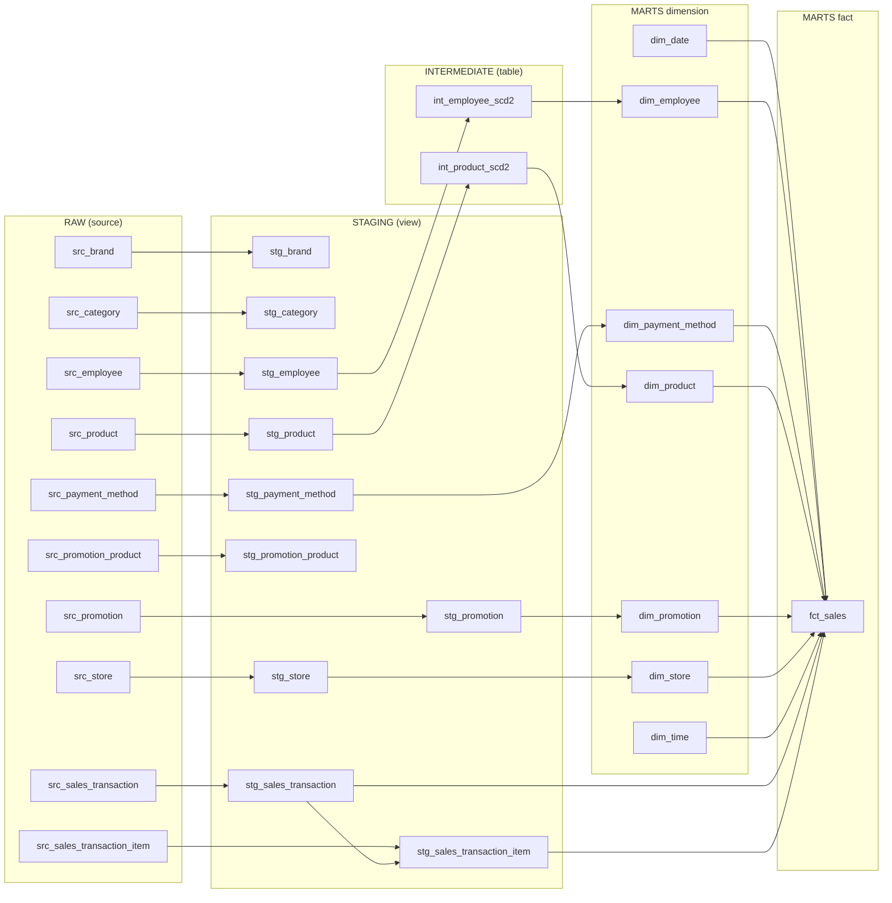

# Phase 5 — dbt (Snowflake RAW → staging → intermediate → marts)

Mục tiêu: biến dữ liệu RAW do dlt nạp thành star schema phân tích doanh số. dbt đi qua bốn tầng, mỗi tầng một việc,
giống một nhà hàng: **staging** là sơ chế nguyên liệu, **intermediate** là nấu phần nền (SCD2), **marts** là bày đĩa
cho dashboard. Mỗi bước dưới đây tự kiểm tra được bằng `dbt build -s <tầng>`.

Tổng cộng 20 model (10 staging, 2 intermediate, 7 dimension, 1 fact) và 148 test; `dbt build` toàn dự án báo `PASS=168`
(168 là số model cộng số test).

## Bước 1 — Kết nối và `dbt debug`

Dự án dbt nằm ở `dbt/`, dùng dbt-core 1.12 và adapter Snowflake trong `.venv` (cài bằng `uv`). Máy có thể còn một bản
dbt khác ở `~/.local/bin` (ví dụ bản 2.0.6); tài liệu này luôn chạy bản trong `.venv` qua `uv run`.
dbt đăng nhập bằng key pair với user `DBT_TRANSFORMER`, role `TRANSFORMER` (tạo ở [phase 3](03-ingestion-snowflake.md)).

| File | Vai trò | Commit? |
|---|---|---|
| `~/.dbt/profiles.yml` | **Cách kết nối**: account, user, key, role, warehouse. Nằm ngoài repo, mỗi người một file; mẫu ở `dbt/profiles.yml.example` | Không |
| `dbt/dbt_project.yml` | **Nội dung dự án**: đường dẫn thư mục, `vars`, materialization và schema theo tầng | Có |
| `dbt/macros/generate_schema_name.sql` | Ghi đè cách đặt tên schema (xem dưới) | Có |
| `dbt/macros/surrogate_key.sql` | Sinh khóa thay thế cho dimension (bước 5) | Có |
| `.env` | Giá trị cho `env_var()` (`SNOWFLAKE_ACCOUNT`, `DBT_PRIVATE_KEY_PATH`) | Không |
| `.snowflake/*.p8` | Private key | Không |

Chép nội dung `dbt/profiles.yml.example` vào `~/.dbt/profiles.yml`. Nếu file đã có profile khác thì **thêm vào cuối**, đừng
ghi đè cả file. Rồi kiểm tra:

```bash
set -a && . ./.env && set +a && cd dbt && uv run dbt debug
```

*Vì sao phải nạp `.env` thủ công:* dbt không tự đọc `.env`, trong khi profile dùng `env_var()` để không chứa bí mật.
*Nếu bỏ qua:* `env_var ... not found`. (Tiện ích dbt trong IDE cũng báo lỗi này vì nó không đọc `.env`; đó không phải
lỗi của file, chạy trong terminal vẫn bình thường.)

| Phần trong output | Ý nghĩa |
|---|---|
| `Debugging profile` | Tìm thấy profile `retail_pulse`; thiếu biến môi trường thì lỗi hiện ở đây |
| `Debugging connection` | Tham số dbt sẽ dùng: account, user, database, warehouse, schema, role |
| `Connection test: OK` | Đã đăng nhập Snowflake thật bằng key |
| `All checks passed!` | Đạt toàn bộ |

### Hai quyết định cấu hình

**`threads: 4`:** số model chạy song song. Bị giới hạn bởi DAG (model phụ thuộc phải chờ nhau) và bởi warehouse
`RETAIL_WH` XSMALL có hàng chờ query. Tăng thread chỉ có ích khi DAG có nhiều nhánh độc lập; muốn nhanh hơn thì cân
nhắc size warehouse trước.

**Mỗi tầng một schema, `generate_schema_name` ghi đè.** Mặc định dbt nối `target.schema` với schema khai báo
(`DBT_DEV_STAGING`). Macro của dự án bỏ phép nối, nên schema đúng là `STAGING`, `INTERMEDIATE`, `MARTS`
(riêng target `ci` của [phase 9](09-dataops-ci.md) thêm tiền tố `PR_<số>_`).

| Tầng | `+materialized` | Lý do |
|---|---|---|
| staging | view | Chỉ đổi tên, ép kiểu, dedup; nhẹ, không cần lưu |
| intermediate | table | `int_product_scd2` dùng window function trên toàn bộ lịch sử và `fct_sales` join vào nó; tính một lần lúc build, không tính lại mỗi lần query |
| marts | table (`fct_sales` là incremental) | Bảng cho dashboard |

> **Hạn chế:** vì macro bỏ phần nối `target.schema`, nếu thêm target `prod` dùng chung database `RETAIL_PULSE`, dev
> và prod sẽ ghi vào cùng `STAGING`, `INTERMEDIATE`, `MARTS`. Hiện chỉ có dev nên chưa ảnh hưởng; khi thêm prod thì
> cho macro rẽ nhánh theo `target.name` hoặc dùng database riêng.

> **Cẩn thận chính tả config:** dbt không báo lỗi khi key có tiền tố `+` bị sai (ví dụ `+materialize` thay vì
> `+materialized`); model lặng lẽ rơi về mặc định (view). Kiểm tra bằng loại đối tượng thực tế được tạo.

Đọc thêm: [Materializations](https://docs.getdbt.com/docs/build/materializations),
[How we structure our dbt projects](https://docs.getdbt.com/best-practices/how-we-structure/1-guide-overview).

## Bước 2 — Khai báo sources

File: `dbt/models/staging/___sources.yml`. **Source** là bảng dbt không tự tạo (ở đây là bảng RAW do dlt nạp). Khai
báo một lần rồi gọi bằng `{{ source('raw', '<bảng>') }}` thay vì gõ cứng tên bảng; nhờ vậy dbt vẽ được DAG từ nguồn
và gắn được test, freshness vào nguồn.

- Khai báo 10 bảng nghiệp vụ; bỏ các bảng nội bộ của dlt (`_dlt_loads`, `_dlt_version`, `_dlt_pipeline_state`).
- Khóa chính lấy từ `PRIMARY KEY` trong `infras/postgres/init/`. Hai bảng có khóa ghép: `promotion_product
  (product_id, promotion_id)` và `sales_transaction_item (transaction_id, line_number)`.
- **Test ở source chỉ khẳng định điều luôn đúng ở nguồn.** Bảng replace: `unique` + `not_null` trên `id`. Bảng append
  (`product`, `employee`): chỉ `not_null`, vì `id` lặp lại qua các phiên bản. Khóa ghép: `not_null` từng cột, còn
  `unique` của tổ hợp kiểm ở staging.
- **Freshness** chỉ đặt cho `sales_transaction` (`loaded_at_field: created_at`, cảnh báo sau 1 ngày, lỗi sau 3 ngày).
  Không đặt cho `product` và `employee` vì chúng chỉ có dòng mới khi dữ liệu đổi, sẽ báo lỗi oan. Chạy bằng
  `dbt source freshness`, không chạy trong `dbt build`; dữ liệu seed cũ nên lệnh này có thể báo lỗi, đó không phải
  lỗi của dbt.

Cú pháp bản dbt hiện tại: dùng `data_tests:` thay `tests:`, và `freshness`, `loaded_at_field` nằm trong `config:`.
Cú pháp cũ vẫn chạy nhưng bị cảnh báo deprecation. Lỗi hay gặp: khai báo trùng một bảng (copy khối rồi sửa) gây
`two sources with the name`; chạy `dbt parse` ngay sau khi sửa file yml để bắt sớm.

Đọc thêm: [Add sources to your DAG](https://docs.getdbt.com/docs/build/sources).

## Bước 3 — Staging

Mỗi bảng RAW một model `stg_<tên>`, chỉ chứa `select`, đọc từ `source()`, materialize thành view trong schema `STAGING`.

| Làm | Không làm |
|---|---|
| Đổi tên cột cho rõ nghĩa (`id` thành `store_id`) | Join, tính toán nghiệp vụ |
| Bỏ cột kỹ thuật `_dlt_*` | Gộp các phiên bản SCD2 (giữ nguyên lịch sử) |
| Dedup bản sao ở biên cursor của dlt (bảng append) | |
| Lọc giao dịch `status = 'completed'` và bỏ cột `status` (chỉ ở hai bảng bán hàng) | |

| Model | Kiểu nạp ở RAW | Dedup | Khóa kiểm tra |
|---|---|---|---|
| `stg_store`, `stg_category`, `stg_brand`, `stg_promotion`, `stg_payment_method` | replace | không | khóa chính: `unique` + `not_null` |
| `stg_promotion_product` | replace | không | `unique_combination_of_columns (promotion_id, product_id)` |
| `stg_product` | append | có | `(product_id, updated_at)` |
| `stg_employee` | append | có | `(employee_id, updated_at)` |
| `stg_sales_transaction` | append | có | `transaction_id` |
| `stg_sales_transaction_item` | append | có | `(transaction_id, line_number)` |

### Dedup bằng `QUALIFY`

```sql
select ... from {{ source('raw', 'product') }}
qualify row_number() over (
    partition by <mọi cột nghiệp vụ, gồm updated_at>
    order by _dlt_load_id desc
) = 1
```

- **Bản sao** là hai dòng giống hệt về mọi cột nghiệp vụ, chỉ khác `_dlt_*`. **Phiên bản** là cùng id nhưng
  `updated_at` khác. Dedup phải loại bản sao và **giữ mọi phiên bản**.
- `updated_at` phải nằm trong `partition by`. *Nếu thiếu:* nhân viên chuyển cửa hàng A, B, A bị gộp hai phiên bản A
  làm một và mất lịch sử; test `unique` vẫn pass nên lỗi chỉ lộ ra khi tự nghĩ tình huống và kiểm tra.
- Gom theo mọi cột (không chỉ `id` và `updated_at`) để hai dòng cùng khóa nhưng khác giá trị không bị chọn bừa mà làm
  test `unique` fail: lỗi được phát hiện thay vì bị che. Thêm cột mới ở nguồn thì phải thêm vào `partition by`.

### Test trong `___models.yml`

- **Khóa chính:** `unique` + `not_null`. **Bảng append:** `unique_combination_of_columns` trên `(id, updated_at)` vì `id`
  một mình lặp lại. Hàm này thuộc package `dbt_utils` (khai báo ở `dbt/packages.yml`, cài bằng `make dbt-deps`).
- **`accepted_values`:** lấy danh sách từ `CHECK` của Postgres, không từ trí nhớ: `promotion.type` là `percentage`,
  `fixed_amount` (không phải `fixed`); `status` ở nguồn là `completed`, `cancelled`, `returned` (đã lọc ở staging nên
  không còn test).
- **`relationships`:** đặt ở bảng **con**, trên cột khóa ngoại, trỏ tới bảng cha. Giá trị rỗng bị bỏ qua nên khóa ngoại
  bắt buộc cần thêm `not_null`. Không đặt từ `product_id` sang `stg_product` (nhiều dòng mỗi `product_id`); kiểm fact
  trỏ tới dimension làm ở marts.
- Mỗi model và cột quan trọng có `description`, hiện ra trong `dbt docs`.

```bash
make dbt-deps
cd dbt && uv run dbt build -s staging     # 10 view và test của chúng; kỳ vọng ERROR=0
```

### Quyết định về `status`

Nguồn có ba trạng thái (một lần đo: 94.982 completed, 3.027 returned, 2.009 cancelled). Chỉ `completed` vào analytics,
nên staging lọc ngay và bỏ cột; các tầng sau không còn quan tâm. Dòng chi tiết (`stg_sales_transaction_item`) được lọc
bằng `transaction_id in (select ... from stg_sales_transaction)` để không còn dòng mồ côi. *Hạn chế:* giao dịch
`completed` sau đó đổi sang `returned` thì fact không tự cập nhật; generator hiện không tạo kiểu thay đổi này và có
test canh giả định (`assert_no_transaction_changes_status`).

### Lỗi hay gặp

| Lỗi | Nguyên nhân | Cách xử lý |
|---|---|---|
| `No dbt_project.yml found` | Chạy dbt ở thư mục gốc repo | `cd dbt` trước |
| `'dbt_utils' is undefined` | Chưa khai báo hoặc chưa cài package | Tạo `packages.yml`, chạy `dbt deps` |
| `accepted_values` fail | Danh sách giá trị lệch thực tế (`fixed` vs `fixed_amount`) | Đối chiếu `CHECK` ở nguồn |
| Dedup làm mất phiên bản | `updated_at` thiếu trong `partition by` | Thêm vào `partition by` |

> Đọc lỗi dbt: bắt đầu từ dòng `Error` **đầu tiên** (không phải cuối), xem file và giai đoạn (parse hay chạy SQL).
> Chi tiết ở `dbt/logs/dbt.log`, SQL đã biên dịch ở `dbt/target/compiled/`.

Đọc thêm: [Add data tests to your DAG](https://docs.getdbt.com/docs/build/data-tests),
[Packages](https://docs.getdbt.com/docs/build/packages),
[Snowflake: QUALIFY](https://docs.snowflake.com/en/sql-reference/constructs/qualify).

## Bước 4 — Intermediate: SCD2 cho product và employee

`int_product_scd2` và `int_employee_scd2` (table, schema `INTERMEDIATE`) biến các dòng nhiều phiên bản ở staging thành
các phiên bản có khoảng hiệu lực. Dựng bằng window function, **không dùng `dbt snapshot`**, nên chạy lại
(`--full-refresh`) luôn ra cùng kết quả vì RAW giữ toàn bộ lịch sử.

### Cách dựng

1. `LAG` các cột theo dõi theo `partition by <id> order by updated_at`.
2. Giữ dòng đầu của mỗi id và những dòng mà **bất kỳ cột theo dõi nào** `IS DISTINCT FROM` giá trị dòng trước. Không
   dùng `DISTINCT` hay `GROUP BY` theo giá trị: A, B, A phải ra 3 phiên bản. `IS DISTINCT FROM` xử lý đúng `NULL`.
3. `LEAD(updated_at)` **sau khi đã lọc** làm `valid_to`; phiên bản cuối có `valid_to = 9999-12-31` và `is_current = true`.
4. Phiên bản đầu của mỗi id có `valid_from = 1900-01-01`: dòng đầu trong RAW chỉ xuất hiện ở lần nạp đầu, sau toàn bộ
   giao dịch lịch sử; dùng `updated_at` hay `created_at` thật sẽ làm giao dịch cũ không khớp phiên bản nào.
5. Cột Type 1 lấy giá trị mới nhất của id bằng `FIRST_VALUE(...) over (partition by id order by updated_at desc)`, áp
   lên mọi phiên bản (nếu không sẽ thành "SCD2 thiếu").

| Model | Cột Type 2 (tạo phiên bản) | Cột Type 1 (mới nhất) |
|---|---|---|
| `int_product_scd2` | `unit_cost`, `unit_price`, `category_id`, `brand_id` | `product_sku`, `product_name` |
| `int_employee_scd2` | `store_id` | `employee_name`, `salary`, `address`, `start_date`, `end_date` |

`int_employee_scd2` không giữ `date_of_birth`, `phone_number` vì dashboard không dùng. Cả hai dùng `valid_to =
9999-12-31` thay cho `NULL`: join khoảng `valid_from <= ts < valid_to` với `NULL` cho kết quả rỗng và âm thầm làm rơi
phiên bản hiện hành.

### Test

Test generic trong `___models.yml`: `unique_combination_of_columns (id, valid_from)`, `not_null` cho khóa và các cột hiệu
lực, `expression_is_true` `(valid_to = '9999-12-31') = is_current`. Singular test trong `dbt/tests/` (mỗi file là một câu
`SELECT` trả về **các dòng sai**; không có dòng nào thì pass):

| Test | Kiểm tra |
|---|---|
| `*_no_overlap` | khoảng hiệu lực không chồng lấn (employee còn kiểm không hở: `next_valid_from = valid_to`) |
| `*_single_current` | mỗi id có đúng một phiên bản hiện hành |
| `*_first_version_from_1900` | phiên bản đầu bắt đầu từ 1900-01-01 |
| `*_no_identical_adjacent` | không có hai phiên bản liền kề giống hệt ở các cột theo dõi |
| `*_type1_consistent` | cột Type 1 giống nhau trên mọi phiên bản của một id |
| `assert_product_scd2_complete`, `*_valid_range` | mọi sản phẩm ở staging có mặt; `valid_to > valid_from` |

> **Test cấu trúc không thay cho test đúng thông số.** Bản đầu của `int_product_scd2` chỉ so sánh hai cột giá, thiếu
> `category_id` và `brand_id`, nhưng vẫn qua hết test cấu trúc (không chồng lấn, đúng một phiên bản hiện hành). Chỉ khi
> thêm test đối chiếu thông số (`first_version_from_1900`, `no_identical_adjacent`, `type1_consistent`) mới bắt được.

```bash
cd dbt && uv run dbt build -s intermediate     # 2 table và test; kỳ vọng ERROR=0
```

### Kiểm chứng bằng thay đổi thật ở nguồn

Chạy một cycle `stream` (đổi giá 5 sản phẩm, chuyển nhân viên 51 từ cửa hàng 7 sang 5), nạp lại, rồi build:

```bash
make stream && make ingest && make dbt-build
```

| Đại lượng | Trước | Sau | Ý nghĩa |
|---|---|---|---|
| `raw.product` | 900 dòng | 905 | RAW chỉ thêm dòng (append) |
| `dim_product` (kể cả Unknown) | 901 | 906 | thêm đúng 5 phiên bản |
| `dim_product` hiện hành | 501 | 501 | mỗi sản phẩm vẫn đúng một phiên bản hiện hành |
| `dim_employee` | 121 | 122 | thêm đúng 1 phiên bản |
| `fct_sales` | 270.973 | 270.973 | không có giao dịch mới nên fact không đổi |
| Test dbt | 168 pass | 168 pass | không chồng lấn, đúng một phiên bản hiện hành vẫn đúng |

Ví dụ sản phẩm 45 (`unit_cost` 22.300 đến 23.200) có hai phiên bản: bản cũ từ `1900-01-01` đến thời điểm đổi, bản mới từ
đó đến `9999-12-31` và `is_current`. Điều quan trọng nhất: **548 dòng fact cũ của sản phẩm 45 vẫn trỏ vào phiên bản cũ
và giữ `unit_cost = 22.300`**, và không dòng nào có `unit_cost` khác phiên bản dimension nó trỏ tới. Nghĩa là đổi giá về
sau không làm sai lợi nhuận đã ghi, đúng mục đích của SCD2.

Quan sát phụ: mốc `1900-01-01` và `9999-12-31` hiện với múi giờ `-08:00` (múi giờ phiên làm việc của Snowflake) thay vì
UTC, vì `int_*_scd2` dùng `::timestamp` không múi giờ. Không ảnh hưởng join vì hai mốc nằm rất xa mọi giao dịch; đổi sang
`::timestamp_tz` ở UTC sẽ gọn hơn (việc còn mở ở cuối trang).

Đọc thêm: [Snowflake: LAG](https://docs.snowflake.com/en/sql-reference/functions/lag),
[Kimball: SCD Type 2](https://www.kimballgroup.com/data-warehouse-business-intelligence-resources/kimball-techniques/dimensional-modeling-techniques/type-2/).

## Bước 5 — Marts: dimension và `fct_sales`

### Dimension

| Model | Loại | Ghi chú |
|---|---|---|
| `dim_store`, `dim_payment_method` | Type 1 | Khóa thay thế `<tên>_key = hash(<id>)` bằng macro `surrogate_key` |
| `dim_promotion` | Type 1 | Có `promotion_label` (nhãn hiển thị), tách khỏi `promotion_type` để `accepted_values` vẫn đúng |
| `dim_product`, `dim_employee` | Type 2 | Lớp mỏng trên `int_*_scd2`; khóa thay thế `hash(id, valid_from)` nên khác nhau giữa các phiên bản. `dim_product` có thêm `category_name`, `brand_name` (join `stg_category`, `stg_brand`) |
| `dim_date`, `dim_time` | Type 0, sinh ra | `GENERATOR` + `var('date_start')`, `var('date_days')`; `dim_time` có 1.440 dòng |

- Mọi dimension có dòng `-2` "Unknown" (thêm bằng `union all`). `dim_promotion` có thêm `-1` "No promotion". Phân biệt: `-1`
  là dòng hàng không có khuyến mãi (hợp lệ), `-2` là khóa chưa có trong dimension (dữ liệu đến trễ).
- Khóa thay thế là số 64 bit **có dấu** do `HASH` của Snowflake, nên nhiều khóa là số âm rất lớn. Đó chỉ là mã định
  danh, không liên quan `-1`, `-2` (giá trị cố định). Đọc thêm: [Snowflake: HASH](https://docs.snowflake.com/en/sql-reference/functions/hash).
- **Nhãn bằng tiếng Anh, cho toàn dashboard.** Dữ liệu nguồn (danh mục `Beverages`, phương thức `cash`, tên sản phẩm)
  đã là tiếng Anh, nên mọi nhãn do dbt sinh ra cũng tiếng Anh để dashboard không lẫn hai ngôn ngữ: `dim_date`
  (`January`, `Monday`), `dim_promotion` (`15% off`, `No promotion`), `dim_time` (`Morning`, `AM`), dòng `Unknown`.
- Dữ liệu cá nhân (`salary`, `address` của `dim_employee`) gắn `meta: {pii: true}`.
- Test: `unique` + `not_null` cho khóa thay thế; `relationships` (`dim_employee.store_id` sang `dim_store`; `category_id`,
  `brand_id` sang staging); singular test cho `dim_date` (đủ số ngày, liên tục) và `dim_time` (đúng 1.440 dòng), loại
  dòng `-2` khỏi phép đếm.

### `fct_sales` (transaction fact, incremental)

Grain: một dòng mỗi dòng chi tiết (`transaction_id`, `line_number`) của hóa đơn `completed`.

```sql
{{ config(materialized='incremental', unique_key=['transaction_id', 'line_number']) }}
```

**Hợp đồng số đo:**

| Cột | Công thức |
|---|---|
| `gross_amount` | `quantity * regular_price` |
| `discount_amount` | `percentage`: `quantity * regular_price * amount / 100`; `fixed_amount`: `quantity * MIN(amount, regular_price)` |
| `coupon_amount` | theo dòng, **không** nhân `quantity` |
| `net_amount` | `gross_amount - discount_amount - coupon_amount` |
| `unit_cost` | lấy từ phiên bản `dim_product` hợp lệ tại `transaction_ts` |
| `cost_amount`, `gross_profit` | `quantity * unit_cost`; `net_amount - cost_amount` |

- **Nguồn:** `stg_sales_transaction_item` join `stg_sales_transaction` (cả hai đã lọc completed).
- **Incremental:** lọc `greatest(i.updated_at, t.updated_at) >= max(source_updated_at)` của chính bảng (`{{ this }}`).
  Dùng cả hai `updated_at` vì chúng thật sự lệch nhau (14.578 dòng chi tiết có `updated_at` sớm hơn hóa đơn). Dùng `>=`
  thay `>` để không bỏ sót dòng đúng ở biên; `unique_key` làm merge nên xử lý lại dòng cũ không sinh trùng.
- **Join dimension:** `left join` rồi `coalesce` về `-2` (và `-1` cho promotion rỗng). Với `dim_product` và `dim_employee`,
  join theo khoảng nửa mở `transaction_ts >= valid_from and transaction_ts < valid_to` để mỗi giao dịch khớp đúng một
  phiên bản. *Đóng cả hai đầu thì fan-out (đếm đôi), mở cả hai đầu thì mất dòng; cả hai đều lỗi im lặng.*
- **Múi giờ:** `transaction_ts` lưu UTC (giờ UTC 0 đến 14). `date_key` và `time_key` tính từ
  `convert_timezone(var('local_tz'), transaction_ts)` (giờ địa phương 7 đến 21). Tính theo UTC thì 58.804 dòng bị gán buổi
  `Night` sai và ngày có thể nhảy sang hôm sau. `transaction_ts` gốc (UTC) vẫn giữ để join khoảng SCD2.
  Đọc thêm: [Snowflake: CONVERT_TIMEZONE](https://docs.snowflake.com/en/sql-reference/functions/convert_timezone).
- **Khóa ngày, giờ tra lại dimension:** `left join` với `dim_date`, `dim_time` rồi `coalesce` về `-2`, giống năm dimension
  còn lại, nên hợp đồng "mọi dimension có dòng -2" dùng thật cho cả hai và lineage có đủ hai mũi tên tới `fct_sales`.

**Test của `fct_sales`:** `unique_combination_of_columns (transaction_id, line_number)`; `relationships` tới cả bảy
dimension; `not_null` cho các khóa (kể cả `unit_cost`, để dòng không khớp phiên bản sản phẩm bị bắt thay vì âm thầm cho
`gross_profit` rỗng); tiền không âm (`net_amount`, `gross_amount`, `coupon_amount` >= 0, `discount_amount <=
gross_amount`, `quantity > 0`); singular test số dòng fact bằng số dòng nguồn đã lọc
(`assert_fct_sales_row_count_matches_source`).

```bash
cd dbt
uv run dbt build -s fct_sales                    # lần đầu: dựng đầy đủ
uv run dbt build -s fct_sales                    # lần hai: incremental, số dòng không đổi
uv run dbt build -s fct_sales --full-refresh     # dựng lại, cùng kết quả
```

Đọc thêm: [Configure incremental models](https://docs.getdbt.com/docs/build/incremental-models).

### Kiểm chứng incremental bằng giao dịch mới

```bash
make stream-sales && make ingest && make dbt-build
```

Một lần chạy thật (300 giao dịch mới, từ 2026-10-08 13:58 đến 2026-10-09 21:53, giờ địa phương):

| Đại lượng | Trước | Sau | Ý nghĩa |
|---|---|---|---|
| dlt nạp | | 300 `sales_transaction`, 823 `sales_transaction_item` | chỉ dòng mới (con trỏ `updated_at`) |
| `stg_sales_transaction_item` | 270.973 | 271.766 | +793 dòng chi tiết completed |
| `fct_sales` | 270.973 | **271.766** | **đúng +793, bằng số dòng nguồn đã lọc**; test đếm dòng pass |
| Khóa `-2`, `unit_cost` rỗng | 0 | 0 | mọi dòng mới khớp dimension và phiên bản |
| Test dbt | 168 pass | 168 pass | |

- **Incremental chỉ thêm dòng mới.** Chạy `dbt build` lần hai ngay sau đó, `fct_sales` vẫn 271.766 dòng (không sinh trùng
  nhờ `unique_key` và `>=`).
- **SCD2 hoạt động ngay trên dòng mới:** trong 793 dòng mới, 767 trỏ vào phiên bản `dim_product` hiện hành và 26 trỏ vào
  phiên bản cũ, vì chúng xảy ra trước lúc sản phẩm đổi giá, nên `unit_cost` đúng tại thời điểm bán.
- Chi tiết của dữ liệu mô phỏng: `regular_price` của giao dịch mới là giá bán **lúc sinh dữ liệu**; giao dịch có thời điểm
  trước một lần đổi giá trong cùng buổi mang giá mới, còn `unit_cost` đúng phiên bản cũ. Không test nào so `regular_price`
  với `unit_price` của dimension, nên không ảnh hưởng.

### Hạn chế: dòng đã gán khóa `-2` không tự sửa

Lần incremental sau chỉ đọc dòng có `source_updated_at` mới hơn, nên dòng cũ không được join lại với dimension. Trường hợp
thật sự xảy ra là giao dịch tới trước bản ghi dimension (dữ liệu đến trễ).

**Quyết định: dùng `--full-refresh` của riêng `fct_sales`** (`make dbt-full-refresh`, hoặc job `fct_sales_full_refresh` trong
Dagster, chạy tay). Không đụng RAW vì RAW giữ lịch sử SCD2. Đủ cho dự án này (270 nghìn dòng, vài giây). Cách còn lại là
mở rộng bộ lọc incremental để xử lý lại các dòng đang có khóa `-2`: chính xác hơn khi dữ liệu lớn, nhưng phải đọc lại
chính bảng fact và liệt kê mọi khóa có thể là `-2`, quá phức tạp so với lợi ích.

**Hệ quả cho người đọc số liệu:** dòng có `product_key = -2` có `unit_cost` rỗng nên `cost_amount` và `gross_profit` rỗng;
`SUM(gross_profit)` bỏ qua chúng, tức lợi nhuận thấp hơn thực tế đến lần full-refresh kế tiếp. Doanh thu (`net_amount`)
vẫn đủ. Test `not_null` của `unit_cost` đặt `severity: warn` vì dữ liệu đến trễ là trường hợp đã chấp nhận, nên cần xem
cảnh báo khi chạy. Các test `not_null` và `relationships` không bắt được `-2` vì đó là giá trị hợp lệ.

## Bước 6 — Lineage và review

Sơ đồ dưới sinh từ `dbt/target/manifest.json` (sau `dbt docs generate`), nên khớp với code. Xem bản tương tác bằng
`make dbt-docs` (`http://localhost:8080`), bấm nút lineage ở góc dưới bên phải, lọc bằng `+fct_sales` để xem mọi thứ
fact phụ thuộc.



Ảnh chụp từ `dbt docs` (nhánh bán hàng ở staging): mỗi bảng RAW có một model staging, và `stg_sales_transaction` đi vào
`stg_sales_transaction_item` (staging đọc staging để lọc `completed`).


### Quan sát khi đọc lineage

- **`fct_sales` phụ thuộc đúng chín nút:** hai model staging bán hàng và bảy dimension.
- **`dim_date` và `dim_time` có cạnh tới `fct_sales`.** Lúc đầu không có vì fact tự tính khóa thay vì `ref`; đã chuyển
  sang `left join` để lineage đúng và dùng được dòng `-2`.
- **Một model staging chưa có model nào dùng: `stg_promotion_product`.** Nó dành cho phân tích độ phủ khuyến mãi
  (factless fact), chưa làm. Tầng staging phản ánh nguồn nên giữ lại, nhưng ghi nhận để không tưởng là sót.
  (`stg_brand`, `stg_category` giờ được `dim_product` dùng để lấy tên danh mục và nhãn hàng.)
- Chiều mũi tên luôn đi source, staging, intermediate, marts; không có mũi tên ngược tầng.

### Lệnh qua Makefile

Chạy từ thư mục gốc repo; các lệnh `dbt-*` tự nạp `.env` và dùng dbt trong `.venv`:

| Lệnh | Việc |
|---|---|
| `make dbt-deps` | Cài package dbt (`dbt_utils`) vào `dbt/dbt_packages` |
| `make dbt-parse` | Sinh `dbt/target/manifest.json` (Dagster cần file này, xem [phase 6](06-dagster.md)) |
| `make dbt-build` | `dbt build` toàn dự án (model và test), cần RAW đã có dữ liệu |
| `make dbt-test` | Chỉ chạy test |
| `make dbt-full-refresh` | Dựng lại `fct_sales` từ đầu, sửa dòng khóa `-2`; không đụng RAW |
| `make dbt-docs` | Sinh và mở dbt docs (lineage) ở `http://localhost:8080` |
| `make clean` | Xóa file sinh ra (cache, `dbt/target`, `dbt/logs`); không đụng `.env`, `.venv`, key, `dbt_packages`; sau đó cần `make dbt-parse` để Dagster có manifest |

### Việc còn mở

- Đổi `::timestamp` thành `::timestamp_tz` ở `int_*_scd2` (không bắt buộc, vô hại vì `UNION ALL` ở dimension ép về
  `timestamp_tz`).
- Test `severity: warn` đếm dòng có khóa `-2` trong `fct_sales` (chưa thêm; hiện số dòng này bằng 0).
- `int_employee_scd2` chưa có test `complete` như bên product.
- Phân tích khuyến mãi dùng `stg_promotion_product`: chưa làm, ngoài phạm vi hiện tại.
- Lập lịch `--full-refresh`: chọn Dagster thay vì Snowflake Tasks, vì Tasks chỉ chạy SQL bên trong Snowflake, không điều
  phối được bước dlt đọc từ Postgres, còn Dagster nối cả chuỗi nạp, dbt và kiểm tra trong một đồ thị có lịch sử chạy. Job
  full-refresh hiện chạy tay, chưa có lịch ([phase 6](06-dagster.md)).

Tiếp theo: [Phase 6 — Dagster](06-dagster.md).
