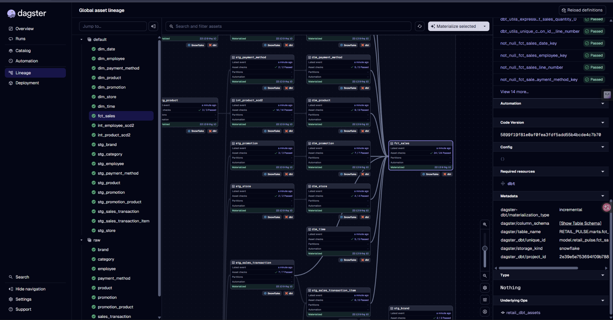

# Phase 6 — Dagster (điều phối dlt và dbt)

Mục tiêu: Dagster chạy cả chuỗi PostgreSQL → dlt → Snowflake RAW → dbt (staging, SCD2, marts, test) và
cho xem trạng thái chạy, lineage, metadata của từng asset. Phạm vi theo
[Project-Spec, mục 11](../Project-Spec.md#11-orchestration-specification): chạy dlt, rồi dbt models,
rồi dbt tests, rồi hiện trạng thái qua Dagster. Lịch chạy, thử lại, cảnh báo, sensor và cách triển
khai còn TBD.

| Bước | Nội dung | Trạng thái |
|---|---|---|
| 1 | Asset dlt: mỗi bảng RAW là một asset | Xong (đã Materialize trong giao diện) |
| 2 | Asset dbt: mỗi model dbt là một asset (`@dbt_assets`) | Xong (đã chạy `dbt build` qua Dagster, test đều pass) |
| 3 | Nối lineage: bảng RAW của dlt chính là source của dbt | Xong (kiểm chứng trên đồ thị asset) |
| 4 | Job chạy toàn chuỗi và job `--full-refresh` cho `fct_sales` | Xong (đã chạy thử job full-refresh) |
| 5 | Lịch chạy | Xong (23:00 hằng ngày cho `full_pipeline`) |

## Khái niệm
- **Asset**: một thứ dữ liệu được tạo ra (bảng RAW, model dbt), có phụ thuộc vào asset khác. Tương
  đương model của dbt nhưng mở rộng ra cả bước nạp dữ liệu.
- **Definitions** (`defs`): danh sách mọi asset, job, lịch mà Dagster biết về.
- **Code location**: gói code Dagster nạp vào. Ở đây là module
  `retail_pulse.orchestration.definitions`, khai báo trong `pyproject.toml` (`[tool.dagster]`).

## Hiện trạng
- `pyproject.toml` đã có `dagster`, `dagster-dbt`, `dagster-dlt` (1.13.25, 0.29.25 khi viết).
- Khung code: `src/retail_pulse/orchestration/definitions.py` với `Definitions(assets=[])`. Kiểm tra:

```bash
uv run dagster definitions validate -m retail_pulse.orchestration.definitions
```
Kết quả mong đợi: `Validation successful`.

**Manifest của dbt:** `@dbt_assets` đọc `dbt/target/manifest.json` ngay lúc nạp code. `dagster dev` tự sinh
nó (qua `prepare_if_dev`), nhưng `dagster definitions validate` và chạy ngoài chế độ dev thì không, nên
sau `make clean` (xóa `dbt/target`) hoặc trên máy mới phải chạy `make dbt-parse` trước, nếu không sẽ lỗi
`DagsterDbtManifestNotFoundError: .../manifest.json does not exist`.

Mở giao diện: `make dagster` (tương đương `uv run dagster dev`, `http://localhost:3000`). Lịch sử chạy
mất khi tắt nếu chưa đặt `DAGSTER_HOME`.

## Điểm cần nhớ từ các phase trước
- RAW là nơi duy nhất giữ lịch sử SCD2 của `product` và `employee`: chuỗi điều phối **không bao giờ**
  được chạy dlt với `replace`/`refresh="drop_sources"` lên hai bảng đó.
- `fct_sales` sửa dòng khóa `-2` bằng `dbt build -s fct_sales --full-refresh` (xem
  [05-dbt.md](05-dbt.md), hạn chế đã biết); job full-refresh ở bước 4 chỉ chạy lại `fct_sales`, không
  đụng RAW. Lịch dự kiến hằng tuần.
- dbt chạy từ thư mục `dbt/`, cần các biến môi trường `SNOWFLAKE_ACCOUNT`, `DBT_PRIVATE_KEY_PATH`
  (xem bước 1 của [05-dbt.md](05-dbt.md)); Dagster phải truyền được chúng cho tiến trình dbt.

## Bước 1 — Asset dlt

File: `src/retail_pulse/orchestration/dlt_assets.py`, đăng ký trong `definitions.py`.

```python
@dlt_assets(
    dlt_source=retail_source(),
    dlt_pipeline=retail_pipeline(),
    name="retail_raw", group_name="raw",
    dagster_dlt_translator=RetailDltTranslator(),
)
def retail_raw_assets(context, dlt_res: DagsterDltResource):
    yield from dlt_res.run(context=context)
```

- `@dlt_assets` biến mỗi **resource** của dlt (mỗi bảng) thành **một asset riêng**: 10 asset
  `raw/<tên bảng>`. Mỗi asset riêng thì Dagster hiện trạng thái, số dòng nạp, thời gian cho từng bảng,
  và mỗi model dbt có thể nối vào đúng bảng nó đọc.
- `retail_pipeline()` (trong `src/retail_pulse/ingestion/pipelines.py`) là **một nơi duy nhất** định nghĩa
  pipeline dlt, dùng chung cho CLI (`make ingest`) và Dagster, nên hai nơi không lệch nhau.
- **`RetailDltTranslator`** đổi tên asset sang `["raw", <tên bảng>]`. Đây đúng là key mặc định của
  source dbt `source('raw', 'store')`, nên khi thêm asset dbt (bước 2), đồ thị nối liền từ RAW sang
  staging mà không cần cấu hình thêm. Dùng `get_asset_spec` (cách hiện tại); `get_asset_key` là cách
  cũ, bị thay thế.
- Cấu hình đọc theo thư mục làm việc, nên chạy Dagster từ thư mục gốc repo: Snowflake ở
  `.dlt/secrets.toml`, Postgres ở `.env` (tiền tố `PG_`).

### Lỗi đã gặp 1: `No module named 'orchestration'`
`definitions.py` import `from orchestration.dbt_assets import ...`, thiếu tên package. Package của
dự án là `retail_pulse`, nên đúng là `from retail_pulse.orchestration....`. Kèm theo, file
`dbt_assets.py` chưa tồn tại (thuộc bước 2) nên tạm bỏ khỏi `Definitions`.

### Lỗi đã gặp 2: code location kết nối Postgres ngay khi nạp code
**Triệu chứng:** `connection to server at "127.0.0.1", port 5432 failed: Connection refused` khi chạy
`dagster definitions validate` lúc Postgres tắt.

**Giải thích bằng ví dụ:** Dagster như người quản lý mở sổ kế hoạch. Lúc mở sổ chỉ nên đọc danh sách
việc. Nhưng code bắt anh ta gọi điện cho kho hàng (Postgres) ngay lúc mở sổ để hỏi "kho có những ngăn
nào". Kho đóng cửa thì anh ta không mở nổi cả cuốn sổ, kể cả những trang không liên quan đến kho.

**Nguyên nhân kỹ thuật:** `retail_source()` được gọi lúc **import** module (nó là đối số của
`@dlt_assets`). Bên trong, `sql_database(...)` mặc định **đọc cấu trúc bảng từ Postgres ngay lúc tạo
source** (reflection). Nên chỉ cần Postgres không sẵn sàng là nạp code thất bại, và phần dbt (chỉ cần
Snowflake) cũng bị chặn theo. Điều này gây khó chịu trên máy khác, trong CI, hoặc khi mở giao diện
Dagster mà chưa bật Docker.

**Cách sửa:** thêm một tham số cho `sql_database`:
```python
sql_database(..., reflection_level="full", defer_table_reflect=True)
```
`defer_table_reflect=True` hoãn việc đọc cấu trúc bảng đến **lúc chạy thật** (lúc nạp dữ liệu), không
phải lúc import.

**Vì sao an toàn, đã kiểm chứng:** `reflection_level="full"` giữ đúng kiểu và độ chính xác của cột
(`NUMERIC(12,2)`). Mình trích xuất (extract, chỉ ghi file cục bộ, không chạm Snowflake) ba bảng
`product`, `sales_transaction_item`, `promotion` hai lần, có và không có `defer_table_reflect`, rồi so
sánh toàn bộ cột: **giống hệt nhau** (ví dụ `unit_price`, `unit_cost` đều `decimal(12, 2)`, không
null). Nên RAW không bị đổi kiểu cột (nếu đổi, dlt sẽ tạo thêm cột `..._v_text` rất khó dọn).

**Kiểm chứng sau khi sửa:** nạp code khi Postgres không tồn tại (trỏ cổng sai), phải thành công:
```bash
PG_PORT=59999 uv run python -c "import retail_pulse.orchestration.dlt_assets"
uv run dagster definitions validate -m retail_pulse.orchestration.definitions
```
Kết quả: import không lỗi và in ra 10 asset `raw/...`; `validate` báo `Validation successful`.

> Lưu ý: `dagster definitions validate` không dùng được để thử cổng sai, vì Dagster tự nạp lại file
> `.env` và có thể ghi đè biến môi trường. Phép thử bằng `python -c "import ..."` ở trên mới đáng tin.

### Bài học tổng quát
Code chạy lúc **import** phải rẻ và không phụ thuộc hệ thống ngoài. Việc cần kết nối (đọc cấu trúc,
gọi API, truy vấn cơ sở dữ liệu) nên hoãn đến lúc **thực thi**. Đây là lỗi hay gặp với bất kỳ framework
nạp code trước rồi chạy sau (Dagster, Airflow...).

## Bước 2 — Asset dbt, và bước 3 — nối lineage

File: `src/retail_pulse/orchestration/dbt_assets.py`, đăng ký trong `definitions.py`.

```python
dbt_project = DbtProject(project_dir=Path(__file__).parents[3] / "dbt")
dbt_project.prepare_if_dev()

@dbt_assets(manifest=dbt_project.manifest_path)
def retail_dbt_assets(context, dbt: DbtCliResource):
    yield from dbt.cli(["build"], context=context).stream()
```

- `@dbt_assets` đọc `dbt/target/manifest.json` và biến **mỗi model dbt thành một asset** (20 model:
  10 staging, 2 intermediate, 7 dimension, 1 fact). Các `ref()` thành mũi tên phụ thuộc, nên đồ thị
  Dagster giống DAG của dbt. Thêm model mới thì asset tự xuất hiện, không phải liệt kê tay.
- `dbt.cli(["build"], ...)` gọi `dbt build` thật dưới nền (cả model lẫn test), rồi gắn kết quả vào
  từng asset. `.stream()` báo kết quả theo từng model khi nó xong.
- `DbtProject.prepare_if_dev()` tự chạy `dbt parse` để sinh `manifest.json` khi chạy `dagster dev`.
  Trên máy mới (chưa có `dbt/target/`) không cần chạy dbt tay trước.
- Dagster dùng dbt-core trong `.venv` (1.12), không dùng bản dbt ở `~/.local/bin`.
- `DbtCliResource` đăng ký trong `definitions.py` với tên `dbt`, trùng tên tham số của hàm asset.

### Lỗi đã gặp 3: `does not contain a profiles.yml file`
**Triệu chứng:** `ValidationError for DbtCliResource ... /…/retail-pulse/dbt does not contain a profiles.yml`.

**Nguyên nhân:** `profiles.yml` nằm ở `~/.dbt/` (ngoài repo, không commit, vì có thông tin kết nối).
Lệnh `dbt` ở terminal tự tìm ở `~/.dbt/`, nhưng `DbtCliResource` chỉ tìm trong thư mục dự án dbt nên
báo lỗi. Cần chỉ cho nó bằng tham số `profiles_dir`:

```python
DbtCliResource(
    project_dir=dbt_project,
    profiles_dir=os.environ.get("DBT_PROFILES_DIR", str(Path.home() / ".dbt")),
)
```
Mặc định `~/.dbt`; đặt biến `DBT_PROFILES_DIR` để ghi đè (ví dụ trên máy chủ). Không bao giờ chép
`profiles.yml` vào repo.

**Lỗi liên quan, chỉ lộ ra khi chạy `dagster dev`:** sau khi thêm `profiles_dir` cho `DbtCliResource`,
`dagster definitions validate` thành công nhưng `dagster dev` vẫn lỗi y như trên, ở dòng
`dbt_project.prepare_if_dev()`. Lý do: `prepare_if_dev()` chỉ chạy ở chế độ dev, và nó **tự tạo một
`DbtCliResource` riêng từ `DbtProject`** để chạy `dbt deps` và `dbt parse`, nên không dùng cái ở
`definitions.py`. Phải đặt `profiles_dir` ngay ở `DbtProject`:

```python
dbt_project = DbtProject(
    project_dir=Path(__file__).parents[3] / "dbt",
    profiles_dir=os.environ.get("DBT_PROFILES_DIR", str(Path.home() / ".dbt")),
)
# definitions.py: DbtCliResource(project_dir=dbt_project)  # profiles_dir lấy từ dbt_project
```
Kiểm chứng chế độ dev mà không mở giao diện: đặt `DAGSTER_IS_DEV_CLI=1` rồi import module. Bài học:
`validate` không bao phủ các bước chỉ chạy ở chế độ dev, nên cần thử bằng `dagster dev` thật.

**Biến môi trường:** `profiles.yml` dùng `env_var('SNOWFLAKE_ACCOUNT')` và
`env_var('DBT_PRIVATE_KEY_PATH')`, nên tiến trình dbt do Dagster gọi phải thấy hai biến này. Hai biến
nằm trong `.env`; Dagster nạp `.env` ở thư mục gốc, nên chạy Dagster từ thư mục gốc repo.

### Lineage: đồ thị nối liền từ Postgres tới `fct_sales`
Hai bên khớp nhau vì key mặc định của source dbt `source('raw', 'store')` là `["raw", "store"]`, và
`RetailDltTranslator` (bước 1) đặt key asset dlt giống hệt. Kiểm chứng trên đồ thị asset (40 asset):

| Asset | Phụ thuộc vào |
|---|---|
| `staging/stg_store` | `raw/store` |
| `staging/stg_sales_transaction_item` | `raw/sales_transaction_item`, `staging/stg_sales_transaction` |
| `marts/fct_sales` | 7 dimension (gồm `dim_date`, `dim_time`), `staging/stg_sales_transaction`, `staging/stg_sales_transaction_item` |

Tên asset gồm schema và model, ví dụ `staging/stg_store` (key dbt = `[schema, model]`), còn asset dlt
là `raw/<bảng>`. 40 asset gồm: 10 asset RAW của dlt, 20 asset dbt, và 10 asset `sql_database_<bảng>`
do dagster-dlt tự tạo, đại diện cho **bảng nguồn ở Postgres** (phía trước `raw/<bảng>`), nên đồ thị
đi được từ PostgreSQL tới `fct_sales`. Có thể đổi tên chúng bằng `get_deps_asset_keys` của translator
nếu muốn gọn hơn.

### Kết quả chạy thật trong giao diện Dagster
Chạy `make dagster`, vào **Lineage** (Global asset lineage), chọn các asset rồi **Materialize selected**.
Ảnh chụp sau khi chạy:



Những gì ảnh cho thấy:
- Cột trái liệt kê asset theo nhóm: **`default`** (20 asset dbt: dimension, intermediate, staging, fact)
  và **`raw`** (asset dlt, `group_name="raw"` đặt ở bước 1). Mọi asset có dấu tích xanh, tức đã
  materialize.
- Đồ thị: staging, intermediate, dimension nối vào `fct_sales`. Mỗi nút hiện thời điểm materialize,
  số **asset check** (test dbt) đã pass, và nhãn công nghệ (`Snowflake`, `dbt`). Ví dụ `fct_sales`:
  `24/24 Passed`, `dim_product`: `9/9`, `int_product_scd2`: `14/14`.
- Panel phải (đang chọn `fct_sales`): danh sách check (`not_null_fct_sales_*`,
  `dbt_utils_unique_combination_of_columns`, ...), metadata `dagster-dbt/materialization_type:
  incremental`, `dagster/table_name: RETAIL_PULSE.marts.fct_sales`, `storage_kind: snowflake`,
  resource `dbt`, và op `retail_dbt_assets`.
- Test dbt hiện ra thành **asset check** gắn vào đúng model, nên thấy ngay model nào có test fail.

Gợi ý cải thiện (chưa làm): 20 asset dbt đang nằm chung nhóm `default`. Có thể chia nhóm theo tầng
(`staging`, `intermediate`, `marts`) bằng cách ghi đè `get_group_name` của `DagsterDbtTranslator`, để
giao diện dễ đọc hơn.

## Bước 4 — Job

File: `src/retail_pulse/orchestration/jobs.py`, đăng ký trong `definitions.py` (`jobs=[...]`).

**Job là gì:** một nhóm asset được đặt tên để chạy cùng lúc, Dagster tự xếp thứ tự theo phụ thuộc. Trước
đây phải chọn tay các asset rồi Materialize; job gói thao tác đó lại thành **một nút bấm**. Job
chưa có lịch (bước 5).

| Job | Chọn asset | Dùng khi |
|---|---|---|
| `full_pipeline` | `retail_raw_assets` (dlt) và `retail_dbt_assets` (dbt) | Chạy thường kỳ: dlt nạp RAW, rồi `dbt build` toàn bộ (model và test) |
| `fct_sales_full_refresh` | chỉ `marts/fct_sales`, kèm tag `full_refresh=true` | Sửa dòng khóa `-2` của fact; không chạy dlt, không đụng RAW |

```python
full_pipeline_job = define_asset_job(
    "full_pipeline", selection=AssetSelection.assets(retail_raw_assets, retail_dbt_assets))
fct_sales_full_refresh_job = define_asset_job(
    "fct_sales_full_refresh",
    selection=AssetSelection.assets(AssetKey(["marts", "fct_sales"])),
    tags={"full_refresh": "true"})
```

**Làm sao một asset dbt biết phải `--full-refresh`:** hai job dùng chung asset dbt, chỉ khác tag của
lần chạy. Asset đọc tag đó (`dbt_assets.py`):

```python
args = ["build"]
if context.run.tags.get("full_refresh") == "true":
    args.append("--full-refresh")
yield from dbt.cli(args, context=context).stream()
```
Dagster tự thêm `--select` theo các asset được chọn, nên job full-refresh chạy
`dbt build --full-refresh --select retail_pulse.marts.fct_sales` (mình đã chạy thử, log đúng như vậy,
26/26 test pass, `fct_sales` vẫn 271.766 dòng). Dùng một asset với hai kiểu chạy khác nhau, thay vì hai
asset trùng khóa, vì Dagster không cho hai asset cùng khóa.

**Chạy:**
- Giao diện: `make dagster`, mục **Jobs**, chọn job, **Launchpad**, **Launch Run**.
- Dòng lệnh, không cần mở giao diện:
  `uv run dagster job execute -m retail_pulse.orchestration.definitions -j full_pipeline`
  (đặt `DAGSTER_HOME` nếu muốn giữ lịch sử chạy).

**Lưu ý an toàn:** đặt nhầm tag `full_refresh=true` cho job `full_pipeline` thì mọi model dbt chạy với
`--full-refresh` (bảng dbt bị dựng lại, vô hại, nhưng chậm hơn). RAW thì không bao giờ bị ghi đè bởi
cờ này vì nó chỉ ảnh hưởng dbt.

Kiểm thử: `tests/test_orchestration.py` kiểm tra hai job tồn tại, `full_pipeline` chứa `raw/product` và
`marts/fct_sales`, job full-refresh chỉ chọn `fct_sales` và mang tag đúng.

## Bước 5 — Lịch chạy (schedule)

Schedule = "đến giờ thì tự launch một job". Định nghĩa trong `jobs.py`, đăng ký bằng `schedules=[...]` ở `definitions.py`.

| Quyết định | Chọn | Lý do |
|---|---|---|
| Job được lên lịch | `full_pipeline` | dlt nạp RAW rồi dbt build |
| Tần suất | Mỗi ngày 23:00, múi giờ `Asia/Ho_Chi_Minh` | Cửa hàng mở 7h–22h, chạy sau giờ đóng cửa thì đã đủ đơn cả ngày; dashboard xem theo ngày không cần mới hơn |
| `fct_sales_full_refresh` | Không lên lịch, chạy tay | Chỉ cần khi có dòng khóa `-2` (dữ liệu đến trễ); dựng lại cả bảng tốn tài nguyên |
| dlt lỗi thì sao | Không build dbt | Mặc định của Dagster, không cần cấu hình thêm |

**Vì sao dlt lỗi thì dbt không chạy mà không cần code gì:** trong cùng một run, asset dbt phụ thuộc asset dlt
(lineage bước 3). Asset upstream fail thì mọi asset downstream bị bỏ qua (skipped). Đây cũng là
best practice: build trên RAW không đầy đủ sẽ cho số liệu sai mà vẫn "xanh". Ngược lại nếu dlt xong mà dbt
fail, RAW đã có dữ liệu mới, lần sau chạy lại chỉ cần dbt (chọn asset dbt trong UI).

**Chạy được cần gì:** lịch chỉ chạy khi **daemon** chạy. `make dagster` (`dagster dev`) bật sẵn daemon, nên
máy phải mở và tiến trình còn sống lúc 23:00. Đặt `DAGSTER_HOME` ra thư mục cố định để lịch sử run và
trạng thái lịch không mất khi khởi động lại; nếu không, mỗi lần dùng thư mục tạm. Production thật dùng
`dagster-daemon run` chạy nền (systemd/Docker), không dùng `dagster dev`.

**Xem/bật tắt:** giao diện, mục **Automation**; lịch đặt `default_status=RUNNING` nên tự bật. Thử ngay không
đợi 23:00: vào lịch, **Test Schedule** hoặc launch job `full_pipeline` bằng tay.

Kiểm thử: `test_daily_schedule_targets_full_pipeline` kiểm tra cron và múi giờ.
