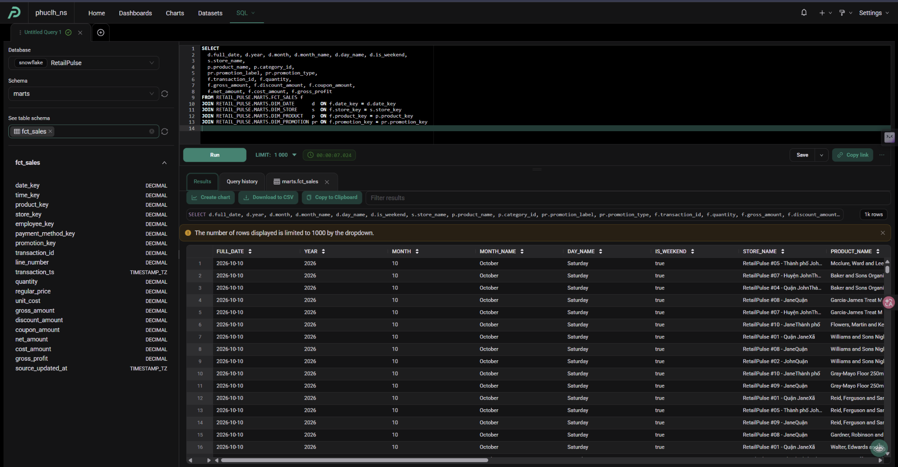
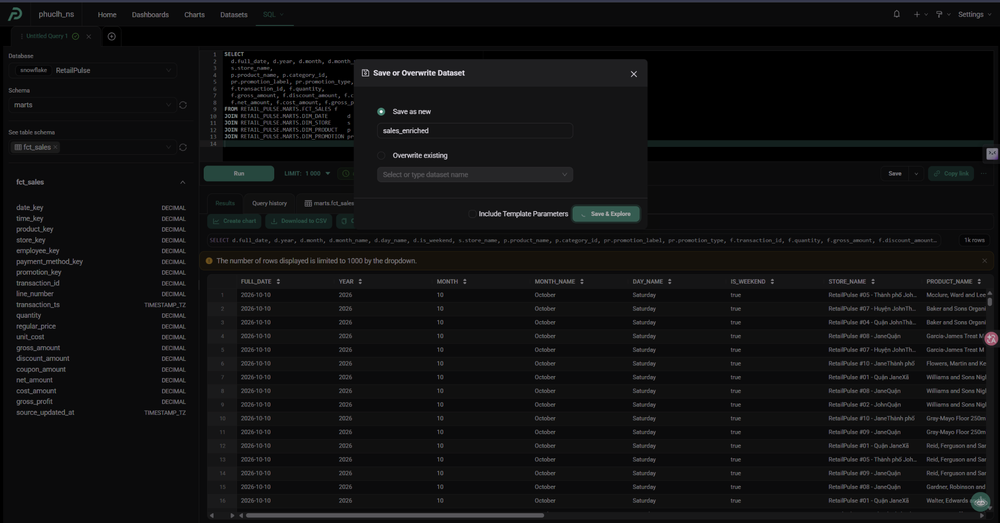
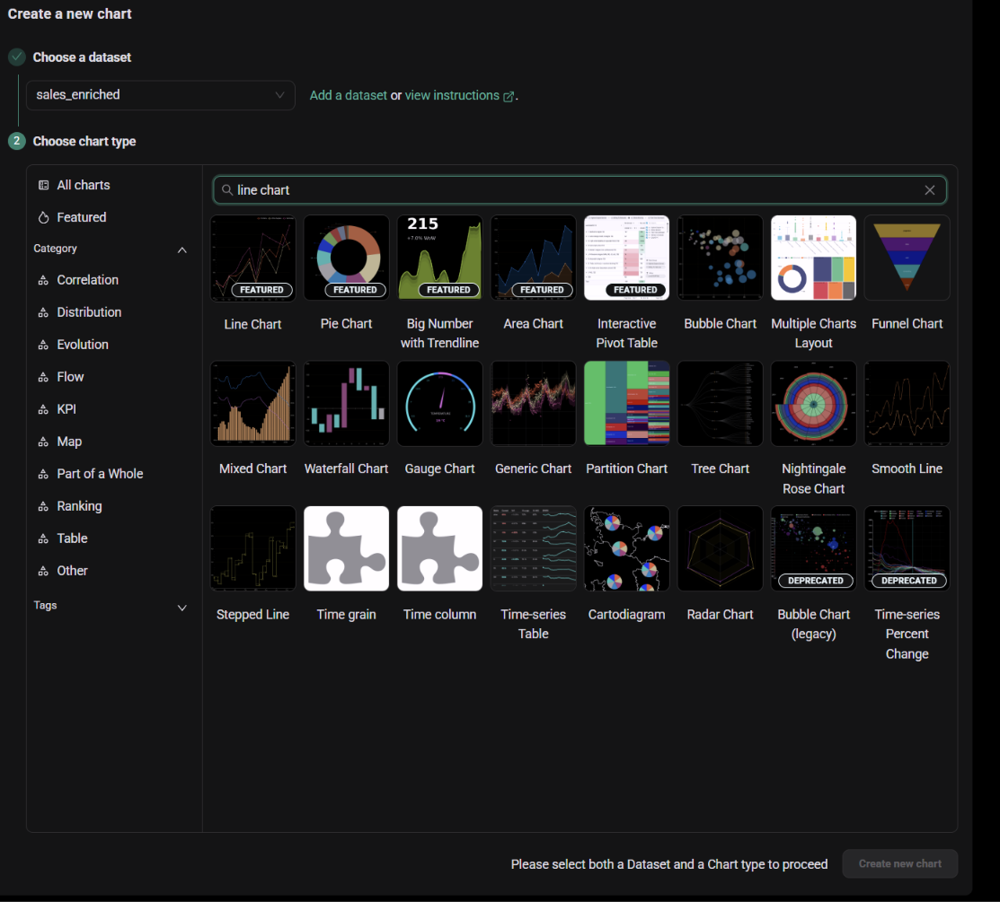
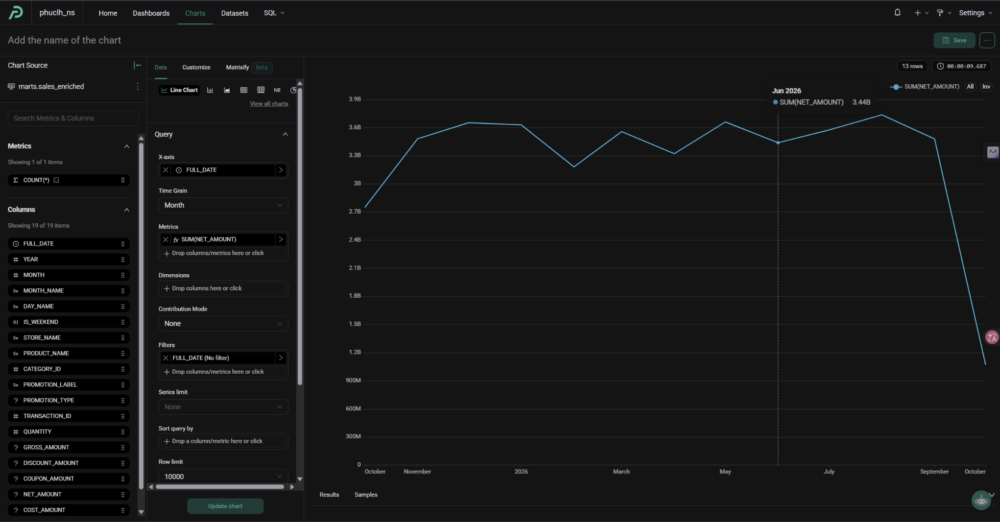
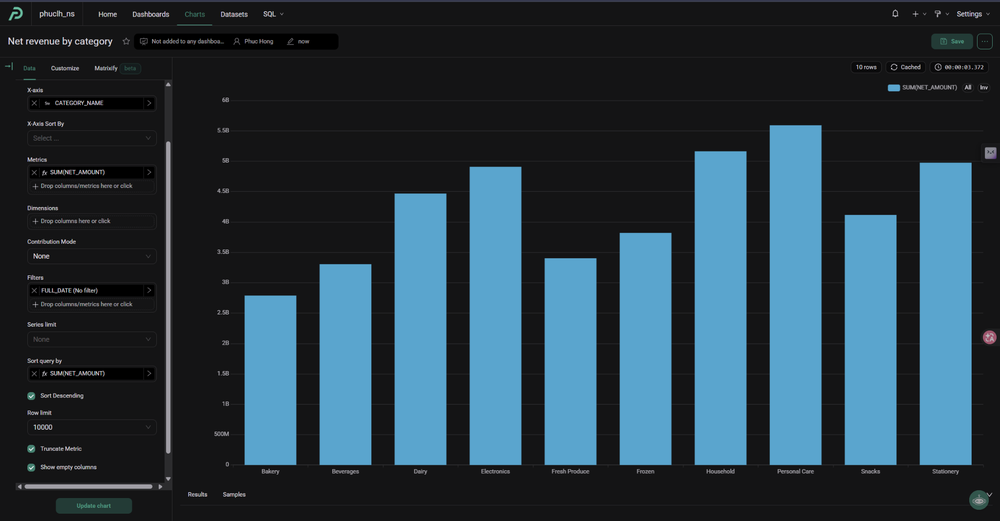
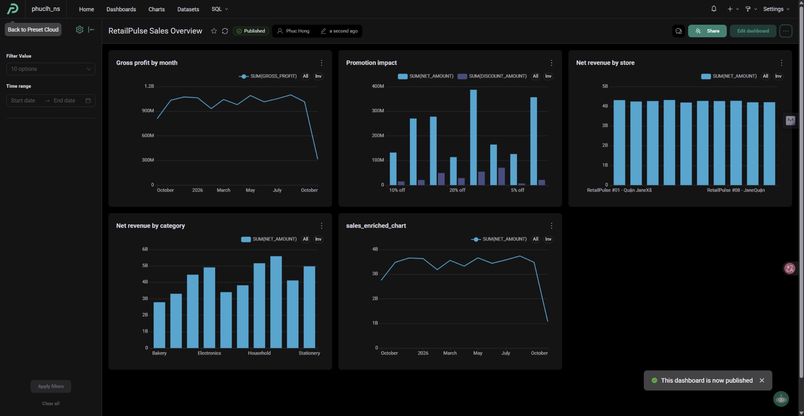

# Phase 7 — Preset (dashboard)

Pipeline chạy xong nhưng chưa ai nhìn thấy kết quả. Preset là tầng cuối: đọc các bảng mart trong Snowflake và biến
chúng thành dashboard. Nguyên tắc theo [Project-Spec, mục 12](../Project-Spec.md#12-bi-specification): Preset **chỉ đọc
mart của dbt**, không đọc PostgreSQL hay RAW.

Năm bước: role chỉ đọc, tài khoản Preset, kết nối Snowflake, dataset, chart và dashboard.

## Bước 1 — Role chỉ đọc cho Preset

*Vì sao role riêng:* Preset chỉ cần đọc. Dùng `TRANSFORMER` thì một công cụ bên ngoài có quyền ghi và xóa cả RAW lẫn
mart. Giới hạn ở mức thấp nhất: chỉ `SELECT` trên `MARTS`.

Chạy trong Snowsight bằng `ACCOUNTADMIN` (schema `MARTS` đã được `make snowflake-init` tạo sẵn):

```sql
USE ROLE ACCOUNTADMIN;
CREATE ROLE IF NOT EXISTS REPORTER;
GRANT ROLE REPORTER TO ROLE SYSADMIN;

GRANT USAGE ON WAREHOUSE RETAIL_WH TO ROLE REPORTER;
GRANT USAGE ON DATABASE RETAIL_PULSE TO ROLE REPORTER;
GRANT USAGE ON SCHEMA RETAIL_PULSE.MARTS TO ROLE REPORTER;
GRANT SELECT ON ALL TABLES IN SCHEMA RETAIL_PULSE.MARTS TO ROLE REPORTER;
GRANT SELECT ON FUTURE TABLES IN SCHEMA RETAIL_PULSE.MARTS TO ROLE REPORTER;
```

- **`FUTURE TABLES`:** dbt dựng lại bảng mỗi lần chạy (`--full-refresh`, bảng mới). Quyền áp cho cả bảng tạo sau này.
  *Nếu thiếu:* sau mỗi lần dbt dựng lại bảng, Preset báo không có quyền đọc.
- **Vì sao tách khỏi `infras/snowflake/init.sql`:** Preset là phần không bắt buộc, không phải ai chạy dự án cũng dùng. `init.sql`
  chỉ giữ phần bắt buộc của pipeline (dlt, dbt, CI). Muốn gộp thì thêm các câu trên vào cuối `init.sql`; vì `MARTS` đã được
  tạo sẵn ở đó nên không còn vướng thứ tự.

Tạo user cho Preset (mật khẩu tự đặt trong Snowsight, lưu ở `.env` dưới tên `PRESET_READER_PASSWORD`, **không ghi vào repo**):

```sql
CREATE USER IF NOT EXISTS PRESET_READER
  DEFAULT_ROLE = REPORTER
  DEFAULT_WAREHOUSE = RETAIL_WH
  PASSWORD = '<đặt mật khẩu mạnh>'
  MUST_CHANGE_PASSWORD = FALSE;
GRANT ROLE REPORTER TO USER PRESET_READER;
```

**Kiểm tra:** đăng nhập `PRESET_READER` (hoặc `USE ROLE REPORTER`), `SELECT count(*) FROM RETAIL_PULSE.MARTS.FCT_SALES;`
phải ra số dòng, còn `SELECT * FROM RETAIL_PULSE.RAW.PRODUCT;` phải bị từ chối. Cái thứ hai bị từ chối mới chứng minh
quyền đã giới hạn đúng.

Đọc thêm: [Snowflake: tổng quan về phân quyền](https://docs.snowflake.com/en/user-guide/security-access-control-overview),
[GRANT ... TO ROLE](https://docs.snowflake.com/en/sql-reference/sql/grant-privilege) (mục `FUTURE`).

## Bước 2 — Tài khoản Preset

Đăng ký tại [preset.io](https://preset.io) (bản free), tạo một workspace. Preset là dịch vụ Apache Superset được quản lý sẵn,
nên mọi khái niệm bên dưới (database, dataset, chart, dashboard) đều theo Superset.

## Bước 3 — Kết nối Snowflake

**Settings → Database Connections → + Database → Snowflake**, điền:

| Trường | Giá trị |
|---|---|
| Account | account identifier (như `SNOWFLAKE_ACCOUNT`) |
| Username / Password | `PRESET_READER` và mật khẩu ở bước 1 |
| Role | `REPORTER` |
| Warehouse | `RETAIL_WH` |
| Database / Schema | `RETAIL_PULSE` / `MARTS` |

Bấm **Test Connection**. Warehouse tự tạm dừng sau 60 giây và bị chặn bởi resource monitor `RETAIL_RM` (10 credit/tháng),
nên dashboard không làm tăng chi phí ngoài ý muốn.

**Lỗi gặp khi làm:** form báo `requested database does not exist or not authorized`, dù chính Snowflake không sai (đăng nhập
`PRESET_READER`, role `REPORTER`, database `RETAIL_PULSE` bằng Python connector vẫn thành công). Lỗi nằm ở cách form của
Preset ghép các ô thành địa chỉ kết nối. Cách sửa: bấm **Connect this database with a SQLAlchemy URI instead** và dán:

```text
snowflake://PRESET_READER:<mật khẩu>@<account>/RETAIL_PULSE/MARTS?role=REPORTER&warehouse=RETAIL_WH
```

`<account>` ở dạng `orgname-accountname` (bỏ đuôi `.snowflakecomputing.com`). Địa chỉ này chỉ rõ database, schema, role và
warehouse nên không còn phụ thuộc cách form tự ghép. Đừng chụp màn hình lúc đang hiện mật khẩu.

Đọc thêm: [Superset: kết nối Snowflake](https://superset.apache.org/docs/databases/supported/snowflake).

## Bước 4 — Dataset

Mỗi dataset là một bảng hoặc một câu SQL. Fact chỉ có khóa, nên tạo một **virtual dataset** tên `sales_enriched` gộp
`fct_sales` với bốn dimension để chart có tên cửa hàng, sản phẩm, ngày, khuyến mãi. Vào **SQL**, chọn database
`RetailPulse`, schema `marts`, chạy:

```sql
SELECT
  d.full_date, d.year, d.month, d.month_name, d.day_name, d.is_weekend,
  s.store_name,
  p.product_name, p.category_name, p.brand_name,
  pr.promotion_label, pr.promotion_type,
  f.transaction_id, f.quantity,
  f.gross_amount, f.discount_amount, f.coupon_amount,
  f.net_amount, f.cost_amount, f.gross_profit
FROM RETAIL_PULSE.MARTS.FCT_SALES f
JOIN RETAIL_PULSE.MARTS.DIM_DATE      d  ON f.date_key = d.date_key
JOIN RETAIL_PULSE.MARTS.DIM_STORE     s  ON f.store_key = s.store_key
JOIN RETAIL_PULSE.MARTS.DIM_PRODUCT   p  ON f.product_key = p.product_key
JOIN RETAIL_PULSE.MARTS.DIM_PROMOTION pr ON f.promotion_key = pr.promotion_key
```



- **Join thẳng theo `*_key`, không lọc lại `valid_from`/`valid_to`:** fact đã trỏ đúng phiên bản SCD2.
- **`JOIN` thường là đủ** vì mọi dimension đều có dòng `-2` hoặc `-1`, nên không dòng fact nào bị mất. Kiểm tra: số dòng kết
  quả phải bằng số dòng `FCT_SALES`. SQL Lab mặc định chỉ hiện 1.000 dòng, nên đếm bằng `SELECT count(*)` bọc ngoài chứ
  đừng nhìn số dòng hiển thị.
- **Lưu:** mũi tên cạnh **Save**, **Save dataset**, đặt tên `sales_enriched`, **Save & Explore**.



Dòng khóa `-2` hiện là "Unknown", `-1` ở promotion là "No promotion"; mọi nhãn bằng tiếng Anh. `dim_product` có
`category_name` và `brand_name` (Type 1, lấy tên hiện tại) để chart theo danh mục hiện tên thay vì mã số. *Khi dbt thêm
cột mới vào dimension*, phải sửa câu SQL của dataset rồi **Save** lại thì Preset mới nhận cột.

## Bước 5 — Chart và dashboard

Các chủ đề theo spec (mục 12), mỗi chủ đề một nhóm chart:

| Chủ đề | Chart |
|---|---|
| Doanh thu và xu hướng | Đường: `sum(net_amount)` theo tháng |
| Sản phẩm và danh mục | Cột: doanh thu theo category |
| Cửa hàng | Cột: doanh thu theo `dim_store` |
| Hiệu quả khuyến mãi | Cột: `sum(discount_amount)` và doanh thu theo `dim_promotion` |
| Biên lợi nhuận gộp | Đường: `sum(gross_profit)` theo tháng (dùng giá vốn đúng thời điểm bán) |

**Chart đầu tiên, doanh thu theo tháng:** **Charts, + Chart**, chọn dataset `sales_enriched` và loại **Line Chart**.



Cấu hình: X-axis `FULL_DATE`, Time Grain `Month`, Metric `SUM(NET_AMOUNT)`.



Doanh thu quanh 3 đến 3,8 tỷ mỗi tháng. Hai điểm hai đầu thấp hơn là **tháng chưa đủ ngày** (tháng dữ liệu bắt đầu và tháng hiện
tại), không phải lỗi pipeline. Khi làm dashboard nên lọc bỏ tháng hiện tại hoặc ghi chú để người xem không hiểu nhầm là doanh
thu sụt.

**Các chart còn lại**, cùng dataset `sales_enriched`. Với chart cột theo nhóm, cột phân loại đặt ở **X-axis** (ô
**Dimensions** chỉ dùng để tách thêm màu trong mỗi cột):

| Chart | Loại | Cấu hình |
|---|---|---|
| Net revenue by category | Bar | X-axis `CATEGORY_NAME`, metric `SUM(NET_AMOUNT)`, sort giảm dần |
| Net revenue by store | Bar | X-axis `STORE_NAME`, metric `SUM(NET_AMOUNT)` |
| Promotion impact | Bar | X-axis `PROMOTION_LABEL`, metrics `SUM(NET_AMOUNT)` và `SUM(DISCOUNT_AMOUNT)`, lọc `PROMOTION_LABEL <> 'No promotion'`, row limit 20 |
| Gross profit by month | Line | X-axis `FULL_DATE` (Month), metric `SUM(GROSS_PROFIT)` |



**Dashboard:** **Dashboards, + Dashboard**, tên `RetailPulse Sales Overview`, **Edit dashboard**, kéo chart từ tab **Charts**
vào khung, thêm hai bộ lọc ở thanh bên trái: **Value** trên `STORE_NAME` và **Time range** trên `FULL_DATE`. **Save**, rồi
**Publish**.



Đọc thêm: [Superset: tạo dashboard đầu tiên](https://superset.apache.org/docs/using-superset/creating-your-first-dashboard),
[tài liệu Preset](https://docs.preset.io/).

## Đối soát số liệu với warehouse

Dashboard chỉ đáng tin khi khớp với bảng nguồn. Đã kiểm tra bằng `PRESET_READER`:

| Chỉ số | Trong `FCT_SALES` | Trên dashboard |
|---|---|---|
| Tổng `net_amount` | 42,53 tỷ | Tổng các cột theo danh mục, theo cửa hàng và các điểm theo tháng đều cộng ra khoảng 42,5 tỷ |
| Tổng `gross_profit` | 12,51 tỷ (biên gộp 29,4%) | Chart theo tháng quanh 0,8 đến 1,1 tỷ mỗi tháng |

Ba cách chia (danh mục, cửa hàng, tháng) cùng cộng ra một tổng, nghĩa là join dimension không làm mất hay nhân đôi dòng fact.

## Điều cần biết khi đọc dashboard

- **Tháng đầu và tháng cuối thấp hơn** vì chưa đủ ngày. Bộ lọc **Time range** giúp loại hai tháng này.
- **Promotion impact chỉ có 8 cột dù có 40 khuyến mãi.** Chart nhóm theo `promotion_label` (ví dụ "10% off"), nhiều chương
  trình dùng chung một nhãn nên bị gộp. Muốn xem từng chương trình thì thêm cột tên hoặc mã chương trình vào `dim_promotion`.
- **Doanh thu giữa 10 cửa hàng gần như bằng nhau (khoảng 4,2 tỷ).** Đặc điểm của dữ liệu giả do generator sinh ra, không phải
  lỗi mô hình.
- Dashboard còn một chart tên mặc định `sales_enriched_chart` (tạo lúc bấm *Save & Explore*); nên đổi tên thành
  `Net revenue by month`.

## Lưu ý

- Số liệu chỉ mới khi `full_pipeline` chạy (23:00 hằng ngày, xem [phase 6](06-dagster.md)). Preset chỉ đọc kết quả, không
  kích hoạt pipeline.
- Không commit mật khẩu hay thông tin kết nối Preset vào repo.

Tiếp theo: [Phase 8 — Great Expectations](08-great-expectations.md).
